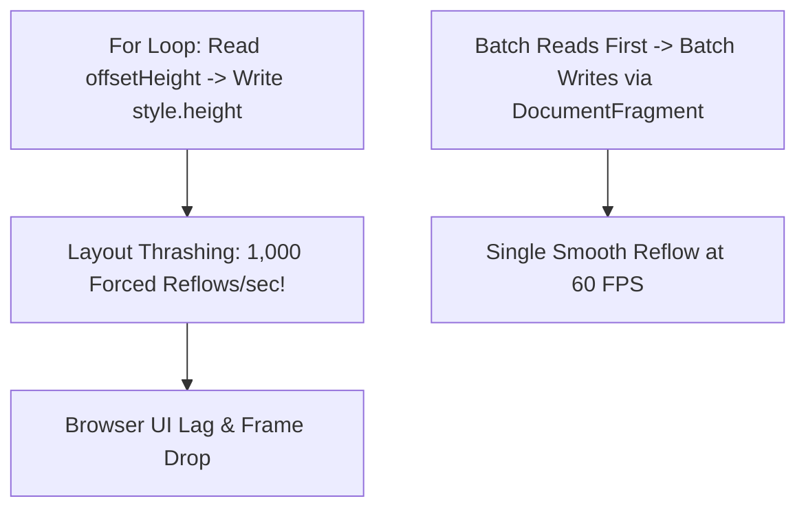

```yaml
schema_version: "2.0"
metadata:
  lesson_id: "JS-MOD11-LES01"
  course_slug: "course-03-javascript"
  course_title: "Course 3: JavaScript & ES6+"
  module_slug: "mod-11-performance-security-optimization"
  module_title: "Module 11 - Browser Performance, Security, & Optimization"
  lesson_slug: "critical-rendering-path-and-dom-reflows"
  lesson_title: "Lesson 11.1 Critical Rendering Path & DOM Reflows"
  sort_order: 1101

pedagogy:
  difficulty: "advanced"
  estimated_time:
    reading_minutes: 20
    practice_minutes: 25
    quiz_minutes: 10
    total_minutes: 55
  bloom_taxonomy_level: "Analyze"
  xp_reward: 70

prerequisites:
  required_lesson_ids:
    - "JS-MOD10-LES03"
  required_skills:
    - "DOM Tree Architecture & Browser Execution Model"

skills_acquired:
  - "Critical Rendering Path Steps (DOM, CSSOM, Render Tree, Layout, Paint)"
  - "Reflow (Layout) vs Repaint Triggering Operations"
  - "Batching DOM Mutations via `requestAnimationFrame()` and `DocumentFragment`"
  - "Avoiding Layout Thrashing"

dependencies:
  software:
    - "VS Code"
    - "Modern Web Browser"
  hardware: []

seo_and_social:
  meta_title: "Browser Critical Rendering Path: DOM Reflows, Repaints & Layout Thrashing"
  meta_description: "Master Browser Performance: Critical Rendering Path, DOM vs CSSOM, Reflow (Layout) vs Repaint cost, avoiding Layout Thrashing, and DocumentFragment batching."
  keywords: ["Critical Rendering Path", "DOM Reflow", "Repaint", "Layout Thrashing", "DocumentFragment", "Browser Performance"]

assessment_config:
  has_quiz: true
  has_lab: true
  has_flashcards: true
  pass_score_percentage: 80
```

# Lesson 11.1 Critical Rendering Path & DOM Reflows

## 1. Overview & Learning Objectives [id: overview]

- **Estimated Time**: 55 Minutes (20m Reading | 25m Practice | 10m Quiz)
- **Difficulty Level**: ⭐⭐⭐ Advanced
- **Prerequisites**: [Lesson 10.3 Build Tooling](file:///d:/My%20Drive/all%20files/PROJECT%20FILES/notes/docs/curriculum/_03_javascript/_03_37_modern_build_tooling_bundlers_tree_shaking.md)
- **XP Reward**: +70 XP

### Learning Objectives
By the end of this lesson, you will be able to:
1. Trace the 5 stages of the **Critical Rendering Path**: HTML parsing $\to$ DOM $\to$ CSSOM $\to$ Render Tree $\to$ Layout (Reflow) $\to$ Paint.
2. Differentiate between expensive **Reflows (Layout)** and lightweight **Repaints**.
3. Identify and prevent **Layout Thrashing** caused by reading geometry properties in mutation loops.
4. Batch DOM updates using **`DocumentFragment`** and **`requestAnimationFrame()`**.

---

## 2. Environment & Prerequisites [id: prerequisites]

Open Browser DevTools Performance Panel (`F12`).

---

## 3. Theoretical Foundations [id: theory]

### 3.1 The Critical Rendering Path
When a browser loads a webpage, it transforms HTML/CSS bytes into pixels on screen via 5 steps:

1. **DOM Tree**: Parses HTML tags into DOM nodes.
2. **CSSOM Tree**: Parses CSS rules into CSS Object Model nodes.
3. **Render Tree**: Combines visible DOM nodes with CSSOM computed styles.
4. **Layout (Reflow)**: Calculates exact pixel positions and bounding dimensions for every element.
5. **Paint**: Fills pixels on screen layers.

```
┌─────────────────────────────────────────────────────────────────────────────┐
│                       CRITICAL RENDERING PATH STAGES                        │
├─────────────────────────────────────────────────────────────────────────────┤
│ HTML ──► DOM   ──┐                                                          │
│                  ├─► Render Tree ──► Layout (Reflow) ──► Paint ──► Composite │
│ CSS  ──► CSSOM ──┘                                                          │
└─────────────────────────────────────────────────────────────────────────────┘
```

### 3.2 Reflow vs Repaint vs Layout Thrashing
- **Reflow (Expensive)**: Recalculates element positions and geometry (triggered by changing `width`, `height`, `margin`, `fontSize`, or appending DOM nodes).
- **Repaint (Cheaper)**: Redraws visual element pixels without affecting geometry (triggered by changing `color`, `background-color`, `visibility`).
- **Layout Thrashing**: Interleaving DOM reads (`element.offsetHeight`) and writes (`element.style.height = ...`) in a loop forces the browser to re-calculate layout on every single iteration!

---

## 4. Architecture & Diagram Visualizations [id: diagram]



---

## 5. Code & Hardware Implementation [id: syntax]

```javascript
// Preventing Layout Thrashing with DocumentFragment & rAF

function appendTelemetryList(items) {
  const container = document.querySelector("#telemetry-list");
  if (!container) return;

  // 1. Create off-screen DocumentFragment (Zero Reflows while populating!)
  const fragment = document.createDocumentFragment();

  items.forEach(item => {
    const li = document.createElement("li");
    li.className = "telemetry-item";
    li.textContent = `Node ${item.id}: ${item.value}°C`;
    fragment.appendChild(li); // Appends to memory fragment!
  });

  // 2. Batch Single DOM Insertion (Only 1 Reflow!)
  requestAnimationFrame(() => {
    container.appendChild(fragment);
  });
}
```

---

## 6. Enterprise Real-World Applications [id: examples]

- **High-Frequency Financial & Telemetry Dashboards**: Render engines use `DocumentFragment` and `requestAnimationFrame()` to render 60 updates per second without freezing user interactions.

---

## 7. Guided Step-by-Step Hands-On Exercise [id: exercises]

1. Save HTML with container `<div>`.
2. Compare looping `container.appendChild(el)` vs `fragment.appendChild(el)` $\to$ Measure 10x speed improvement in DevTools Performance timeline!

---

## 8. Common Pitfalls & Troubleshooting [id: common_mistakes]

| Bug / Error | Root Cause | Engineering Solution |
| :--- | :--- | :--- |
| **Forced Synchronous Layout** | Reading geometry properties (`offsetWidth`, `getBoundingClientRect()`) immediately after mutating style properties. | Separate DOM read operations from write operations. |

---

## 9. Best Practices & Optimization [id: best_practices]

- **Batch DOM Updates with `DocumentFragment`**: Keeps elements in off-screen memory before performing a single append.

---

## 10. Industry Interview Q&A [id: interview_qa]

### Q1: What is Layout Thrashing in JavaScript and how do you prevent it?
**Answer**: Layout Thrashing occurs when JavaScript repeatedly reads geometry properties (e.g. `element.offsetHeight`) immediately after writing DOM styles inside a loop. This forces the browser to synchronously recalculate layout on every iteration. It is prevented by batching all DOM reads first, then batching all DOM writes together using `requestAnimationFrame()`.

---

## 11. Self-Assessment Quiz [id: quiz]

```json
{
  "quiz_title": "Lesson 11.1 Rendering Path Assessment",
  "questions": [
    {
      "question_id": "Q1",
      "type": "multiple_choice",
      "question_text": "Which operation calculates the exact geometry position and dimensions of elements on screen?",
      "options": ["Paint", "Reflow (Layout)", "Composite", "CSSOM Parsing"],
      "correct_answer_index": 1,
      "explanation": "Reflow (Layout) calculates geometry positions and element bounds."
    }
  ]
}
```

---

## 12. Portfolio Assignment & Challenge [id: lab]

Refactor a laggy DOM list update script to eliminate forced synchronous layouts.

---

## 13. Spaced Repetition Flashcards [id: flashcards]

**Front**: Does changing an element's `background-color` trigger a Reflow?
**Back**: No. Color changes trigger a Repaint, which does not recalculate element geometry.
<!-- flashcard:end -->

---

## 14. Summary & Cheat Sheet [id: summary]

```javascript
const fragment = document.createDocumentFragment();
fragment.appendChild(el);
container.appendChild(fragment);
```
