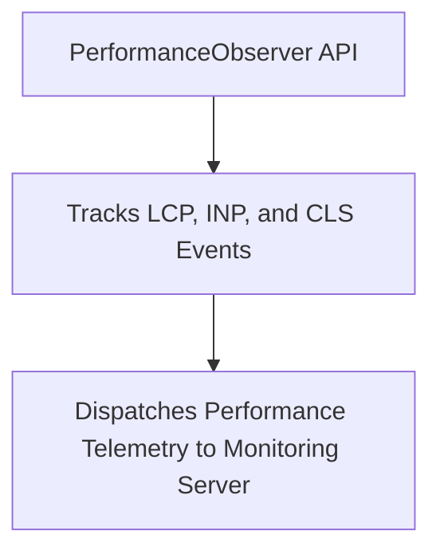

```yaml
schema_version: "2.0"
metadata:
  lesson_id: "JS-MOD11-LES02"
  course_slug: "course-03-javascript"
  course_title: "Course 3: JavaScript & ES6+"
  module_slug: "mod-11-performance-security-optimization"
  module_title: "Module 11 - Browser Performance, Security, & Optimization"
  lesson_slug: "core-web-vitals-and-performance-monitoring"
  lesson_title: "Lesson 11.2 Core Web Vitals & Performance Monitoring"
  sort_order: 1102

pedagogy:
  difficulty: "intermediate"
  estimated_time:
    reading_minutes: 15
    practice_minutes: 20
    quiz_minutes: 10
    total_minutes: 45
  bloom_taxonomy_level: "Apply"
  xp_reward: 50

prerequisites:
  required_lesson_ids:
    - "JS-MOD11-LES01"
  required_skills:
    - "Critical Rendering Path & Event Loop Mechanics"

skills_acquired:
  - "Core Web Vitals Metrics (LCP, INP, CLS)"
  - "Performance API (`performance.mark()`, `performance.measure()`)"
  - "`PerformanceObserver` Real-User Monitoring"
  - "Lazy Loading via `IntersectionObserver`"

dependencies:
  software:
    - "VS Code"
    - "Modern Web Browser"
  hardware: []

seo_and_social:
  meta_title: "Core Web Vitals: LCP, INP, CLS Optimization & Performance API"
  meta_description: "Master Core Web Vitals Optimization: Largest Contentful Paint (LCP), Interaction to Next Paint (INP), Cumulative Layout Shift (CLS), and PerformanceObserver monitoring."
  keywords: ["Core Web Vitals", "LCP", "INP", "CLS", "PerformanceObserver", "IntersectionObserver", "Web Performance"]

assessment_config:
  has_quiz: true
  has_lab: true
  has_flashcards: true
  pass_score_percentage: 80
```

# Lesson 11.2 Core Web Vitals & Performance Monitoring

## 1. Overview & Learning Objectives [id: overview]

- **Estimated Time**: 45 Minutes (15m Reading | 20m Practice | 10m Quiz)
- **Difficulty Level**: ⭐⭐ Intermediate
- **Prerequisites**: [Lesson 11.1 Rendering Path](file:///d:/My%20Drive/all%20files/PROJECT%20FILES/notes/docs/curriculum/_03_javascript/_03_38_critical_rendering_path_and_dom_reflows.md)
- **XP Reward**: +50 XP

### Learning Objectives
By the end of this lesson, you will be able to:
1. Explain Google's 3 **Core Web Vitals**: **LCP**, **INP**, and **CLS**.
2. Measure custom user execution timing using `performance.mark()` and `performance.measure()`.
3. Capture real-user performance telemetry using **`PerformanceObserver`**.
4. Optimize page loading speed using **`IntersectionObserver`** for lazy asset loading.

---

## 2. Environment & Prerequisites [id: prerequisites]

Open Browser DevTools Performance & Lighthouse Panels.

---

## 3. Theoretical Foundations [id: theory]

### 3.1 Google Core Web Vitals Metrics

```
┌─────────────────────────────────────────────────────────────────────────────┐
│                        CORE WEB VITALS BENCHMARK MATRIX                     │
├─────────────────┬───────────────────────────────┬───────────────────────────┤
│ Metric          │ Full Name                     │ Target Threshold          │
├─────────────────┼───────────────────────────────┼───────────────────────────┤
│ **LCP**         │ Largest Contentful Paint      │ $\le 2.5$ Seconds         │
│ **INP**         │ Interaction to Next Paint     │ $\le 200$ Milliseconds    │
│ **CLS**         │ Cumulative Layout Shift       │ $\le 0.1$                 │
└─────────────────┴───────────────────────────────┴───────────────────────────┘
```

- **LCP**: Measures main hero content render speed.
- **INP**: Measures user interaction responsiveness (replaces FID).
- **CLS**: Measures visual layout stability (unexpected content jumps).

---

## 4. Architecture & Diagram Visualizations [id: diagram]



---

## 5. Code & Hardware Implementation [id: syntax]

```javascript
// Performance Measurement & IntersectionObserver Lazy Loading

// 1. Measuring Custom Execution Marks
performance.mark("data-fetch-start");
// ... Async Operation ...
performance.mark("data-fetch-end");
performance.measure("DataFetchTime", "data-fetch-start", "data-fetch-end");

const measure = performance.getEntriesByName("DataFetchTime")[0];
console.log(`Fetch Execution Duration: ${measure.duration.toFixed(2)}ms`);

// 2. Lazy Loading Images via IntersectionObserver
const lazyImageObserver = new IntersectionObserver((entries, observer) => {
  entries.forEach(entry => {
    if (entry.isIntersecting) {
      const img = entry.target;
      img.src = img.dataset.src; // Swap placeholder with real image URL!
      img.classList.remove("lazy");
      observer.unobserve(img);   // Stop observing once loaded
    }
  });
});

document.querySelectorAll("img.lazy").forEach(img => lazyImageObserver.observe(img));
```

---

## 6. Enterprise Real-World Applications [id: examples]

- **SEO & Conversion Optimization**: E-commerce applications monitor and optimize Core Web Vitals to achieve top Google search rankings and prevent user drop-off.

---

## 7. Guided Step-by-Step Hands-On Exercise [id: exercises]

1. Run Lighthouse audit in Chrome DevTools.
2. Inspect LCP, INP, and CLS scores $\to$ Apply `loading="lazy"` on offscreen images!

---

## 8. Common Pitfalls & Troubleshooting [id: common_mistakes]

| Bug / Error | Root Cause | Engineering Solution |
| :--- | :--- | :--- |
| **High Cumulative Layout Shift (CLS)** | Loading images without explicit `width` and `height` CSS/HTML attributes. | Always specify `width` and `height` dimensions on image tags to reserve layout space. |

---

## 9. Best Practices & Optimization [id: best_practices]

- **Always Reserve Image Space**: Prevents unexpected CLS layout shifts during image loading.

---

## 10. Industry Interview Q&A [id: interview_qa]

### Q1: What is Interaction to Next Paint (INP) and how does it differ from FID?
**Answer**: INP measures page responsiveness by tracking the latency of *all* user interactions (clicks, keypresses) throughout the entire page lifecycle, taking the worst-case interaction latency. FID (First Input Delay) only measured the delay of the very first user click on page load.

---

## 11. Self-Assessment Quiz [id: quiz]

```json
{
  "quiz_title": "Lesson 11.2 Core Web Vitals Assessment",
  "questions": [
    {
      "question_id": "Q1",
      "type": "multiple_choice",
      "question_text": "Which Core Web Vital metric measures visual layout stability and unexpected content shifting?",
      "options": ["LCP", "INP", "CLS", "TTFB"],
      "correct_answer_index": 2,
      "explanation": "CLS measures Cumulative Layout Shift."
    }
  ]
}
```

---

## 12. Portfolio Assignment & Challenge [id: lab]

Build a `PerformanceObserver` client sending Web Vitals telemetry to an analytics endpoint.

---

## 13. Spaced Repetition Flashcards [id: flashcards]

**Front**: What target score threshold represents a good Cumulative Layout Shift (CLS)?
**Back**: $\le 0.1$.
<!-- flashcard:end -->

---

## 14. Summary & Cheat Sheet [id: summary]

```javascript
performance.mark("start");
performance.mark("end");
performance.measure("metric", "start", "end");
```
