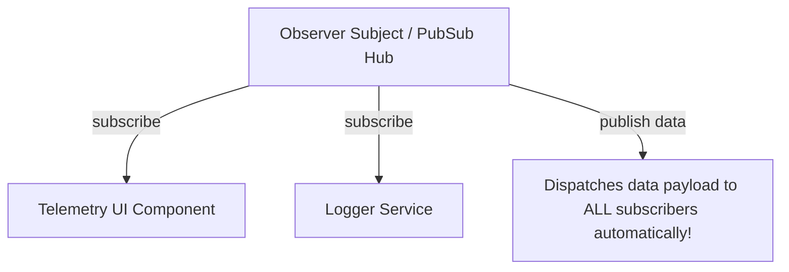

```yaml
schema_version: "2.0"
metadata:
  lesson_id: "JS-MOD12-LES06"
  course_slug: "course-03-javascript"
  course_title: "Course 3: JavaScript & ES6+"
  module_slug: "mod-12-advanced-patterns-testing-capstone"
  module_title: "Module 12 - Advanced Patterns, Meta-Programming, & Testing"
  lesson_slug: "javascript-design-patterns"
  lesson_title: "Lesson 12.6 Design Patterns: Singleton, Factory, & Observer"
  sort_order: 1206

pedagogy:
  difficulty: "advanced"
  estimated_time:
    reading_minutes: 20
    practice_minutes: 25
    quiz_minutes: 10
    total_minutes: 55
  bloom_taxonomy_level: "Apply"
  xp_reward: 70

prerequisites:
  required_lesson_ids:
    - "JS-MOD12-LES05"
  required_skills:
    - "ES6 Classes, Closures, & Event Systems"

skills_acquired:
  - "Singleton Pattern Implementation"
  - "Factory Pattern Object Creation"
  - "Observer & PubSub Event Broadcasting Pattern"
  - "Module & Decorator Structural Architecture"

dependencies:
  software:
    - "VS Code"
    - "Node.js REPL"
  hardware: []

seo_and_social:
  meta_title: "JavaScript Design Patterns: Singleton, Factory, Observer & PubSub"
  meta_description: "Master Software Architecture in JavaScript: Singleton pattern, Factory pattern, Observer/PubSub event broadcasting, and Module patterns."
  keywords: ["JavaScript Design Patterns", "Singleton Pattern", "Factory Pattern", "Observer Pattern", "PubSub", "Software Architecture"]

assessment_config:
  has_quiz: true
  has_lab: true
  has_flashcards: true
  pass_score_percentage: 80
```

# Lesson 12.6 Design Patterns: Singleton, Factory, & Observer

## 1. Overview & Learning Objectives [id: overview]

- **Estimated Time**: 55 Minutes (20m Reading | 25m Practice | 10m Quiz)
- **Difficulty Level**: ⭐⭐⭐ Advanced
- **Prerequisites**: [Lesson 12.5 Playwright E2E Testing](file:///d:/My%20Drive/all%20files/PROJECT%20FILES/notes/docs/curriculum/_03_javascript/_03_46_e2e_testing_with_playwright.md)
- **XP Reward**: +70 XP

### Learning Objectives
By the end of this lesson, you will be able to:
1. Guarantee single global object instances using the **Singleton Pattern**.
2. Encapsulate complex object instantiation using the **Factory Pattern**.
3. Implement decoupled event broadcasting via the **Observer / PubSub Pattern**.
4. Apply structural Module patterns for enterprise codebase maintainability.

---

## 2. Environment & Prerequisites [id: prerequisites]

Open Node.js REPL.

---

## 3. Theoretical Foundations [id: theory]

### 3.1 Design Patterns Categories

```
┌─────────────────────────────────────────────────────────────────────────────┐
│                       CORE JAVASCRIPT DESIGN PATTERNS                       │
├─────────────────┬─────────────────┬─────────────────────────────────────────┤
│ Category        │ Pattern Name    │ Enterprise Purpose                      │
├─────────────────┼─────────────────┼─────────────────────────────────────────┤
│ Creational      │ **Singleton**   │ Restricts class to 1 global instance    │
│ Creational      │ **Factory**     │ Abstracts complex subclass creation     │
│ Behavioral      │ **Observer**    │ Notifies multiple subscribers on change │
└─────────────────┴─────────────────┴─────────────────────────────────────────┘
```

---

## 4. Architecture & Diagram Visualizations [id: diagram]



---

## 5. Code & Hardware Implementation [id: syntax]

```javascript
// Singleton & Observer Pattern Implementation

// 1. Singleton Database Pool
class DatabaseConnection {
  static #instance = null;

  constructor() {
    if (DatabaseConnection.#instance) {
      return DatabaseConnection.#instance;
    }
    this.connectionId = `CONN-${Math.random()}`;
    DatabaseConnection.#instance = this;
  }
}

const db1 = new DatabaseConnection();
const db2 = new DatabaseConnection();
console.log("Singleton Equality:", db1 === db2); // true (Exact same memory instance!)

// 2. Observer (PubSub) Pattern Hub
class EventEmitter {
  #events = new Map();

  subscribe(event, listener) {
    if (!this.#events.has(event)) {
      this.#events.set(event, new Set());
    }
    this.#events.get(event).add(listener);
    return () => this.#events.get(event).delete(listener); // Unsubscribe function
  }

  publish(event, payload) {
    if (this.#events.has(event)) {
      this.#events.get(event).forEach(listener => listener(payload));
    }
  }
}

const hub = new EventEmitter();
const unsubscribe = hub.subscribe("telemetry", data => console.log("Sub 1 Received:", data));

hub.publish("telemetry", { temp: 24.5 }); // Sub 1 Received: { temp: 24.5 }
unsubscribe(); // Cleanup subscription
```

---

## 6. Enterprise Real-World Applications [id: examples]

- **Redux & Event-Driven Microservices**: Redux global store store dispatchers and Event Emitters use the Observer pattern to synchronize UI components when centralized state updates.

---

## 7. Guided Step-by-Step Hands-On Exercise [id: exercises]

1. Save code as `patterns_demo.js`.
2. Run `node patterns_demo.js` $\to$ Inspect Singleton equality and PubSub event broadcasting!

---

## 8. Common Pitfalls & Troubleshooting [id: common_mistakes]

| Bug / Error | Root Cause | Engineering Solution |
| :--- | :--- | :--- |
| **PubSub Memory Leaks** | Subscribing components without invoking `unsubscribe()` callbacks on component unmount. | Return and call an explicit `unsubscribe()` function on teardown. |

---

## 9. Best Practices & Optimization [id: best_practices]

- **Use ES Modules as Natural Singletons**: Importing an ES module (`import config from './config.js'`) executes the module script once and caches the single instance automatically.

---

## 10. Industry Interview Q&A [id: interview_qa]

### Q1: What is the main difference between the Observer Pattern and the Publisher-Subscriber (PubSub) Pattern?
**Answer**: In the Observer pattern, the Subject maintains a direct reference list of its Observers and calls them directly. In the PubSub pattern, a separate Event Broker/Hub sits between Publishers and Subscribers—Publishers and Subscribers have zero direct knowledge of each other, providing full decoupling.

---

## 11. Self-Assessment Quiz [id: quiz]

```json
{
  "quiz_title": "Lesson 12.6 Design Patterns Assessment",
  "questions": [
    {
      "question_id": "Q1",
      "type": "multiple_choice",
      "question_text": "Which design pattern restricts a class from having more than one global instance?",
      "options": ["Factory", "Singleton", "Observer", "Decorator"],
      "correct_answer_index": 1,
      "explanation": "The Singleton pattern guarantees a single instance."
    }
  ]
}
```

---

## 12. Portfolio Assignment & Challenge [id: lab]

Build a custom PubSub event hub supporting event wildcard matching (`*`).

---

## 13. Spaced Repetition Flashcards [id: flashcards]

**Front**: Are ES Modules singletons by default in JavaScript?
**Back**: Yes. V8 evaluates module code once on initial import and caches the single exported instance.
<!-- flashcard:end -->

---

## 14. Summary & Cheat Sheet [id: summary]

```javascript
class Hub {
  sub(evt, fn) { /* ... */ }
  pub(evt, val) { /* ... */ }
}
```
