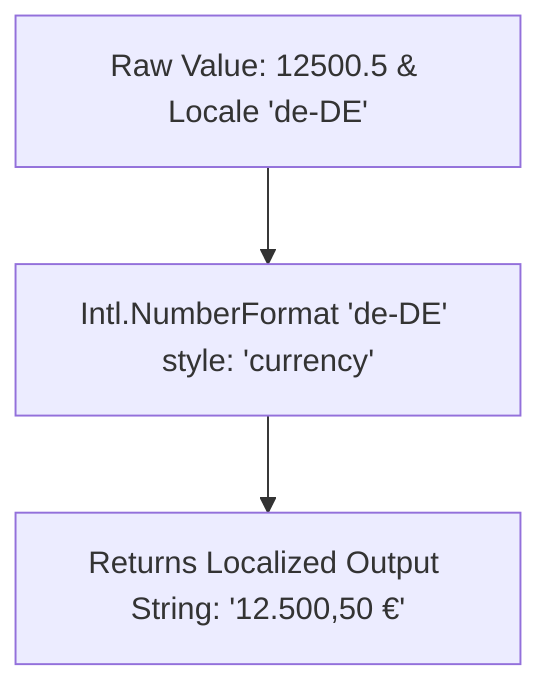

```yaml
schema_version: "2.0"
metadata:
  lesson_id: "JS-MOD12-LES07"
  course_slug: "course-03-javascript"
  course_title: "Course 3: JavaScript & ES6+"
  module_slug: "mod-12-advanced-patterns-testing-capstone"
  module_title: "Module 12 - Advanced Patterns, Meta-Programming, & Testing"
  lesson_slug: "internationalization-intl-api"
  lesson_title: "Lesson 12.7 Internationalization (Intl API)"
  sort_order: 1207

pedagogy:
  difficulty: "beginner"
  estimated_time:
    reading_minutes: 15
    practice_minutes: 20
    quiz_minutes: 10
    total_minutes: 45
  bloom_taxonomy_level: "Apply"
  xp_reward: 50

prerequisites:
  required_lesson_ids:
    - "JS-MOD12-LES06"
  required_skills:
    - "JavaScript Strings & Numbers"

skills_acquired:
  - "Locale Number & Currency Formatting (`Intl.NumberFormat`)"
  - "Locale Date & Time Formatting (`Intl.DateTimeFormat`)"
  - "Relative Time Formatting (`Intl.RelativeTimeFormat`)"
  - "Locale String Collator Sorting (`Intl.Collator`)"

dependencies:
  software:
    - "VS Code"
    - "Node.js REPL"
  hardware: []

seo_and_social:
  meta_title: "JavaScript Intl API: NumberFormat, DateTimeFormat & RelativeTimeFormat"
  meta_description: "Master JavaScript Internationalization: Intl.NumberFormat currency/unit formatting, Intl.DateTimeFormat dates, Intl.RelativeTimeFormat, and Intl.Collator."
  keywords: ["Intl API", "JavaScript i18n", "Intl.NumberFormat", "Intl.DateTimeFormat", "Intl.RelativeTimeFormat", "Locale Formatting"]

assessment_config:
  has_quiz: true
  has_lab: true
  has_flashcards: true
  pass_score_percentage: 80
```

# Lesson 12.7 Internationalization (Intl API)

## 1. Overview & Learning Objectives [id: overview]

- **Estimated Time**: 45 Minutes (15m Reading | 20m Practice | 10m Quiz)
- **Difficulty Level**: ⭐ Beginner
- **Prerequisites**: [Lesson 12.6 Design Patterns](file:///d:/My%20Drive/all%20files/PROJECT%20FILES/notes/docs/curriculum/_03_javascript/_03_47_javascript_design_patterns.md)
- **XP Reward**: +50 XP

### Learning Objectives
By the end of this lesson, you will be able to:
1. Format numbers, percentages, and currencies using **`Intl.NumberFormat`**.
2. Format dates and times according to global locales using **`Intl.DateTimeFormat`**.
3. Display human-readable relative time phrases ("2 hours ago") using **`Intl.RelativeTimeFormat`**.
4. Perform locale-aware string sorting using **`Intl.Collator`**.

---

## 2. Environment & Prerequisites [id: prerequisites]

Open Node.js REPL.

---

## 3. Theoretical Foundations [id: theory]

### 3.1 The Native ECMAScript `Intl` API
Before the `Intl` API, developers relied on heavy third-party libraries (like Moment.js) for locale-aware formatting. The native `Intl` namespace provides high-performance, zero-dependency internationalization built directly into V8.

```
┌─────────────────────────────────────────────────────────────────────────────┐
│                          INTL API FORMATTING MATRIX                         │
├─────────────────────────┬───────────────────────────────────────────────────┤
│ API Class               │ Primary Purpose                                   │
├─────────────────────────┼───────────────────────────────────────────────────┤
│ `Intl.NumberFormat`     │ Formats numbers, currencies ($24.50, €24,50), % │
│ `Intl.DateTimeFormat`   │ Formats localized timestamps & calendars          │
│ `Intl.RelativeTimeFormat`│ Formats relative time ("3 days ago", "in 5 min") │
│ `Intl.Collator`         │ Performs locale-aware string sorting & comparisons │
└─────────────────────────┴───────────────────────────────────────────────────┘
```

---

## 4. Architecture & Diagram Visualizations [id: diagram]



---

## 5. Code & Hardware Implementation [id: syntax]

```javascript
// Internationalization (Intl API) Demonstration

// 1. Currency & Number Formatting
const usCurrency = new Intl.NumberFormat("en-US", { style: "currency", currency: "USD" });
const deCurrency = new Intl.NumberFormat("de-DE", { style: "currency", currency: "EUR" });

console.log("US Format:", usCurrency.format(1250.5)); // "$1,250.50"
console.log("DE Format:", deCurrency.format(1250.5)); // "1.250,50 €"

// 2. Relative Time Formatting ("x time ago")
const rtf = new Intl.RelativeTimeFormat("en", { numeric: "auto" });
console.log(rtf.format(-1, "day"));   // "yesterday"
console.log(rtf.format(-2, "hour"));  // "2 hours ago"
console.log(rtf.format(3, "month"));  // "in 3 months"

// 3. Locale-Aware String Collator Sorting
const words = ["ä", "z", "a"];
const germanCollator = new Intl.Collator("de-DE");
console.log("German Sorted:", words.sort(germanCollator.compare)); // ['a', 'ä', 'z']
```

---

## 6. Enterprise Real-World Applications [id: examples]

- **Global Enterprise Dashboards**: SaaS applications detect user browser locales (`navigator.language`) to automatically format revenue metrics and activity timestamps into local conventions.

---

## 7. Guided Step-by-Step Hands-On Exercise [id: exercises]

1. Save code as `intl_demo.js`.
2. Run `node intl_demo.js` $\to$ Inspect localized currency and relative time outputs!

---

## 8. Common Pitfalls & Troubleshooting [id: common_mistakes]

| Bug / Error | Root Cause | Engineering Solution |
| :--- | :--- | :--- |
| **Incorrect Alphabetical Sorting** | Using `.sort()` directly on non-English strings containing accents (`ä`, `é`). | Pass an `Intl.Collator('locale').compare` function to `.sort()`. |

---

## 9. Best Practices & Optimization [id: best_practices]

- **Reuse `Intl` Formatter Instances**: Construct `new Intl.NumberFormat()` once and reuse it across loops for optimal V8 performance.

---

## 10. Industry Interview Q&A [id: interview_qa]

### Q1: What are the performance advantages of using the native `Intl` API over external libraries like Moment.js?
**Answer**: The native `Intl` API is built into the V8 C++ engine, requiring 0 KB of additional bundle download size and executing up to 10x faster than JavaScript-based formatting libraries.

---

## 11. Self-Assessment Quiz [id: quiz]

```json
{
  "quiz_title": "Lesson 12.7 Intl API Assessment",
  "questions": [
    {
      "question_id": "Q1",
      "type": "multiple_choice",
      "question_text": "Which `Intl` class formats relative time strings like '2 hours ago'?",
      "options": ["Intl.NumberFormat", "Intl.DateTimeFormat", "Intl.RelativeTimeFormat", "Intl.Collator"],
      "correct_answer_index": 2,
      "explanation": "Intl.RelativeTimeFormat formats relative time strings."
    }
  ]
}
```

---

## 12. Portfolio Assignment & Challenge [id: lab]

Build a multi-currency price converter utility using `Intl.NumberFormat`.

---

## 13. Spaced Repetition Flashcards [id: flashcards]

**Front**: What property reads the user's default browser locale language code in JS?
**Back**: `navigator.language` (e.g. `'en-US'`).
<!-- flashcard:end -->

---

## 14. Summary & Cheat Sheet [id: summary]

```javascript
const fmt = new Intl.NumberFormat("en-US", { style: "currency", currency: "USD" });
console.log(fmt.format(100));
```
