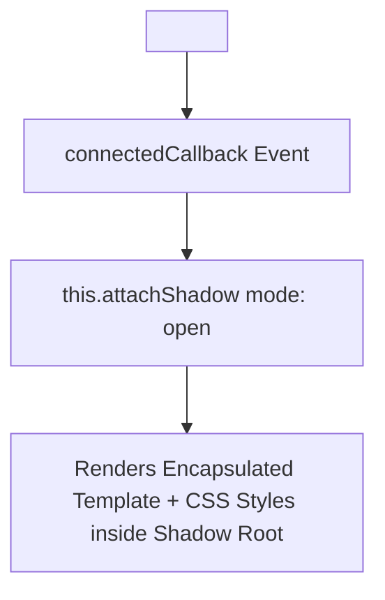

```yaml
schema_version: "2.0"
metadata:
  lesson_id: "JS-MOD12-LES08"
  course_slug: "course-03-javascript"
  course_title: "Course 3: JavaScript & ES6+"
  module_slug: "mod-12-advanced-patterns-testing-capstone"
  module_title: "Module 12 - Advanced Patterns, Meta-Programming, & Testing"
  lesson_slug: "web-components-and-shadow-dom"
  lesson_title: "Lesson 12.8 Web Components & Shadow DOM"
  sort_order: 1208

pedagogy:
  difficulty: "advanced"
  estimated_time:
    reading_minutes: 20
    practice_minutes: 25
    quiz_minutes: 10
    total_minutes: 55
  bloom_taxonomy_level: "Apply"
  xp_reward: 70

prerequisites:
  required_lesson_ids:
    - "JS-MOD12-LES07"
  required_skills:
    - "ES6 Classes & DOM Tree Manipulation"

skills_acquired:
  - "Custom Elements API Registration (`customElements.define()`)"
  - "Component Lifecycle Callbacks (`connectedCallback`, `disconnectedCallback`)"
  - "Shadow DOM Encapsulation (`attachShadow({ mode: 'open' })`)"
  - "HTML Templates (`<template>`) & Transclusion Slots (`<slot>`)"

dependencies:
  software:
    - "VS Code"
    - "Modern Web Browser"
  hardware: []

seo_and_social:
  meta_title: "Web Components: Custom Elements, Shadow DOM Encapsulation & Slots"
  meta_description: "Master Native Web Components: Custom Elements API, connectedCallback lifecycle, Shadow DOM style encapsulation, <template> and <slot> transclusion."
  keywords: ["Web Components", "Custom Elements", "Shadow DOM", "connectedCallback", "HTML Template", "Slot", "Encapsulated CSS"]

assessment_config:
  has_quiz: true
  has_lab: true
  has_flashcards: true
  pass_score_percentage: 80
```

# Lesson 12.8 Web Components & Shadow DOM

## 1. Overview & Learning Objectives [id: overview]

- **Estimated Time**: 55 Minutes (20m Reading | 25m Practice | 10m Quiz)
- **Difficulty Level**: ⭐⭐⭐ Advanced
- **Prerequisites**: [Lesson 12.7 Intl API](file:///d:/My%20Drive/all%20files/PROJECT%20FILES/notes/docs/curriculum/_03_javascript/_03_48_internationalization_intl_api.md)
- **XP Reward**: +70 XP

### Learning Objectives
By the end of this lesson, you will be able to:
1. Define framework-agnostic HTML tags using the **Custom Elements API** (`customElements.define()`).
2. Manage component lifecycles (`connectedCallback`, `disconnectedCallback`, `attributeChangedCallback`).
3. Enforce true DOM and CSS style encapsulation using **Shadow DOM**.
4. Project child content dynamically using **`<template>`** tags and **`<slot>`** transclusion.

---

## 2. Environment & Prerequisites [id: prerequisites]

Open Browser DevTools Console & Inspector.

---

## 3. Theoretical Foundations [id: theory]

### 3.1 The 4 Web Components Technologies
Web Components allow developers to create reusable, framework-agnostic custom HTML elements with true style encapsulation:

1. **Custom Elements**: Defines custom HTML tags (e.g. `<sensor-card>`). Must contain a hyphen `-`!
2. **Shadow DOM**: Attaches a private, isolated DOM tree to an element that prevents outer CSS styles from bleeding in or out.
3. **HTML Templates (`<template>`)**: Holds inert HTML markup that is not rendered until instantiated.
4. **Slots (`<slot>`)**: Placeholder insertion points for user-provided child markup inside a Shadow DOM.

```
┌─────────────────────────────────────────────────────────────────────────────┐
│                          SHADOW DOM ENCAPSULATION                           │
├─────────────────────────────────────────────────────────────────────────────┤
│ Outer Document CSS ──► [ Shadow Boundary: STYLES BLOCKED! ] ──► Shadow Root │
└─────────────────────────────────────────────────────────────────────────────┘
```

---

## 4. Architecture & Diagram Visualizations [id: diagram]



---

## 5. Code & Hardware Implementation [id: syntax]

```javascript
// Native Web Component Implementation

class TelemetryCard extends HTMLElement {
  constructor() {
    super();
    // 1. Attach Isolated Shadow Root
    this.attachShadow({ mode: "open" });
  }

  // Lifecycle: Fired when element is inserted into DOM document
  connectedCallback() {
    const nodeId = this.getAttribute("node-id") || "UNKNOWN";
    
    // Encapsulated Styles & HTML Markup
    this.shadowRoot.innerHTML = `
      <style>
        :host { display: block; font-family: sans-serif; margin: 10px; }
        .card { border: 1px solid #3b82f6; padding: 16px; borderRadius: 8px; background: #1e293b; color: white; }
        h4 { margin: 0 0 8px 0; color: #60a5fa; }
      </style>
      <div class="card">
        <h4>Node: ${nodeId}</h4>
        <slot name="metric">Default Metric Placeholder</slot>
      </div>
    `;
  }
}

// 2. Register Custom Element (Tag name MUST contain a hyphen!)
customElements.define("telemetry-card", TelemetryCard);
```

### Usage in HTML:

```html
<telemetry-card node-id="ESP32-A1">
  <span slot="metric">Temp: 24.5°C</span>
</telemetry-card>
```

---

## 6. Enterprise Real-World Applications [id: examples]

- **Cross-Framework Enterprise UI Libraries**: Micro-frontend architectures build core design systems as Web Components, allowing React, Vue, and Angular applications to share identical UI buttons and modals.

---

## 7. Guided Step-by-Step Hands-On Exercise [id: exercises]

1. Save code inside an HTML file.
2. Open in browser $\to$ Inspect element under DevTools Inspector to observe the `#shadow-root (open)` boundary!

---

## 8. Common Pitfalls & Troubleshooting [id: common_mistakes]

| Bug / Error | Root Cause | Engineering Solution |
| :--- | :--- | :--- |
| **`DOMException: Registration failed for 'tag'`** | Defining a custom element tag without a hyphen (e.g. `<card>` instead of `<sensor-card>`). | Custom Element tag names MUST contain at least one hyphen `-` to avoid collision with standard HTML tags. |

---

## 9. Best Practices & Optimization [id: best_practices]

- **Enforce Hyphenated Tags**: Always include a hyphen in custom tag names (`<telemetry-card>`).

---

## 10. Industry Interview Q&A [id: interview_qa]

### Q1: Why must Custom Element tag names contain a hyphen (`-`)?
**Answer**: HTML specifications enforce hyphens in custom element tag names (`<my-element>`) to guarantee namespace separation between user-defined components and future official HTML elements added to the HTML specification.

---

## 11. Self-Assessment Quiz [id: quiz]

```json
{
  "quiz_title": "Lesson 12.8 Web Components Assessment",
  "questions": [
    {
      "question_id": "Q1",
      "type": "multiple_choice",
      "question_text": "Which lifecycle callback fires when a Custom Element is attached to the document DOM?",
      "options": ["createdCallback()", "connectedCallback()", "mounted()", "attributeChangedCallback()"],
      "correct_answer_index": 1,
      "explanation": "connectedCallback() fires when an element is inserted into the DOM."
    }
  ]
}
```

---

## 12. Portfolio Assignment & Challenge [id: lab]

Build a framework-agnostic `<status-badge>` Web Component with Shadow DOM styling.

---

## 13. Spaced Repetition Flashcards [id: flashcards]

**Front**: What method attaches a Shadow Root to a Web Component instance?
**Back**: `this.attachShadow({ mode: 'open' })`.
<!-- flashcard:end -->

---

## 14. Summary & Cheat Sheet [id: summary]

```javascript
class MyEl extends HTMLElement {
  connectedCallback() {
    this.attachShadow({ mode: "open" }).innerHTML = `<slot></slot>`;
  }
}
customElements.define("my-el", MyEl);
```
