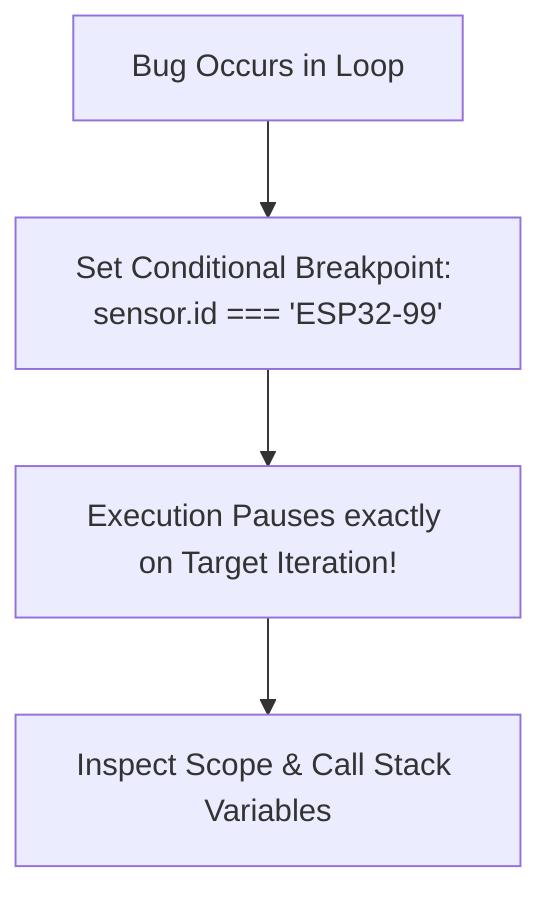

```yaml
schema_version: "2.0"
metadata:
  lesson_id: "JS-MOD12-LES10"
  course_slug: "course-03-javascript"
  course_title: "Course 3: JavaScript & ES6+"
  module_slug: "mod-12-advanced-patterns-testing-capstone"
  module_title: "Module 12 - Advanced Patterns, Meta-Programming, & Testing"
  lesson_slug: "advanced-debugging-chrome-devtools"
  lesson_title: "Lesson 12.10 Debugging Techniques & Chrome DevTools"
  sort_order: 1210

pedagogy:
  difficulty: "intermediate"
  estimated_time:
    reading_minutes: 15
    practice_minutes: 20
    quiz_minutes: 10
    total_minutes: 45
  bloom_taxonomy_level: "Apply"
  xp_reward: 50

prerequisites:
  required_lesson_ids:
    - "JS-MOD12-LES09"
  required_skills:
    - "JavaScript Execution Context & DevTools Basics"

skills_acquired:
  - "Conditional Breakpoints & Non-Intrusive Logpoints"
  - "Call Stack Navigation & Local Scope Inspection"
  - "Async Stack Traces Debugging"
  - "Advanced Console API (`console.table`, `console.time`, `console.group`)"

dependencies:
  software:
    - "VS Code"
    - "Modern Web Browser"
  hardware: []

seo_and_social:
  meta_title: "Advanced JavaScript Debugging: Chrome DevTools, Breakpoints & console.table"
  meta_description: "Master Advanced JavaScript Debugging: Conditional Breakpoints, Logpoints, Call Stack inspection, Async Stack Traces, console.table, and console.time profiling."
  keywords: ["JavaScript Debugging", "Chrome DevTools", "Conditional Breakpoints", "Logpoints", "Call Stack", "console.table", "console.time"]

assessment_config:
  has_quiz: true
  has_lab: true
  has_flashcards: true
  pass_score_percentage: 80
```

# Lesson 12.10 Debugging Techniques & Chrome DevTools

## 1. Overview & Learning Objectives [id: overview]

- **Estimated Time**: 45 Minutes (15m Reading | 20m Practice | 10m Quiz)
- **Difficulty Level**: ⭐⭐ Intermediate
- **Prerequisites**: [Lesson 12.9 WebAssembly](file:///d:/My%20Drive/all%20files/PROJECT%20FILES/notes/docs/curriculum/_03_javascript/_03_50_webassembly_integration_basics.md)
- **XP Reward**: +50 XP

### Learning Objectives
By the end of this lesson, you will be able to:
1. Set **Conditional Breakpoints** and non-intrusive **Logpoints** inside Chrome DevTools.
2. Inspect variable bindings across stack frames in the **Call Stack** panel.
3. Debug asynchronous Promise chains using **Async Stack Traces**.
4. Format structured data using advanced Console API features (`console.table()`, `console.time()`, `console.group()`).

---

## 2. Environment & Prerequisites [id: prerequisites]

Open Browser DevTools Sources & Console Panels.

---

## 3. Theoretical Foundations [id: theory]

### 3.1 Advanced Breakpoint Types
Replacing `console.log()` with native DevTools breakpoints dramatically speeds up root-cause debugging:

- **Conditional Breakpoints**: Pauses execution ONLY when an expression evaluates to `true` (e.g. `temp > 100`).
- **Logpoints**: Logs a message to Console without pausing execution or editing source code files.
- **XHR/Fetch Breakpoints**: Pauses execution whenever a fetch URL contains a target substring.

---

## 4. Architecture & Diagram Visualizations [id: diagram]



---

## 5. Code & Hardware Implementation [id: syntax]

```javascript
// Advanced Console API & Debugging Utilities

const telemetryBatch = [
  { id: "S1", temp: 22.4, status: "OK" },
  { id: "S2", temp: 88.9, status: "WARNING" },
  { id: "S3", temp: 19.1, status: "OK" }
];

// 1. Tabular Formatting for Array of Objects
console.table(telemetryBatch);

// 2. Performance Execution Profiling
console.time("HeavyCalculationTimer");
let sum = 0;
for (let i = 0; i < 1000000; i++) sum += i;
console.timeEnd("HeavyCalculationTimer"); // Output: HeavyCalculationTimer: X.XXms

// 3. Collapsible Console Grouping
console.group("Sensor Diagnostics");
console.log("Active Nodes:", 3);
console.log("Gateway Status: ONLINE");
console.groupEnd();

// 4. Programmatic Breakpoint Trigger
function processTelemetry(sensor) {
  if (sensor.temp > 80.0) {
    debugger; // Triggers DevTools Pause if DevTools is Open!
  }
}

processTelemetry(telemetryBatch[1]);
```

---

## 6. Enterprise Real-World Applications [id: examples]

- **Production Diagnostics**: Senior engineers use Logpoints and Async Stack Traces in Chrome DevTools to trace unhandled rejection bugs without modifying or re-deploying production build files.

---

## 7. Guided Step-by-Step Hands-On Exercise [id: exercises]

1. Open DevTools Sources tab on any site.
2. Right-click line number $\to$ Add Logpoint `console.log('Current value:', x)` $\to$ Observe non-intrusive console logs!

---

## 8. Common Pitfalls & Troubleshooting [id: common_mistakes]

| Bug / Error | Root Cause | Engineering Solution |
| :--- | :--- | :--- |
| **`debugger` Statement Ignored** | Running code with Chrome DevTools closed. | Ensure DevTools panel (`F12`) is open when executing `debugger` statements. |

---

## 9. Best Practices & Optimization [id: best_practices]

- **Use `console.table()`**: Converts arrays of objects into readable sorted tables in the console.

---

## 10. Industry Interview Q&A [id: interview_qa]

### Q1: What is a Logpoint in Chrome DevTools and how does it differ from a standard Breakpoint?
**Answer**: A Logpoint logs a user-defined expression or variable to the Console whenever execution reaches that line of code *without* pausing execution. Unlike standard breakpoints or code edits, Logpoints require zero source file modifications and zero server reloads.

---

## 11. Self-Assessment Quiz [id: quiz]

```json
{
  "quiz_title": "Lesson 12.10 Debugging Assessment",
  "questions": [
    {
      "question_id": "Q1",
      "type": "multiple_choice",
      "question_text": "Which Console API method displays an array of objects as an interactive, sortable table?",
      "options": ["console.log()", "console.table()", "console.dir()", "console.group()"],
      "correct_answer_index": 1,
      "explanation": "console.table() renders structured data as an interactive table."
    }
  ]
}
```

---

## 12. Portfolio Assignment & Challenge [id: lab]

Profile execution timing of 3 sorting algorithms using `console.time()`.

---

## 13. Spaced Repetition Flashcards [id: flashcards]

**Front**: What JS statement programmatically triggers a DevTools breakpoint pause?
**Back**: `debugger;`.
<!-- flashcard:end -->

---

## 14. Summary & Cheat Sheet [id: summary]

```javascript
console.table(data);
console.time("timer");
console.timeEnd("timer");
```
