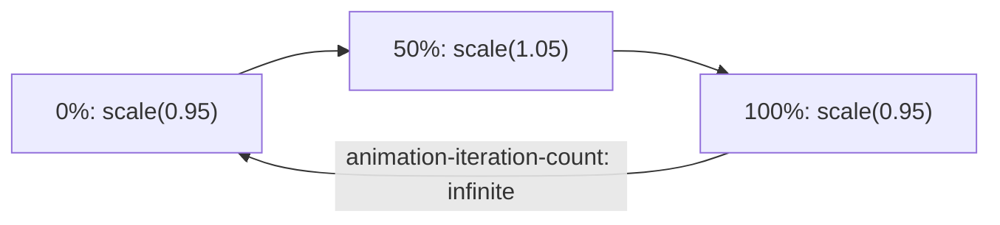

# Keyframe Animations

> **Course**: Git Fundamentals | **Module**: Introduction | **Difficulty**: beginner

---

- **Estimated Time**: 55 Minutes (20m Reading | 25m Practice | 10m Quiz)
- **Difficulty Level**: ⭐⭐⭐ Advanced
- **Prerequisites**: [Lesson 5.2 2D & 3D Transformations](file:///d:/My%20Drive/all%20files/PROJECT%20FILES/notes/docs/curriculum/_02_css3/_02_15_2d_and_3d_transformations.md)
- **XP Reward**: +70 XP

### Learning Objectives
By the end of this lesson, you will be able to:
1. Define complex multi-step animation sequences using `@keyframes`.
2. Configure animation properties (`animation-name`, `duration`, `timing-function`, `delay`, `iteration-count`, `direction`, `fill-mode`, `play-state`).
3. Lock end states after animation completion using `animation-fill-mode: forwards`.
4. Pause and resume animations dynamically using `animation-play-state: paused`.
5. Implement modern **Scroll-Driven Animations** using `animation-timeline: scroll()`.

---

---

Open VS Code and create `keyframes_demo.html` to write keyframe animations.

---

---

### 3.1 `@keyframes` Syntax & Shorthand
Unlike Transitions (which require state triggers like `:hover`), Keyframe Animations run automatically on page load or class addition:

```css
@keyframes pulse-ring {
  0%   { transform: scale(0.95); opacity: 0.8; }
  50%  { transform: scale(1.05); opacity: 1; }
  100% { transform: scale(0.95); opacity: 0.8; }
}

/* Shorthand: name | duration | timing | delay | iterations | direction | fill-mode */
.status-indicator {
  animation: pulse-ring 2s infinite ease-in-out;
}
```

### 3.2 `animation-fill-mode`
- `none`: Element resets to original un-animated state after animation ends.
- `forwards`: Element retains final keyframe state (`100%`) after completion.
- `backwards`: Element applies initial keyframe state (`0%`) during `animation-delay`.
- `both`: Applies both `backwards` delay styles and `forwards` end styles!

---

---



---

---

```html
<!DOCTYPE html>
<html lang="en">
<head>
  <meta charset="UTF-8">
  <title>Keyframe Animations</title>
  <style>
    body { font-family: system-ui; padding: 4rem; background: #0f172a; color: #fff; }
    
    @keyframes pulse {
      0% { transform: scale(1); box-shadow: 0 0 0 0 rgba(34, 197, 94, 0.7); }
      70% { transform: scale(1.05); box-shadow: 0 0 0 10px rgba(34, 197, 94, 0); }
      100% { transform: scale(1); box-shadow: 0 0 0 0 rgba(34, 197, 94, 0); }
    }
    
    .status-badge {
      display: inline-block; padding: 8px 16px; background: #22c55e;
      color: #000; font-weight: bold; border-radius: 999px;
      animation: pulse 2s infinite ease-in-out;
    }
  </style>
</head>
<body>
  <div class="status-badge">ESP32 GATEWAY ONLINE</div>
</body>
</html>
```

---

---

- **Live Status Radar Bullets & Loading Spinners**: Telemetry dashboards use infinite keyframe animations for real-time connection status indicators and loading skeletons.

---

---

1. Save code as `keyframes_demo.html`.
2. Open in Chrome $\rightarrow$ Observe continuous live green pulsing radar status badge!

---

---

| Bug / Error | Root Cause | Engineering Solution |
| :--- | :--- | :--- |
| **Animation Resets to Initial State** | Missing `animation-fill-mode: forwards`. | Add `animation-fill-mode: forwards;` to retain end state. |

---

---

- **Use `animation-fill-mode: forwards`**: Retains final animation state cleanly.

---

---

### Q1: What does `animation-fill-mode: forwards` do?
**Answer**: It forces the element to retain the computed property values established by the final keyframe (`100%` or `to`) after the animation completes.

---

---

```json
{
  "quiz_title": "Lesson 5.3 Keyframes Assessment",
  "questions": [
    {
      "question_id": "Q1",
      "type": "multiple_choice",
      "question_text": "Which property value keeps an element locked at its final 100% keyframe state when an animation ends?",
      "options": ["animation-fill-mode: forwards", "animation-fill-mode: backwards", "animation-iteration-count: 1", "animation-play-state: paused"],
      "correct_answer_index": 0,
      "explanation": "forwards causes the element to retain final keyframe properties."
    }
  ]
}
```

---

---

Build a multi-stage radar sweep animation for IoT device discovery.

---

---

**Front**: What property pauses a running CSS keyframe animation?
**Back**: `animation-play-state: paused;`
<!-- flashcard:end -->

---

---

```css
@keyframes pulse { 0% { opacity: 0; } 100% { opacity: 1; } }
.badge { animation: pulse 1s forwards; }
```

---
