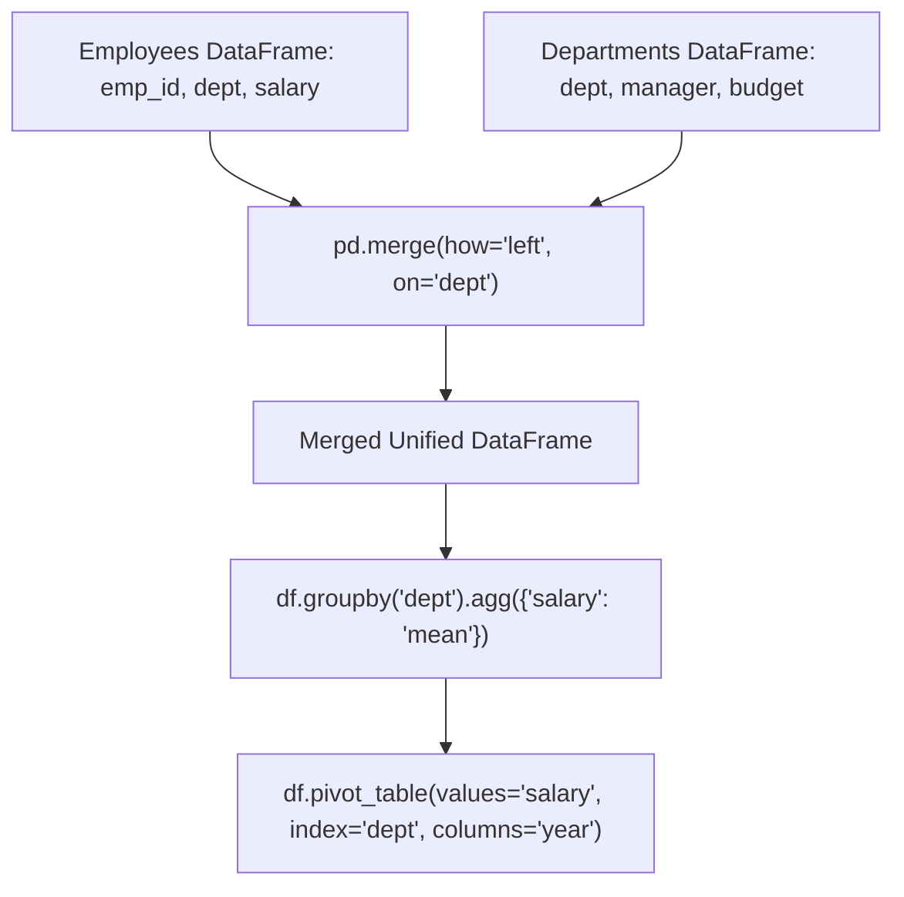

# Pandas Groupby Pivoting And Merging

> **Course**: Git Fundamentals | **Module**: Introduction | **Difficulty**: beginner

---

- **Estimated Time**: 55 Minutes (20m Reading | 25m Practice | 10m Quiz)
- **Difficulty Level**: ⭐⭐ Intermediate
- **Prerequisites**: [Lesson 2.2 Advanced Indexing](file:///d:/My%20Drive/all%20files/PROJECT%20FILES/notes/docs/curriculum/_09_python_data_science/_09_04_pandas_indexing_filtering_and_imputation.md)
- **XP Reward**: +60 XP

### Learning Objectives
By the end of this lesson, you will be able to:
1. Implement the **Split-Apply-Combine** pattern using `groupby()`, `agg()`, and `transform()`.
2. Construct dynamic multidimensional summary matrices using **`df.pivot_table()`**.
3. Combine datasets using SQL-style relational joins via **`pd.merge()`** (inner, left, outer, right).
4. Stack DataFrames along row or column axes using **`pd.concat()`**.

---

---

Open Python REPL or VS Code.

---

---

### 3.1 The Split-Apply-Combine Pattern
Data analysis frequently requires segmenting a dataset into distinct groups, applying an aggregation or transformation function to each segment, and combining the results into a unified summary DataFrame.

```
┌─────────────────────────────────────────────────────────────────────────────┐
│                    SPLIT-APPLY-COMBINE GROUPBY WORKFLOW                     │
├─────────────────────────────────────────────────────────────────────────────┤
│ 1. SPLIT   ──► Group rows by key (`df.groupby('department')`)               │
│ 2. APPLY   ──► Compute aggregate metrics (`agg({'salary': ['mean', 'max']})`)│
│ 3. COMBINE ──► Reassemble group metrics into a clean summary DataFrame      │
└─────────────────────────────────────────────────────────────────────────────┘
```

---

---



---

---

```python
# Pandas GroupBy, Pivoting, & Relational Merges (pandas_aggregations.py)
import pandas as pd
import numpy as np

# 1. Primary Datasets
emp_data = {
    "emp_id": [101, 102, 103, 104, 105, 106],
    "name": ["Alice", "Bob", "Charlie", "David", "Eve", "Frank"],
    "dept_id": ["D1", "D2", "D1", "D3", "D2", "D1"],
    "salary": [95000, 62000, 115000, 88000, 64000, 120000],
    "hire_year": [2021, 2022, 2020, 2021, 2022, 2020]
}

dept_data = {
    "dept_id": ["D1", "D2", "D3", "D4"],
    "dept_name": ["Engineering", "Marketing", "Finance", "Human Resources"],
    "budget": [1500000, 600000, 900000, 400000]
}

df_emp = pd.DataFrame(emp_data)
df_dept = pd.DataFrame(dept_data)

# 2. Relational Merge (SQL Left Outer Join)
merged_df = pd.merge(df_emp, df_dept, on="dept_id", how="left")
print("==================================================")
print("             MERGED RELATIONAL DATAFRAME          ")
print("==================================================")
print(merged_df[["emp_id", "name", "dept_name", "salary"]])

# 3. Split-Apply-Combine GroupBy Aggregations
print("\n--- GroupBy Department Metrics ---")
dept_stats = merged_df.groupby("dept_name").agg(
    avg_salary=("salary", "mean"),
    max_salary=("salary", "max"),
    employee_count=("emp_id", "count")
).reset_index()

print(dept_stats)

# 4. Multidimensional Pivot Table
print("\n--- Salary Pivot Table (Dept vs Hire Year) ---")
pivot = merged_df.pivot_table(
    values="salary",
    index="dept_name",
    columns="hire_year",
    aggfunc="mean",
    fill_value=0
)
print(pivot)
```

---

---

- **E-Commerce Revenue Analytics**: Enterprise BI pipelines execute `pd.merge()` to join raw order transaction tables with customer demographic tables, followed by `groupby()` aggregations calculating Customer Lifetime Value (CLV) per region.

---

---

1. Save code as `pandas_aggregations.py`.
2. Run `python pandas_aggregations.py`.
3. Inspect left outer join results and department-level pivot table matrices!

---

---

| Bug / Error | Root Cause | Engineering Solution |
| :--- | :--- | :--- |
| **Unexpected Row Count Explosion after `pd.merge()`** | Merging on non-unique key columns containing duplicate values on both sides. | Verify uniqueness of merge keys using `df['key'].is_unique` before merging. |

---

---

- **Use Named Aggregations**: Pass named tuples to `.agg()` (e.g. `avg_salary=('salary', 'mean')`) for clean, explicit output column names.

---

---

### Q1: What is the difference between `transform()` and `agg()` when performing a `groupby()` in Pandas?
**Answer**: `agg()` computes summary statistics per group and returns a reduced DataFrame with one row per group. `transform()` applies a function to each group and returns a Series of the exact same length as the original DataFrame, making it ideal for broadcasting group statistics (e.g., calculating group Z-scores `(x - x.mean()) / x.std()`) back into individual rows.

---

---

```json
{
  "quiz_title": "Lesson 2.3 GroupBy & Merges Assessment",
  "questions": [
    {
      "question_id": "Q1",
      "type": "multiple_choice",
      "question_text": "Which Pandas function merges two DataFrames based on matching relational key columns?",
      "options": ["pd.merge()", "pd.concat()", "df.append()", "df.join_table()"],
      "correct_answer_index": 0,
      "explanation": "pd.merge() performs SQL-style relational joins."
    }
  ]
}
```

---

---

Merge employee and department tables using `pd.merge()` and construct a pivot table of salaries.

---

---

**Front**: What parameter in `pd.merge()` specifies the join type (`'inner'`, `'left'`, `'right'`, `'outer'`)?
**Back**: `how='left'`.
<!-- flashcard:end -->

---

---

```python
merged = pd.merge(df1, df2, on="key", how="left")
stats = merged.groupby("dept").agg(mean_sal=("salary", "mean"))
pivot = merged.pivot_table(values="salary", index="dept", columns="year")
```

---
