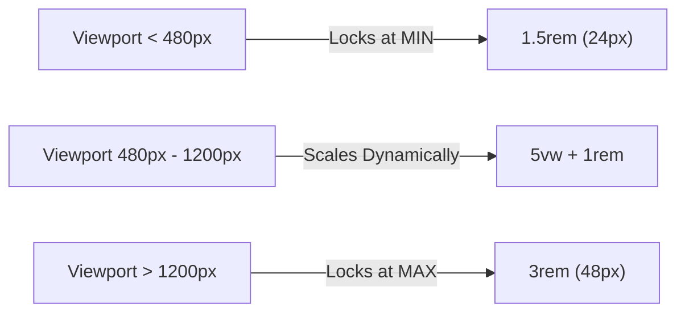

# Fluid Layout Functions

> **Course**: Git Fundamentals | **Module**: Introduction | **Difficulty**: beginner

---

- **Estimated Time**: 55 Minutes (20m Reading | 25m Practice | 10m Quiz)
- **Difficulty Level**: ⭐⭐ Intermediate
- **Prerequisites**: [Lesson 6.1 Responsive Architecture](file:///d:/My%20Drive/all%20files/PROJECT%20FILES/notes/docs/curriculum/_02_css3/_02_17_responsive_architecture_principles.md)
- **XP Reward**: +60 XP

### Learning Objectives
By the end of this lesson, you will be able to:
1. Perform dynamic length calculations using `calc()`.
2. Restrict upper and lower property bounds using `min()` and `max()`.
3. Implement zero-media-query **Fluid Typography** using `clamp(MIN, VAL, MAX)`.
4. Create fluid spacing scales for padding and gaps.
5. Apply CSS Trigonometric functions (`sin()`, `cos()`, `atan2()`).

---

---

Open VS Code and create `fluid_demo.html` to write fluid math function code.

---

---

### 3.1 CSS Math Functions (`calc`, `min`, `max`, `clamp`)
- `calc()`: Computes dynamic math values (`width: calc(100% - 40px);`).
- `min(val1, val2)`: Picks the **smallest** of listed values (`width: min(100%, 1200px);`).
- `max(val1, val2)`: Picks the **largest** of listed values (`font-size: max(16px, 2vw);`).
- `clamp(MIN, VAL, MAX)`: Clamps a fluid value between a minimum lower bound and a maximum upper bound!

```css
/* Fluid Typography: Scales smoothly from 1.5rem (24px) up to 3rem (48px) based on viewport width! */
h1 {
  font-size: clamp(1.5rem, 5vw + 1rem, 3rem);
}
```

---

---



---

---

```html
<!DOCTYPE html>
<html lang="en">
<head>
  <meta charset="UTF-8">
  <meta name="viewport" content="width=device-width, initial-scale=1.0">
  <title>Fluid Typography Demo</title>
  <style>
    body {
      font-family: system-ui;
      background: #0f172a; color: #fff;
      padding: clamp(1rem, 4vw, 4rem); /* Fluid Padding */
    }
    
    /* Fluid Heading */
    h1 {
      font-size: clamp(2rem, 5vw, 4.5rem);
      color: #38bdf8;
    }
  </style>
</head>
<body>
  <h1>Fluid Heading Scaling</h1>
  <p>Resize browser window to observe font size scaling smoothly without media queries!</p>
</body>
</html>
```

---

---

- **Zero-Breakpoints Typography**: Modern design systems use `clamp()` to scale heading font sizes smoothly across mobile, tablet, and 4K displays without writing dozens of media query breakpoints.

---

---

1. Save code as `fluid_demo.html`.
2. Resize browser window in Chrome $\rightarrow$ Observe `<h1>` text scaling smoothly in real time!

---

---

| Bug / Error | Root Cause | Engineering Solution |
| :--- | :--- | :--- |
| **`calc()` Syntax Fails** | Missing spaces around operators inside `calc()` (e.g. `calc(100%-40px)`). | Always include spaces around `+` and `-` operators: `calc(100% - 40px)`. |

---

---

- **Use `clamp()` for Typography**: Replaces complex breakpoint font scales.

---

---

### Q1: What are the three parameters passed to `clamp()`?
**Answer**: `clamp(MIN, VAL, MAX)`. `MIN` is the minimum lower bound limit, `VAL` is the fluid preferred value (e.g. `5vw`), and `MAX` is the maximum upper bound limit.

---

---

```json
{
  "quiz_title": "Lesson 6.4 Fluid Functions Assessment",
  "questions": [
    {
      "question_id": "Q1",
      "type": "multiple_choice",
      "question_text": "Which CSS math function locks a fluid property value between a minimum and maximum threshold?",
      "options": ["calc()", "min()", "max()", "clamp()"],
      "correct_answer_index": 3,
      "explanation": "clamp(min, val, max) restricts values within minimum and maximum bounds."
    }
  ]
}
```

---

---

Build a fluid typography and container padding system using `clamp()` and `calc()`.

---

---

**Front**: What syntax rule is mandatory for operators inside `calc()`?
**Back**: Spaces must surround `+` and `-` operators (`calc(100% - 20px)`).
<!-- flashcard:end -->

---

---

```css
h1 { font-size: clamp(1.5rem, 4vw, 3rem); }
```

---
