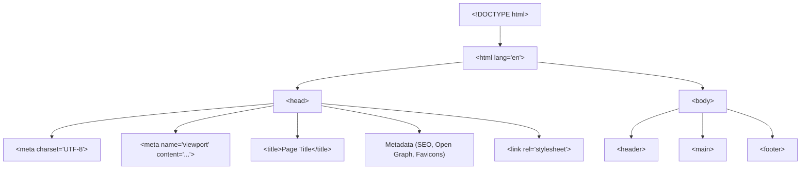

# Html Standards And Document Structure

> **Course**: Git Fundamentals | **Module**: Introduction | **Difficulty**: beginner

---

- **Estimated Time**: 50 Minutes (15m Reading | 25m Practice | 10m Quiz)
- **Difficulty Level**: ⭐ Beginner
- **Prerequisites**: [Lesson 1.1](file:///d:/My%20Drive/all%20files/PROJECT%20FILES/notes/docs/curriculum/_01_html5/_01_01_web_architecture_and_protocols.md), [Lesson 1.2](file:///d:/My%20Drive/all%20files/PROJECT%20FILES/notes/docs/curriculum/_01_html5/_01_02_browser_rendering_engine_architecture.md)
- **XP Reward**: +50 XP

### Learning Objectives
By the end of this lesson, you will be able to:
1. Explain the historical evolution of HTML from HTML 1.0 through XHTML to the modern **WHATWG HTML Living Standard**.
2. Construct a production-ready HTML5 document boilerplate using the canonical `<!DOCTYPE html>` declaration.
3. Contrast Standards Mode, Almost Standards Mode, and Quirks Mode rendering behaviors.
4. Configure character encodings (`UTF-8`), mobile viewport settings (`width=device-width`), and accessibility language attributes.
5. Implement complete `<head>` metadata architectures including SEO meta tags, Open Graph (`og:`) tags, Twitter Cards, and Favicons.

---

---

To test document validity in this lesson:
- Install the **HTMLHint** or **W3C Validation** extension in VS Code.
- Access the online [W3C Markup Validation Service](https://validator.w3.org/).

---

---

### 3.1 Evolution of HTML Standards
HTML has evolved through distinct governance epochs:

```
HTML 1.0/2.0 (1991-1995) ──► HTML 4.01 (1999) ──► XHTML 1.0 (2000) ──► HTML5 (2014) ──► WHATWG Living Standard (Present)
```

- **W3C vs WHATWG Split**: In 2004, Apple, Mozilla, and Opera formed the **WHATWG (Web Hypertext Application Technology Working Group)** to push web standards forward when the W3C prioritized strict XML/XHTML formats.
- **HTML Living Standard**: In 2019, W3C and WHATWG signed an agreement establishing the **WHATWG HTML Living Standard** as the sole authoritative specification for HTML. HTML is no longer versioned as "HTML6"; it continuously evolves.

### 3.2 The DOCTYPE Declaration & Rendering Modes
The Document Type Declaration (`<!DOCTYPE>`) informs the browser engine which rendering specification to apply before parsing begins.

#### Standard HTML5 DOCTYPE
```html
<!DOCTYPE html>
```

> [!IMPORTANT]
> The HTML5 DOCTYPE is case-insensitive, minimal, and required as the very first line of an HTML document (line 1, column 1).

#### Rendering Modes Explained

```
┌─────────────────────────────────────────────────────────────────────────────┐
│                          BROWSER RENDERING MODES                            │
├──────────────────────────┬──────────────────────────────────────────────────┤
│ Standards Mode           │ Triggered by `<!DOCTYPE html>`. Renders layout   │
│                          │ according to modern W3C/WHATWG specifications.   │
├──────────────────────────┼──────────────────────────────────────────────────┤
│ Quirks Mode              │ Triggered by missing or obsolete DOCTYPEs.       │
│                          │ Emulates 1990s Netscape Navigator/IE5 layout    │
│                          │ bugs (e.g. incorrect box model calculations).     │
├──────────────────────────┼──────────────────────────────────────────────────┤
│ Almost Standards Mode    │ Emulates Standards Mode except for vertical cell │
│                          │ alignment heuristics in legacy tables.           │
└──────────────────────────┴──────────────────────────────────────────────────┘
```

### 3.3 Root Element (`<html>`) & Language Attribute
The `<html>` element represents the root node of the DOM tree. The `lang` attribute is **mandatory for accessibility**:

```html
<html lang="en" dir="ltr">
```
- `lang="en"`: Specifies the primary language (e.g. `en`, `es`, `hi`, `fr`) enabling screen readers to load correct pronunciation engines and search engines to index target locales.
- `dir="ltr"`: Text direction (`ltr` for Left-to-Right, `rtl` for Right-to-Left scripts like Arabic/Hebrew).

### 3.4 Character Encodings (ASCII vs UTF-8)
- **ASCII**: 7-bit encoding supporting 128 English characters.
- **ISO-8859-1 (Latin-1)**: 8-bit encoding supporting Western European languages.
- **UTF-8 (Unicode)**: Variable-width encoding (1 to 4 bytes per character) capable of representing **149,000+ characters** across all global writing systems, mathematical symbols, and Emojis.

```html
<meta charset="UTF-8">
```

> [!CAUTION]
> Always place `<meta charset="UTF-8">` within the first 1024 bytes of the `<head>` element to prevent browsers from executing security-vulnerable encoding auto-detection scans.

### 3.5 Viewport Configuration for Mobile Responsiveness
By default, mobile browsers render desktop web pages on a virtual layout viewport of 980 pixels and scale it down, causing tiny unreadable text.

```html
<meta name="viewport" content="width=device-width, initial-scale=1.0">
```
- `width=device-width`: Sets layout viewport width to match physical device screen width in CSS pixels.
- `initial-scale=1.0`: Sets 1:1 zoom ratio when page loads.

### 3.6 Metadata & Social Media Protocol (Open Graph)
Metadata (`<meta>`) tags provide machine-readable key-value pairs consumed by search engines, social media platforms, and web crawlers.

#### Open Graph Protocol (`og:`)
Developed by Facebook to transform web pages into rich social graph objects when shared:

```html
<!-- Primary Open Graph Meta Tags -->
<meta property="og:type" content="website">
<meta property="og:url" content="https://example.com/course">
<meta property="og:title" content="IoT Full Stack Masterclass">
<meta property="og:description" content="Learn web development and IoT engineering from scratch.">
<meta property="og:image" content="https://example.com/static/images/social-cover.jpg">

<!-- Twitter Card Meta Tags -->
<meta name="twitter:card" content="summary_large_image">
<meta name="twitter:title" content="IoT Full Stack Masterclass">
<meta name="twitter:image" content="https://example.com/static/images/social-cover.jpg">
```

---

---

### Complete HTML5 Document Architecture Tree


---

---

### 5.1 Production-Ready HTML5 Boilerplate Template

```html
<!DOCTYPE html>
<html lang="en" dir="ltr">
<head>
  <!-- 1. Character Encoding (Must be inside first 1024 bytes) -->
  <meta charset="UTF-8">

  <!-- 2. Mobile Viewport Scaling -->
  <meta name="viewport" content="width=device-width, initial-scale=1.0">

  <!-- 3. Page Title (Unique & Descriptive for SEO) -->
  <title>Enterprise IoT Dashboard — Real-time Telemetry</title>

  <!-- 4. Primary SEO Metadata -->
  <meta name="description" content="Production enterprise IoT monitoring platform for sensor telemetry and microservices.">
  <meta name="author" content="Bytes and Boards Solutions">
  <meta name="robots" content="index, follow">

  <!-- 5. Canonical URL (Prevents duplicate content penalty) -->
  <link rel="canonical" href="https://example.com/dashboard">

  <!-- 6. Favicon & Apple Touch Icons -->
  <link rel="icon" type="image/svg+xml" href="/assets/favicon.svg">
  <link rel="apple-touch-icon" sizes="180x180" href="/assets/apple-touch-icon.png">

  <!-- 7. Open Graph / Facebook Social Sharing -->
  <meta property="og:type" content="website">
  <meta property="og:url" content="https://example.com/dashboard">
  <meta property="og:title" content="Enterprise IoT Dashboard">
  <meta property="og:description" content="Real-time telemetry and edge device control platform.">
  <meta property="og:image" content="https://example.com/assets/og-cover.png">

  <!-- 8. Twitter Card Meta -->
  <meta name="twitter:card" content="summary_large_image">
  <meta name="twitter:site" content="@iotplatform">

  <!-- 9. Stylesheets -->
  <link rel="stylesheet" href="/static/css/main.css">

  <!-- 10. Deferred JavaScript Execution -->
  <script src="/static/js/app.js" defer></script>
</head>
<body>

  <!-- Document Header -->
  <header>
    <h1>IoT Platform Portal</h1>
  </header>

  <!-- Main Content Area -->
  <main>
    <p>Welcome to the production IoT telemetry console.</p>
  </main>

  <!-- Document Footer -->
  <footer>
    <p>&copy; 2026 Bytes and Boards Solutions. All rights reserved.</p>
  </footer>

</body>
</html>
```

---

---

### Open Graph Debugging & Rich Social Cards
When links are shared on LinkedIn, WhatsApp, Slack, or Twitter, social bots fetch URL metadata to display rich preview cards:

```
┌─────────────────────────────────────────────────────────┐
│ [ Image Preview: 1200 x 630 px ]                         │
├─────────────────────────────────────────────────────────┤
│ Enterprise IoT Dashboard                                │
│ Real-time telemetry and edge device control platform.   │
│ example.com                                             │
└─────────────────────────────────────────────────────────┘
```

> [!TIP]
> Use official social validator tools during staging deployment:
> - **Facebook Sharing Debugger**: `developers.facebook.com/tools/debug/`
> - **Twitter Card Validator**: `cards-dev.twitter.com/validator`
> - **LinkedIn Post Inspector**: `linkedin.com/post-inspector/`

---

---

### Task: Build & Validate an Enterprise Boilerplate

#### Step 1: Create `index.html`
Create a file named `index.html` on your desktop using VS Code and insert the production boilerplate from Section 5.1.

#### Step 2: Test W3C Syntax Validation
1. Open the [W3C Direct Input Validator](https://validator.w3.org/#validate_by_input).
2. Copy the entire contents of your `index.html` and paste it into the text box.
3. Click **Check**.
4. Verify the output: `Document checking completed. No errors or warnings to show.`

#### Step 3: Test Browser Rendering Mode
1. Open `index.html` in Chrome.
2. Open Console (`F12` $\rightarrow$ Console).
3. Type: `document.compatMode`
4. Verify output: `"CSS1Compat"` (*Confirms page is running in Standards Mode*).

---

---

| Bug / Warning | Root Cause | Engineering Solution |
| :--- | :--- | :--- |
| **`document.compatMode === "BackCompat"`** | Missing or misspelled `<!DOCTYPE html>`. Page is rendering in legacy Quirks Mode. | Ensure `<!DOCTYPE html>` is on line 1, column 1 of the file. |
| **Garbled Special Characters (e.g. `’` instead of `’`)** | Missing `<meta charset="UTF-8">` or file saved in ANSI/ISO-8859-1 format. | Add `<meta charset="UTF-8">` in `<head>` and configure text editor to save files as UTF-8. |
| **Unreadable Tiny Text on Mobile Devices** | Missing `<meta name="viewport" content="...">`. Browser defaults to 980px desktop view. | Include `<meta name="viewport" content="width=device-width, initial-scale=1.0">`. |

---

---

- **Line 1 DOCTYPE**: Always place `<!DOCTYPE html>` at the exact start of the document.
- **Always Include `lang`**: Declare `<html lang="en">` for screen reader accessibility and SEO locale targeting.
- **Unique Page Titles**: Ensure `<title>` tags are concise (50–60 characters) and unique across every page.
- **Specify Image Open Graph Ratio**: Use $1200 \times 630$ pixels for `og:image` files to ensure crisp rendering on high-DPI displays.

---

---

### Q1: What is the difference between Standards Mode and Quirks Mode in modern browsers?
**Answer**:
When a browser parses an HTML document, it checks for a valid `<!DOCTYPE html>` declaration. If present, the browser enters **Standards Mode** (or `CSS1Compat`), rendering content according to modern W3C/WHATWG specifications. If the DOCTYPE is missing, invalid, or obsolete, the browser falls back to **Quirks Mode** (or `BackCompat`), emulating 1990s Netscape and Internet Explorer box model bugs to prevent ancient websites from breaking.

### Q2: Why is the WHATWG specification referred to as a "Living Standard"?
**Answer**:
Historically, W3C published HTML as monolithic versions (HTML 4.01, XHTML 1.0, HTML5). Under the WHATWG agreement, HTML is maintained as a continuously updated **Living Standard**. Features are added, refined, or deprecated incrementally based on browser vendor implementation consensus, removing fixed major version numbers.

---

---

```json
{
  "quiz_title": "Lesson 1.3 HTML Standards & Document Structure Assessment",
  "questions": [
    {
      "question_id": "Q1",
      "type": "multiple_choice",
      "question_text": "What organization maintains the official Living Standard specification for HTML?",
      "options": ["IEEE", "WHATWG", "IETF", "ISO"],
      "correct_answer_index": 1,
      "explanation": "WHATWG (Web Hypertext Application Technology Working Group) maintains the official HTML Living Standard."
    },
    {
      "question_id": "Q2",
      "type": "multiple_choice",
      "question_text": "What value will `document.compatMode` return in JavaScript when a page is running in Standards Mode?",
      "options": ["StandardsMode", "CSS1Compat", "BackCompat", "HTML5Mode"],
      "correct_answer_index": 1,
      "explanation": "CSS1Compat indicates Standards Mode; BackCompat indicates legacy Quirks Mode."
    },
    {
      "question_id": "Q3",
      "type": "multiple_choice",
      "question_text": "Why must the `<meta name='viewport' ...>` tag be included in modern HTML documents?",
      "options": [
        "To enable desktop GPU acceleration",
        "To prevent mobile browsers from rendering at default 980px desktop layout width",
        "To compress HTTP header sizes",
        "To enable JavaScript execution on mobile"
      ],
      "correct_answer_index": 1,
      "explanation": "Viewport metadata forces mobile browsers to set layout viewport to device screen width (1:1 scale)."
    },
    {
      "question_id": "Q4",
      "type": "multiple_choice",
      "question_text": "Which character encoding can represent over 149,000 characters across all global writing systems?",
      "options": ["ASCII", "ISO-8859-1", "UTF-8", "Windows-1252"],
      "correct_answer_index": 2,
      "explanation": "UTF-8 is the universal variable-length Unicode encoding used by over 98% of all websites."
    },
    {
      "question_id": "Q5",
      "type": "multiple_choice",
      "question_text": "Which metadata protocol prefix is used to configure social media preview cards on Facebook and LinkedIn?",
      "options": ["twitter:", "og:", "meta:", "social:"],
      "correct_answer_index": 1,
      "explanation": "og: (Open Graph) properties define title, description, image, and type for social preview cards."
    }
  ]
}
```

---

---

### Objective
Create a valid, SEO-optimized, social-media-ready HTML5 landing page template for an IoT Smart Agriculture project.

### Starter Requirements
1. Valid `<!DOCTYPE html>` and `lang="en"`.
2. Valid `<meta charset="UTF-8">` and mobile viewport tags.
3. Complete Open Graph (`og:`) and Twitter Card metadata for social previews.
4. Pass W3C validation with zero errors.

---

---

**Front**: What rendering mode does a browser enter if `<!DOCTYPE html>` is missing from line 1?
**Back**: Quirks Mode (`BackCompat`), which emulates legacy browser rendering bugs.
<!-- flashcard:end -->

**Front**: Why is the `<html lang="en">` attribute critical for accessibility?
**Back**: Screen readers use the `lang` attribute to select the correct language pronunciation engine and accent.
<!-- flashcard:end -->

**Front**: What is the primary function of the Open Graph Protocol (`og:`)?
**Back**: Allows web pages to specify rich social media cards (title, description, cover image) when shared on platforms like Facebook, LinkedIn, and Slack.
<!-- flashcard:end -->

---

---

### Key Takeaways
- **HTML Living Standard**: Maintained continuously by WHATWG.
- **Standards Mode**: Enabled by `<!DOCTYPE html>` on line 1.
- **Core Metadata**: Always set `charset="UTF-8"`, `viewport`, `title`, `description`, and `og:` tags.

### Quick Syntax Reference

```html
<!DOCTYPE html>
<html lang="en">
<head>
  <meta charset="UTF-8">
  <meta name="viewport" content="width=device-width, initial-scale=1.0">
  <title>Page Title</title>
</head>
<body>
</body>
</html>
```

### Official References
- [WHATWG HTML Living Standard Specification](https://html.spec.whatwg.org/multipage/)
- [W3C Markup Validation Service](https://validator.w3.org/)
- [The Open Graph Protocol Standard](https://ogp.me/)

---
