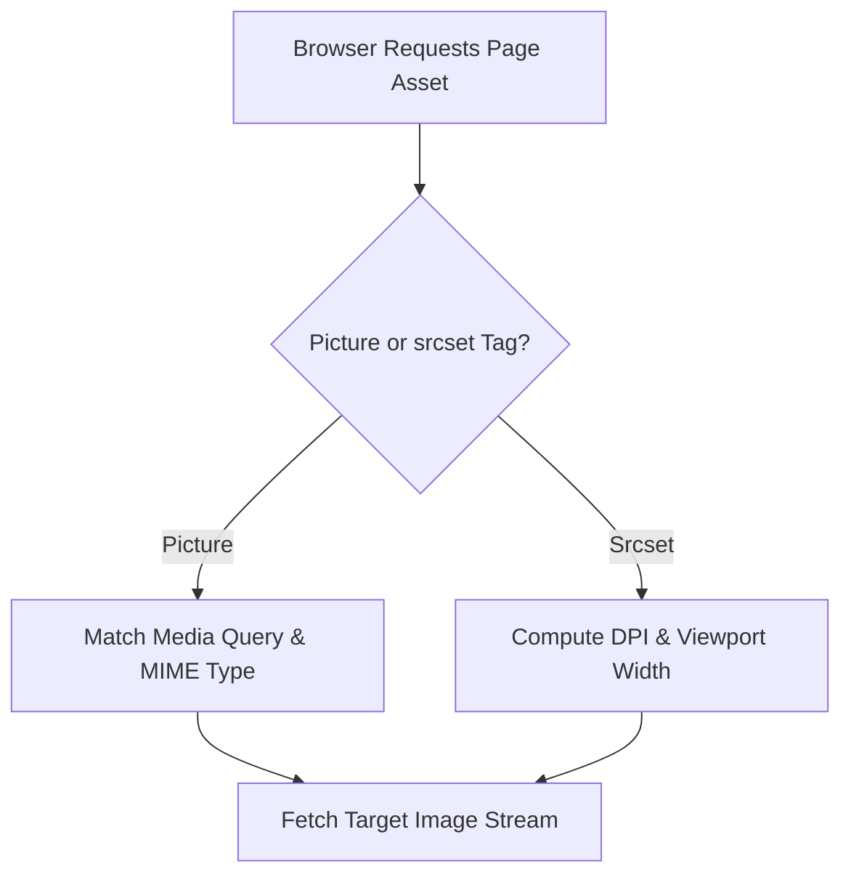

# Media Elements Images Audio And Video

> **Course**: Git Fundamentals | **Module**: Introduction | **Difficulty**: beginner

---

- **Estimated Time**: 55 Minutes (20m Reading | 25m Practice | 10m Quiz)
- **Difficulty Level**: ⭐⭐ Intermediate
- **Prerequisites**: [Lesson 3.1 Structural Semantic Elements](file:///d:/My%20Drive/all%20files/PROJECT%20FILES/notes/docs/curriculum/_01_html5/_01_07_structural_semantic_elements.md)
- **XP Reward**: +60 XP

### Learning Objectives
By the end of this lesson, you will be able to:
1. Implement responsive image loading using `srcset` and `sizes` attributes.
2. Execute art direction for different screen sizes using `<picture>` and `<source>` elements.
3. Compare modern image formats (AVIF, WebP, SVG) vs legacy formats (JPEG, PNG).
4. Embed native HTML5 audio (`<audio>`) and video (`<video>`) media streams.
5. Add accessible subtitles and captions using `<track>` and WebVTT files.

---

---

Open VS Code and create `media_demo.html` to write interactive media embeds.

---

---

### 3.1 Responsive Images (`srcset` & `sizes`)
`srcset` allows browsers to select the optimal image resolution based on device screen density (DPI) and viewport width:

```html

```

### 3.2 Art Direction (`<picture>`)
`<picture>` allows serving completely different cropped images or modern formats (AVIF/WebP) based on media queries:

```html
<picture>
  <source srcset="hero-mobile.webp" media="(max-width: 600px)" type="image/webp">
  <source srcset="hero-desktop.avif" type="image/avif">
  
</picture>
```

### 3.3 Audio & Video Elements
HTML5 provides native hardware-accelerated playback without plugins:

```html
<video controls width="640" poster="cover.jpg" preload="metadata">
  <source src="stream.webm" type="video/webm">
  <source src="stream.mp4" type="video/mp4">
  <track src="subtitles-en.vtt" kind="subtitles" srclang="en" label="English" default>
  Your browser does not support video playback.
</video>
```

---

---

### Media Selection Pipeline


---

---

### 5.1 Comprehensive Media Dashboard (`media_dashboard.html`)

```html
<!DOCTYPE html>
<html lang="en">
<head>
  <meta charset="UTF-8">
  <title>Media & WebVTT Portal</title>
  <style>
    body { font-family: system-ui; padding: 20px; }
    video, img { max-width: 100%; height: auto; border-radius: 8px; }
  </style>
</head>
<body>

  <h1>IoT Video Telemetry Feed</h1>

  <video controls width="720" poster="/assets/poster.jpg">
    <source src="/assets/stream.mp4" type="video/mp4">
    <track src="/assets/subtitles.vtt" kind="subtitles" srclang="en" label="English" default>
  </video>

</body>
</html>
```

---

---

### AVIF & WebP Next-Gen Image Compression
Enterprise platforms (YouTube, Netflix) use AVIF/WebP image formats to reduce page payload size by up to 50% compared to legacy JPEG/PNG formats.

---

---

1. Save Section 5.1 as `media_dashboard.html`.
2. Inspect the video element in DevTools to verify subtitle track rendering.

---

---

| Bug / Error | Root Cause | Engineering Solution |
| :--- | :--- | :--- |
| **Autoplay Fails** | Browsers block unmuted video autoplay. | Always include the `muted` attribute alongside `autoplay`: `<video autoplay muted>`. |

---

---

- **Use `loading="lazy"`**: Defer offscreen image loading.
- **Mute Autoplay Videos**: Always add `muted` when using `autoplay`.

---

---

### Q1: What is the difference between `` and the `<picture>` tag?
**Answer**: `srcset` lets the browser automatically select the best resolution of the *same* image. `<picture>` gives the developer explicit control over *art direction* (switching images or format types based on CSS media queries).

---

---

```json
{
  "quiz_title": "Lesson 6.1 Media Elements Assessment",
  "questions": [
    {
      "question_id": "Q1",
      "type": "multiple_choice",
      "question_text": "Which tag defines text subtitles for a `<video>` element?",
      "options": ["<caption>", "<track>", "<text>", "<subtitle>"],
      "correct_answer_index": 1,
      "explanation": "<track> defines subtitles and captions in WebVTT format."
    }
  ]
}
```

---

---

Build a responsive media gallery using `<picture>`, WebP formats, and lazy loading.

---

---

**Front**: What attribute is required for video `autoplay` to function in modern browsers?
**Back**: `muted`
<!-- flashcard:end -->

---

---

```html

```

---
