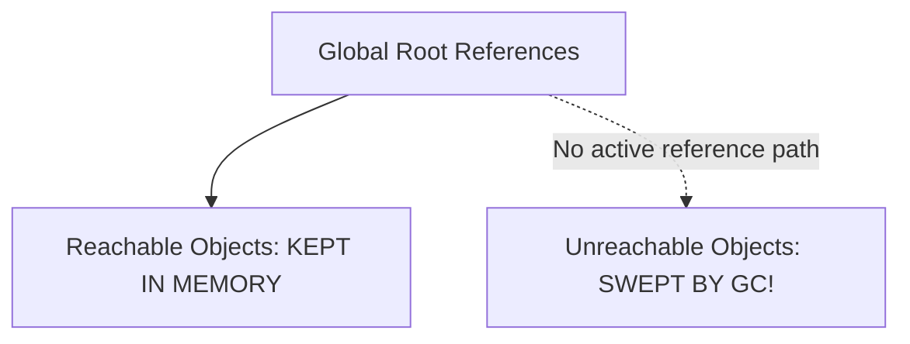

# Memory Management And Leak Prevention

> **Course**: Git Fundamentals | **Module**: Introduction | **Difficulty**: beginner

---

- **Estimated Time**: 55 Minutes (20m Reading | 25m Practice | 10m Quiz)
- **Difficulty Level**: ⭐⭐⭐ Advanced
- **Prerequisites**: [Lesson 11.2 Core Web Vitals](file:///d:/My%20Drive/all%20files/PROJECT%20FILES/notes/docs/curriculum/_03_javascript/_03_39_core_web_vitals_and_performance_monitoring.md)
- **XP Reward**: +70 XP

### Learning Objectives
By the end of this lesson, you will be able to:
1. Explain V8's **Mark-and-Sweep Garbage Collection** algorithm.
2. Identify the 4 primary causes of JavaScript **Memory Leaks**.
3. Detect and eliminate **Detached DOM Tree** memory leaks.
4. Profile memory allocation using **Chrome DevTools Heap Snapshots**.

---

---

Open Browser DevTools Memory Panel (`F12`).

---

---

### 3.1 Mark-and-Sweep Garbage Collection
V8 periodically traverses memory starting from root references (Global Object, active stack frames). Any object reachable from roots is marked as **Active**. Unreachable objects are swept and reclaimed.

### 3.2 The 4 Common Memory Leak Patterns
1. **Accidental Globals**: Assigning variables without `let`/`const`/`var` attaches them permanently to `window`.
2. **Forgotten Timers**: `setInterval()` callbacks holding active scope references after target components unmount.
3. **Uncleared Event Listeners**: Listening on global objects (`window.addEventListener`) without cleanup.
4. **Detached DOM Nodes**: Keeping JavaScript references to DOM elements that have been removed from the document tree.

```
┌─────────────────────────────────────────────────────────────────────────────┐
│                          DETACHED DOM MEMORY LEAK                           │
├─────────────────────────────────────────────────────────────────────────────┤
│ DOM Tree ──► element.remove() ──► Removed from visual page!                 │
│ BUT: JS variable `const ref = element` retains reference ──► LEAK IN HEAP!  │
└─────────────────────────────────────────────────────────────────────────────┘
```

---

---



---

---

```javascript
// Diagnosing & Preventing Memory Leaks Demonstration

class TelemetryWidget {
  #timerId;
  #dataCache = [];

  constructor() {
    // 1. Forgotten Timer Leak Prevention Pattern
    this.#timerId = setInterval(() => {
      this.#dataCache.push(new Array(1000).fill("payload"));
    }, 1000);

    // Bind event handler
    this.handleResize = this.handleResize.bind(this);
    window.addEventListener("resize", this.handleResize);
  }

  handleResize() {
    console.log("Window resized!");
  }

  // 2. Explicit Cleanup / Teardown Method (Mandatory for Lifecycle Management!)
  destroy() {
    console.log("Cleaning up widget memory references...");
    clearInterval(this.#timerId); // Stop interval timer!
    window.removeEventListener("resize", this.handleResize); // Detach listener!
    this.#dataCache = null; // Clear array heap reference!
  }
}

const widget = new TelemetryWidget();

// Simulate component unmount teardown after 5 seconds:
setTimeout(() => widget.destroy(), 5000);
```

---

---

- **Single-Page Application Long Sessions**: Dashboards running continuously for days without full page reloads require strict memory cleanup to prevent tab crashes caused by memory leaks.

---

---

1. Open DevTools Memory Tab $\to$ Take Heap Snapshot #1.
2. Instantiate leaking timer $\to$ Take Heap Snapshot #2.
3. Compare snapshots under "Comparison" view $\to$ Identify retained memory objects!

---

---

| Bug / Error | Root Cause | Engineering Solution |
| :--- | :--- | :--- |
| **Tab Crash (`Aw, Snap! Out of Memory`)** | Storing un-bounded event logs inside global arrays without clearing. | Cap cache arrays using `.slice(-100)` or use `WeakMap`/`WeakSet`. |

---

---

- **Implement Teardown Methods**: Always expose a `.destroy()` method on long-lived classes to clear timers and event listeners.

---

---

### Q1: What is a Detached DOM Node memory leak in JavaScript?
**Answer**: A Detached DOM Node occurs when an HTML element is removed from the DOM tree (e.g. `element.remove()`), but a JavaScript variable or closure still holds an active reference to that element object. Because the object remains reachable from a JS root reference, V8 Garbage Collection cannot reclaim its memory.

---

---

```json
{
  "quiz_title": "Lesson 11.3 Memory Management Assessment",
  "questions": [
    {
      "question_id": "Q1",
      "type": "multiple_choice",
      "question_text": "Which algorithm does modern V8 Garbage Collection use to reclaim unreachable objects?",
      "options": ["Reference Counting", "Mark-and-Sweep", "Generational Copying", "Stop-the-World"],
      "correct_answer_index": 1,
      "explanation": "V8 uses the Mark-and-Sweep Garbage Collection algorithm."
    }
  ]
}
```

---

---

Locate and fix 3 intentional memory leaks using Chrome DevTools Heap Snapshots.

---

---

**Front**: Does setting a local variable inside a function to `null` immediately trigger Garbage Collection?
**Back**: No. It breaks the reference, but V8 triggers GC at its own scheduled intervals.
<!-- flashcard:end -->

---

---

```javascript
clearInterval(timerId);
window.removeEventListener("event", handler);
```

---
