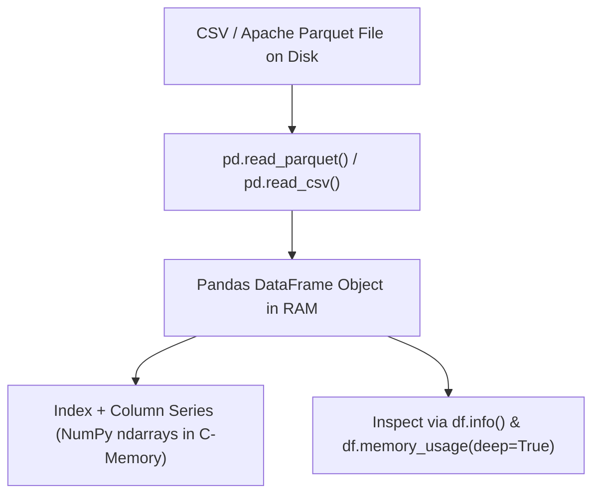

# Pandas Dataframes Series And Ingestion

> **Course**: Git Fundamentals | **Module**: Introduction | **Difficulty**: beginner

---

- **Estimated Time**: 45 Minutes (15m Reading | 20m Practice | 10m Quiz)
- **Difficulty Level**: ⭐ Beginner
- **Prerequisites**: [Lesson 1.2 Vectorization & Broadcasting](file:///d:/My%20Drive/all%20files/PROJECT%20FILES/notes/docs/curriculum/_09_python_data_science/_09_02_vectorization_slicing_and_broadcasting.md)
- **XP Reward**: +50 XP

### Learning Objectives
By the end of this lesson, you will be able to:
1. Explain the relational data architecture of Pandas **`Series`** and **`DataFrame`** objects.
2. Ingest structured datasets efficiently using **`pd.read_csv()`** and **`pd.read_parquet()`**.
3. Inspect DataFrame schema metadata using `info()`, `describe()`, and `memory_usage()`.
4. Reduce memory consumption by casting object columns to **`category`** data types.

---

---

Install `pandas` and `pyarrow`:

```bash
pip install pandas pyarrow
```

---

---

### 3.1 Pandas Data Structures Architecture
Built directly on top of NumPy, Pandas provides two primary data structures:
- **`Series`**: A 1-dimensional array with labeled indices and homogeneous data types.
- **`DataFrame`**: A 2-dimensional tabular structure with labeled axes (rows and columns), where each column is an independent Pandas `Series`.

```
┌─────────────────────────────────────────────────────────────────────────────┐
│                          PANDAS DATAFRAME ARCHITECTURE                      │
├─────────────┬──────────────────┬──────────────────┬─────────────────────────┤
│ Index       │ Column: 'age'    │ Column: 'dept'   │ Column: 'salary'        │
│             │ (Series: int64)  │ (Series: category│ (Series: float64)       │
├─────────────┼──────────────────┼──────────────────┼─────────────────────────┤
│ 0           │ 29               │ Engineering      │ 85000.0                 │
│ 1           │ 34               │ Marketing        │ 62000.0                 │
│ 2           │ 41               │ Engineering      │ 110000.0                │
└─────────────┴──────────────────┴──────────────────┴─────────────────────────┘
```

> [!TIP]
> **Parquet vs CSV**: Apache Parquet is a columnar binary file format. Reading Parquet files via `pd.read_parquet()` is up to 10x faster and consumes 80% less disk space than reading raw CSV files!

---

---



---

---

```python
# Pandas Ingestion & Memory Optimization (pandas_ingestion.py)
import pandas as pd
import numpy as np

# 1. Create Sample Synthetic Dataset
data = {
    "employee_id": range(1000, 1005),
    "name": ["Alice", "Bob", "Charlie", "David", "Eve"],
    "department": ["Engineering", "Marketing", "Engineering", "Finance", "Marketing"],
    "salary": [95000.50, 62000.00, 115000.75, 88000.00, 64000.25],
    "join_date": pd.date_range(start="2022-01-01", periods=5, freq="D")
}

df = pd.DataFrame(data)

print("==================================================")
print("             PANDAS DATAFRAME REPORT               ")
print("==================================================")
print(f"DataFrame Shape: {df.shape}")
print(f"\nFirst 3 Rows:\n{df.head(3)}\n")

# 2. Inspect Memory Footprint
print("--- Initial Memory Usage ---")
print(df.info(memory_usage="deep"))

# 3. Optimize Memory: Cast 'department' from object to category!
df["department"] = df["department"].astype("category")

print("\n--- Optimized Memory Usage (After Categorical Cast) ---")
print(f"Department Column Dtype: {df['department'].dtype}")
print(f"Total Deep Memory: {df.memory_usage(deep=True).sum()} Bytes")

# 4. Ingest and Export Data
df.to_parquet("employees.parquet", index=False)
reloaded_df = pd.read_parquet("employees.parquet")
print(f"\nSuccessfully reloaded {len(reloaded_df)} rows from Parquet file!")
```

---

---

- **ETL Data Engineering Pipelines**: Enterprise analytics engines load gigabyte-scale transaction datasets using `pd.read_parquet()`, casting string status columns to `category` to reduce RAM usage from 16 GB to under 3 GB during batch processing.

---

---

1. Save code as `pandas_ingestion.py`.
2. Run `python pandas_ingestion.py`.
3. Inspect deep memory usage before and after casting `department` to `category`!

---

---

| Bug / Error | Root Cause | Engineering Solution |
| :--- | :--- | :--- |
| **High RAM Memory Crashes (OOM)** | Ingesting massive CSV files with default `object` dtypes for repeated string columns. | Specify `dtype={'col': 'category'}` inside `pd.read_csv()` or use `chunksize` batching. |

---

---

- **Use Apache Parquet Format**: Store analytical datasets in `.parquet` format for fast columnar reads and compression.

---

---

### Q1: Why does converting string columns with low cardinality to the `category` dtype in Pandas significantly reduce memory usage?
**Answer**: By default, string columns store Python string object pointers for every row. The `category` dtype uses dictionary encoding: unique strings are stored once in an integer lookup table, and each row stores only a small integer index (e.g. 8-bit `int8`), dramatically reducing memory consumption for columns with repeated values.

---

---

```json
{
  "quiz_title": "Lesson 2.1 Pandas Ingestion Assessment",
  "questions": [
    {
      "question_id": "Q1",
      "type": "multiple_choice",
      "question_text": "Which columnar file format offers up to 10x faster ingestion speed than CSV in Pandas?",
      "options": ["Apache Parquet", "JSON", "XML", "HTML"],
      "correct_answer_index": 0,
      "explanation": "Apache Parquet is a binary columnar format optimized for fast reads."
    }
  ]
}
```

---

---

Load a dataset, inspect deep memory usage with `info()`, and convert string columns to `category`.

---

---

**Front**: What Pandas method returns summary statistics (mean, std, min, max, quartiles) for numeric columns?
**Back**: `df.describe()`.
<!-- flashcard:end -->

---

---

```python
df = pd.read_parquet("data.parquet")
df["dept"] = df["dept"].astype("category")
print(df.info(memory_usage="deep"))
```

---
