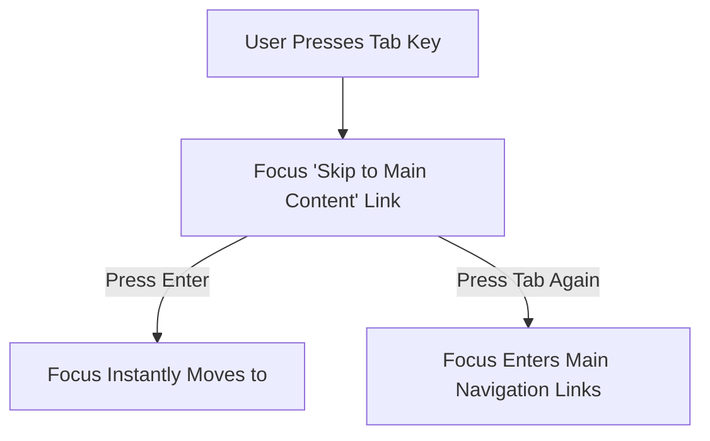

# Web Content Accessibility Guidelines

> **Course**: Git Fundamentals | **Module**: Introduction | **Difficulty**: beginner

---

- **Estimated Time**: 55 Minutes (20m Reading | 25m Practice | 10m Quiz)
- **Difficulty Level**: ⭐⭐ Intermediate
- **Prerequisites**: [Lesson 3.2 Document Outline & Accessibility Tree](file:///d:/My%20Drive/all%20files/PROJECT%20FILES/notes/docs/curriculum/_01_html5/_01_08_document_outline_and_accessibility_tree.md)
- **XP Reward**: +60 XP

### Learning Objectives
By the end of this lesson, you will be able to:
1. Apply the four core **POUR** principles of WCAG 2.1 / 2.2 (Perceivable, Operable, Understandable, Robust).
2. Evaluate WCAG conformance levels (Level A, Level AA, Level AAA).
3. Enforce color contrast minimum ratios (4.5:1 for normal text, 3:1 for large text).
4. Implement "Skip to Main Content" links to assist keyboard navigation.
5. Audit web applications for accessible form error messages and focus management.

---

---

Run WCAG audits in Chrome DevTools:
- Open DevTools (`F12`) $\rightarrow$ Click **Lighthouse** tab $\rightarrow$ Check **Accessibility** $\rightarrow$ Click **Analyze page load**.

---

---

### 3.1 The POUR Principles (WCAG 2.1 / 2.2)

```
┌─────────────────────────────────────────────────────────────────────────────┐
│                       THE 4 POUR ACCESSIBILITY PRINCIPLES                   │
├─────────────────┬───────────────────────────────────────────────────────────┤
│ 1. Perceivable  │ Information must be presented in ways users can perceive  │
│                 │ (e.g. text alternatives for images, captions for video).   │
├─────────────────┼───────────────────────────────────────────────────────────┤
│ 2. Operable     │ Interface components must be operable via keyboard        │
│                 │ without trapping focus.                                   │
├─────────────────┼───────────────────────────────────────────────────────────┤
│ 3. Understandable│ Text content and UI controls must be clear and predictable.│
├─────────────────┼───────────────────────────────────────────────────────────┤
│ 4. Robust       │ Content must be compatible with assistive technologies.   │
└─────────────────┴───────────────────────────────────────────────────────────┘
```

### 3.2 Conformance Levels
- **Level A**: Minimum baseline requirements (e.g., non-text alt text).
- **Level AA (Industry Standard)**: Legal requirement for enterprise websites (4.5:1 contrast, keyboard navigation, visible focus indicators).
- **Level AAA**: Highest accessibility standards (7:1 contrast, sign language translation).

### 3.3 Color Contrast Requirements (Level AA)
- **Normal Text (< 24px or < 18.66px bold)**: Minimum **4.5:1** contrast ratio against background.
- **Large Text ($\ge$ 24px or $\ge$ 18.66px bold)**: Minimum **3.0:1** contrast ratio against background.

### 3.4 Skip Navigation Links
Allows screen reader and keyboard users to bypass top navigation bars and jump directly to the primary page content:

```html
<!-- Visible on keyboard focus only -->
<a href="#main-content" class="skip-link">Skip to Main Content</a>
```

---

---



---

---

```html
<!DOCTYPE html>
<html lang="en">
<head>
  <meta charset="UTF-8">
  <title>WCAG AA Compliant Page</title>
  <style>
    /* Visually hidden until keyboard focus */
    .skip-link {
      position: absolute; top: -40px; left: 0; background: #0f172a; color: #fff;
      padding: 8px; z-index: 100; transition: top 0.2s;
    }
    .skip-link:focus { top: 0; }
    body { font-family: system-ui; color: #0f172a; background: #ffffff; } /* 16:1 Contrast Ratio */
  </style>
</head>
<body>

  <!-- Skip Navigation Link -->
  <a href="#main-content" class="skip-link">Skip to main content</a>

  <header><h1>Enterprise Portal</h1></header>

  <main id="main-content" tabindex="-1">
    <h2>Accessible Form Section</h2>
    <p>High contrast content matching WCAG Level AA standards.</p>
  </main>

</body>
</html>
```

---

---

- **Legal Compliance**: Section 508 and the European Accessibility Act require enterprise websites to meet WCAG 2.1 Level AA conformance.

---

---

1. Save code as `wcag_demo.html`.
2. Open in Chrome $\rightarrow$ Press <kbd>Tab</kbd> key $\rightarrow$ Verify **Skip to main content** link appears at the top left of screen!

---

---

| Bug / Error | Root Cause | Engineering Solution |
| :--- | :--- | :--- |
| **Outline Reset Anti-Pattern** | Adding `* { outline: none; }` in CSS, removing keyboard focus rings. | Use `:focus-visible { outline: 3px solid #3b82f6; }`. |

---

---

- **Never Remove Focus Outlines**: Retain visible focus rings.
- **Maintain 4.5:1 Contrast Ratio**: Ensure text is legible.

---

---

### Q1: What are the four WCAG POUR principles?
**Answer**: Perceivable, Operable, Understandable, and Robust.

---

---

```json
{
  "quiz_title": "Lesson 9.1 WCAG Assessment",
  "questions": [
    {
      "question_id": "Q1",
      "type": "multiple_choice",
      "question_text": "What is the minimum WCAG 2.1 Level AA color contrast ratio required for normal body text?",
      "options": ["2:1", "3:1", "4.5:1", "7:1"],
      "correct_answer_index": 2,
      "explanation": "WCAG Level AA mandates a minimum 4.5:1 contrast ratio for normal text."
    }
  ]
}
```

---

---

Perform a WCAG Level AA audit on an existing web page using Chrome Lighthouse.

---

---

**Front**: What is the target conformance level for most enterprise web applications?
**Back**: WCAG 2.1 / 2.2 Level AA.
<!-- flashcard:end -->

---

---

```html
<a href="#main-content" class="skip-link">Skip to content</a>
```

---
