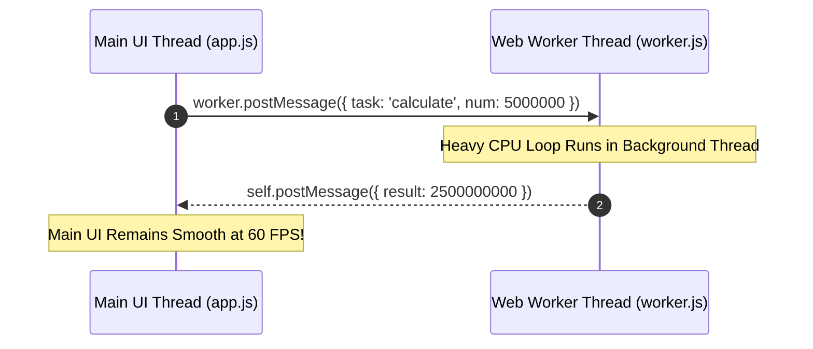

# Web Workers And Multithreading

> **Course**: Git Fundamentals | **Module**: Introduction | **Difficulty**: beginner

---

- **Estimated Time**: 55 Minutes (20m Reading | 25m Practice | 10m Quiz)
- **Difficulty Level**: ⭐⭐⭐ Advanced
- **Prerequisites**: [Lesson 1.2 Browser Rendering Engine](file:///d:/My%20Drive/all%20files/PROJECT%20FILES/notes/docs/curriculum/_01_html5/_01_02_browser_rendering_engine_architecture.md)
- **XP Reward**: +70 XP

### Learning Objectives
By the end of this lesson, you will be able to:
1. Explain JavaScript single-threaded main loop limitations and UI freezing.
2. Instantiate Dedicated Web Workers (`new Worker('worker.js')`).
3. Communicate between main UI thread and background threads using `postMessage()` and `onmessage`.
4. Terminate background worker threads using `worker.terminate()`.
5. Identify DOM access restrictions inside worker execution contexts.

---

---

Web Workers require running from a local web server (e.g. `python -m http.server 8000`) due to CORS security rules.

---

---

### 3.1 Single-Threaded JS & Web Workers Solution
JavaScript runs on a single **Main Thread**. Heavy CPU calculations (image processing, data parsing, encryption) freeze the UI, causing unresponsive pages.

**Web Workers** spawn true OS background threads that run heavy scripts in parallel without blocking the main UI thread.

```
┌─────────────────────────────────────────────────────────────────────────────┐
│                         WEB WORKERS THREADING ARCHITECTURE                  │
├─────────────────────────────────────────────────────────────────────────────┤
│ Main UI Thread     ──► Handles DOM Rendering, User Clicks, 60 FPS UI       │
│                        │ (postMessage)            ▲ (onmessage)             │
│                        ▼                          │                         │
│ Worker Thread (OS) ──► Executes Heavy CPU Loop, Math, Telemetry Parsing     │
└─────────────────────────────────────────────────────────────────────────────┘
```

> [!CAUTION]
> Web Workers operate in an isolated context: they **CANNOT access the DOM** (`document`, `window`), manipulate DOM nodes, or access global variables directly!

---

---



---

---

### Main Application Thread (`app.js`)
```javascript
// Spawn background worker thread
const worker = new Worker('worker.js');

// Send data payload to worker
worker.postMessage({ number: 42 });

// Receive result from worker
worker.onmessage = function(event) {
  console.log('Result from background worker:', event.data.result);
};

// Handle worker errors
worker.onerror = function(error) {
  console.error('Worker error:', error.message);
};
```

### Background Worker Script (`worker.js`)
```javascript
// Listen for messages from main thread
self.onmessage = function(event) {
  const num = event.data.number;
  
  // Heavy computation loop
  let result = 0;
  for (let i = 0; i < num * 1000000; i++) {
    result += i;
  }

  // Send result back to main thread
  self.postMessage({ result: result });
};
```

---

---

- **Client-Side Encryption & Image Compression**: Offloading AES-256 encryption or Canvas image filters to Web Workers so UI input forms remain smooth.

---

---

1. Create `app.js` and `worker.js` as shown above.
2. Launch `python -m http.server 8000` $\rightarrow$ Open console $\rightarrow$ Verify computation completes without freezing the browser!

---

---

| Bug / Error | Root Cause | Engineering Solution |
| :--- | :--- | :--- |
| **`Uncaught ReferenceError: document is not defined`** | Attempting to access `document` or DOM nodes inside `worker.js`. | Web Workers cannot touch the DOM. Pass data to main thread via `postMessage` and let main thread update DOM. |

---

---

- **Terminate Unused Workers**: Call `worker.terminate()` when background processing finishes to free OS memory.

---

---

### Q1: Can a Web Worker access `localStorage` or DOM elements directly?
**Answer**: No. Web Workers run in an isolated global scope (`DedicatedWorkerGlobalScope`) separate from `window`. They cannot access `document`, `window`, or `localStorage`. They can, however, use `fetch()`, `IndexedDB`, and `WebSocket`.

---

---

```json
{
  "quiz_title": "Lesson 7.4 Web Workers Assessment",
  "questions": [
    {
      "question_id": "Q1",
      "type": "multiple_choice",
      "question_text": "What method is used to pass data messages between the main thread and a Web Worker?",
      "options": ["sendMessage()", "postMessage()", "emit()", "dispatch()"],
      "correct_answer_index": 1,
      "explanation": "postMessage() sends data payloads across thread boundaries."
    }
  ]
}
```

---

---

Build a Web Worker prime number calculator that processes 10,000,000 iterations while an interactive CSS animation plays at 60 FPS.

---

---

**Front**: What JS method immediately terminates a Web Worker from the main UI thread?
**Back**: `worker.terminate()`
<!-- flashcard:end -->

---

---

```javascript
const worker = new Worker('worker.js');
worker.postMessage('start');
```

---
