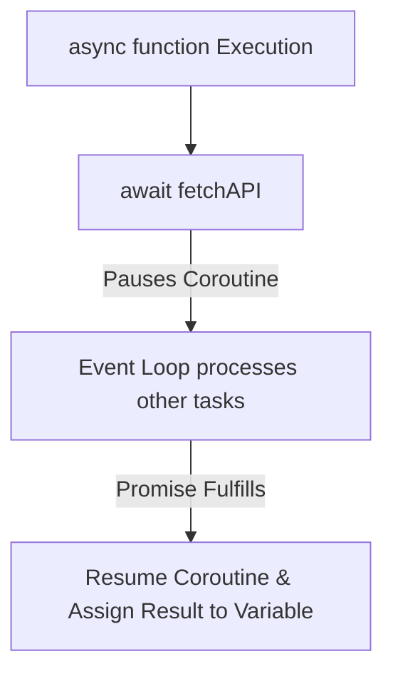

# Async Await Syntactic Sugar And Async Iteration

> **Course**: Git Fundamentals | **Module**: Introduction | **Difficulty**: beginner

---

- **Estimated Time**: 55 Minutes (20m Reading | 25m Practice | 10m Quiz)
- **Difficulty Level**: ⭐⭐ Intermediate
- **Prerequisites**: [Lesson 6.2 ES6 Promises](file:///d:/My%20Drive/all%20files/PROJECT%20FILES/notes/docs/curriculum/_03_javascript/_03_20_es6_promises_architecture_states_and_chaining.md)
- **XP Reward**: +60 XP

### Learning Objectives
By the end of this lesson, you will be able to:
1. Explain how **`async`** functions automatically wrap return values in Promises.
2. Use **`await`** to pause coroutine execution without blocking the main thread.
3. Handle asynchronous errors using standard `try...catch...finally` blocks.
4. Iterate over streaming data sources using **`for await...of`** and `Symbol.asyncIterator`.

---

---

Open Node.js REPL to execute async/await expressions.

---

---

### 3.1 Async/Await as Syntactic Sugar
`async/await` is syntactic sugar built on top of ES6 Promises and Generator functions. An `async` function always returns a Promise. The `await` keyword pauses the execution of an `async` function until the awaited Promise fulfills or rejects:

```javascript
// Equivalent Promise Chain vs Async/Await

// Promise Chain:
function getDataChain() {
  return fetch(url).then(res => res.json());
}

// Async/Await (Synchronous-looking syntax!):
async function getDataAsync() {
  const res = await fetch(url);
  return await res.json();
}
```

### 3.2 Asynchronous Iteration (`for await...of`)
Streams (such as Node.js ReadableStreams or WebSocket message streams) implement `[Symbol.asyncIterator]`, allowing consumption via `for await...of`:

```javascript
async function processStream(stream) {
  for await (const chunk of stream) {
    console.log("Chunk received:", chunk);
  }
}
```

---

---



---

---

```javascript
// Async/Await & Async Iteration Demonstration

const mockApi = (id) => new Promise((res, rej) => 
  setTimeout(() => id ? res({ id, status: "OK" }) : rej(new Error("Missing ID")), 300)
);

// 1. Async/Await with try...catch
async function loadDeviceDetails(deviceId) {
  try {
    console.log(`[Fetching] Device ${deviceId}...`);
    const device = await mockApi(deviceId);
    console.log("[Success]:", device);
    return device;
  } catch (err) {
    console.error("[Failed]:", err.message);
  } finally {
    console.log("[Completed] Fetch operation complete.");
  }
}

// 2. Asynchronous Generator Stream (Symbol.asyncIterator)
async function* telemetryStream() {
  for (let i = 1; i <= 3; i++) {
    await new Promise(r => setTimeout(r, 200));
    yield `Stream Event #${i}`;
  }
}

async function consumeStream() {
  for await (const event of telemetryStream()) {
    console.log("Stream Packet:", event);
  }
}

loadDeviceDetails("ESP32-100");
consumeStream();
```

---

---

- **Node.js File Streaming**: Reading gigabyte-sized log files using `fs.createReadStream()` with `for await (const chunk of stream)` to process log entries line-by-line without memory heap overflow.

---

---

1. Save code as `asyncawait_demo.js`.
2. Run `node asyncawait_demo.js` $\to$ Inspect clean async/await and streaming packet outputs!

---

---

| Bug / Error | Root Cause | Engineering Solution |
| :--- | :--- | :--- |
| **Sequential Await Waterfall** | Awaiting independent promises sequentially in a loop (`await p1; await p2;`), doubling total execution time. | Run independent promises concurrently using `Promise.all([p1, p2])`. |

---

---

- **Always Wrap `await` in `try...catch`**: Catches unhandled rejections cleanly.

---

---

### Q1: What happens when the `await` keyword is executed in an `async` function?
**Answer**: The execution of the `async` function is suspended, and the function yields control back to the central Event Loop. When the awaited Promise fulfills or rejects, a microtask is queued to resume the execution of the `async` function from the line after the `await`.

---

---

```json
{
  "quiz_title": "Lesson 6.3 Async/Await Assessment",
  "questions": [
    {
      "question_id": "Q1",
      "type": "multiple_choice",
      "question_text": "What does an `async` function automatically return if it returns a plain scalar number `return 42`?",
      "options": ["Number 42", "Promise fulfilling to 42", "Undefined", "Generator Object"],
      "correct_answer_index": 1,
      "explanation": "Async functions automatically wrap return values in a Fulfilled Promise."
    }
  ]
}
```

---

---

Build a resilient API client with 3 automatic retries on failure using async/await.

---

---

**Front**: Can `await` be used outside of an `async` function?
**Back**: Only at the top level of ES Modules (Top-Level Await). In standard functions, `await` requires `async`.
<!-- flashcard:end -->

---

---

```javascript
async function run() {
  try { const res = await fetch(url); }
  catch(e) { console.error(e); }
}
```

---
