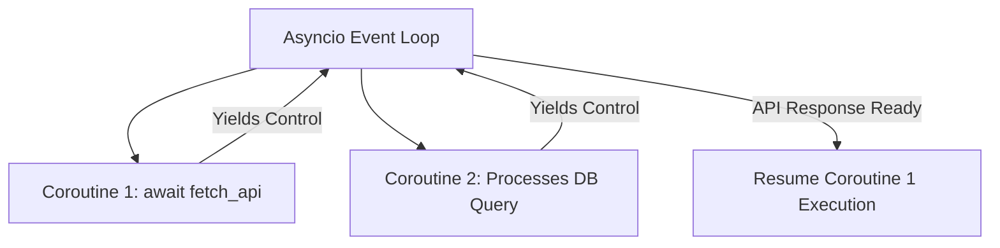

# Asyncio Event Loop And Async Await

> **Course**: Git Fundamentals | **Module**: Introduction | **Difficulty**: beginner

---

- **Estimated Time**: 55 Minutes (20m Reading | 25m Practice | 10m Quiz)
- **Difficulty Level**: ⭐⭐⭐ Advanced
- **Prerequisites**: Python Functions & Static Typing
- **XP Reward**: +70 XP

### Learning Objectives
By the end of this lesson, you will be able to:
1. Explain how single-threaded cooperative multitasking operates via the **Asyncio Event Loop**.
2. Define Coroutines using `async def` and yield control using `await`.
3. Execute high-concurrency tasks in parallel using Python 3.11+ `asyncio.TaskGroup()`.
4. Implement asynchronous resource context managers (`async with`).

---

---

Open VS Code and write python async scripts.

---

---

### 3.1 Synchronous vs Asynchronous Execution
In synchronous execution, I/O operations (network API calls, database queries) block the main execution thread. In **Asyncio**, the single-threaded **Event Loop** pauses a waiting coroutine and immediately switches to execute other ready coroutines:

```
Sync:  [Task 1 (I/O Wait...)] ──► [Task 2 (I/O Wait...)] ──► Total: 4 Seconds
Async: [Task 1 Start] ──┐
       [Task 2 Start] ──┼──► Event Loop processes both concurrently ──► Total: 2 Seconds
```

### 3.2 Python 3.11+ `TaskGroup` Architecture
`asyncio.TaskGroup()` provides exception-safe structured concurrency:

```python
async with asyncio.TaskGroup() as tg:
    task1 = tg.create_task(fetch_user(1))
    task2 = tg.create_task(fetch_user(2))
```

---

---



---

---

```python
import asyncio
import time

async def fetch_telemetry_sensor(sensor_id: int, delay: float) -> dict[str, float]:
    print(f"[Sensor {sensor_id}] Fetching data...")
    await asyncio.sleep(delay)  # Non-blocking async sleep!
    print(f"[Sensor {sensor_id}] Received data.")
    return {"sensor_id": sensor_id, "reading": 24.5 + sensor_id}

async def main():
    start_time = time.perf_counter()
    
    # Python 3.11+ Structured Concurrency via TaskGroup
    async with asyncio.TaskGroup() as tg:
        t1 = tg.create_task(fetch_telemetry_sensor(1, 1.5))
        t2 = tg.create_task(fetch_telemetry_sensor(2, 1.0))
        t3 = tg.create_task(fetch_telemetry_sensor(3, 0.5))

    # All tasks inside TaskGroup complete here
    results = [t1.result(), t2.result(), t3.result()]
    elapsed = time.perf_counter() - start_time
    
    print("Telemetry Results:", results)
    print(f"Total Concurrency Time: {elapsed:.2f} seconds")

# Run Event Loop
asyncio.run(main())
```

---

---

- **FastAPI Async Web Servers**: High-throughput REST API servers utilize `async def` endpoints to handle thousands of concurrent client connections without worker thread starvation.

---

---

1. Save code as `async_demo.py`.
2. Run `python async_demo.py` $\to$ Verify all 3 tasks finish in ~1.5 seconds instead of 3.0 seconds!

---

---

| Bug / Error | Root Cause | Engineering Solution |
| :--- | :--- | :--- |
| **Blocking the Event Loop** | Calling synchronous blocking I/O functions like `time.sleep()` or `requests.get()` inside coroutines. | Use non-blocking async libraries (`asyncio.sleep()`, `httpx`, `aiohttp`). |

---

---

- **Use `asyncio.TaskGroup()`**: Replaces legacy `asyncio.gather()` for clean exception propagation.

---

---

### Q1: Is Asyncio multi-threaded?
**Answer**: No. Asyncio runs on a single thread using cooperative multitasking. When a coroutine reaches an `await` expression, it yields control back to the central Event Loop, allowing other coroutines to execute while waiting for I/O.

---

---

```json
{
  "quiz_title": "Lesson 5.2 Asyncio Assessment",
  "questions": [
    {
      "question_id": "Q1",
      "type": "multiple_choice",
      "question_text": "What keyword defines an asynchronous coroutine function in Python?",
      "options": ["async def", "def async", "coroutine def", "task def"],
      "correct_answer_index": 0,
      "explanation": "async def defines an asynchronous coroutine."
    }
  ]
}
```

---

---

Build a high-performance async Web Scraper fetching 20 URLs concurrently using `httpx` and `asyncio.TaskGroup`.

---

---

**Front**: What entry point starts the Asyncio Event Loop in Python 3.7+?
**Back**: `asyncio.run(main())`
<!-- flashcard:end -->

---

---

```python
asyncio.run(main())
```

---
