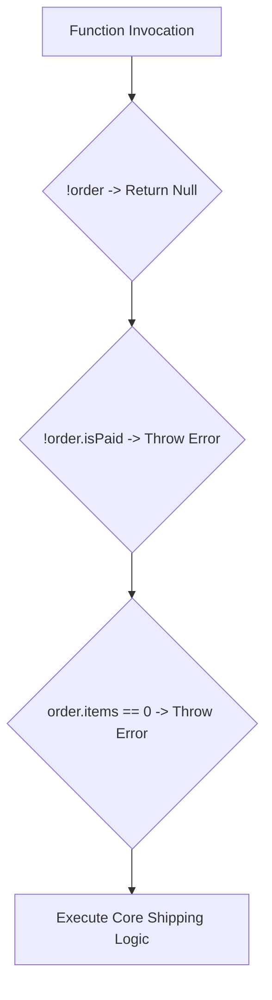

# Conditional Logic And Guard Clauses

> **Course**: Git Fundamentals | **Module**: Introduction | **Difficulty**: beginner

---

- **Estimated Time**: 45 Minutes (15m Reading | 20m Practice | 10m Quiz)
- **Difficulty Level**: ⭐ Beginner
- **Prerequisites**: [Lesson 2.4 Comprehensive Operators](file:///d:/My%20Drive/all%20files/PROJECT%20FILES/notes/docs/curriculum/_03_javascript/_03_07_comprehensive_operator_systems.md)
- **XP Reward**: +50 XP

### Learning Objectives
By the end of this lesson, you will be able to:
1. Construct robust `if`, `else if`, and `else` conditional branches.
2. Evaluate `switch` statements, `break` keywords, and fallthrough mechanics.
3. Refactor deeply nested "arrow code" into clean **Guard Clauses** with early returns.
4. Replace bloated `switch`/`if` blocks with object **Lookup Tables**.

---

---

Open Node.js REPL to execute conditional logic expressions.

---

---

### 3.1 Guard Clauses vs Nested Arrow Code
Deeply nested `if` statements create illegible "arrow code" that is difficult to maintain. **Guard Clauses** handle invalid conditions at the top of a function and return immediately, keeping the primary happy path flat and unindented:

```javascript
// BAD: Deeply Nested Arrow Code
function processOrderBad(order) {
  if (order) {
    if (order.isPaid) {
      if (order.items.length > 0) {
        return shipOrder(order);
      }
    }
  }
}

// GOOD: Clean Guard Clauses (Flat Execution Flow)
function processOrderGood(order) {
  if (!order) return null;
  if (!order.isPaid) throw new Error("Unpaid Order");
  if (order.items.length === 0) throw new Error("Empty Order");

  return shipOrder(order); // Happy path stays un-indented!
}
```

### 3.2 Object Lookup Tables
For mapping discrete state codes to actions, Object Lookup Tables eliminate switch/if overhead:

```javascript
const STATUS_HANDLERS = {
  PENDING: () => "Order queued",
  SHIPPED: () => "In transit",
  DELIVERED: () => "Package arrived"
};

const getStatus = (status) => STATUS_HANDLERS[status]?.() ?? "Unknown Status";
```

---

---



---

---

```javascript
// Conditional Logic & Lookup Table Demonstration

function getSystemRoleAccess(role) {
  // Guard Clause for missing inputs
  if (!role || typeof role !== 'string') {
    return 'GUEST';
  }

  // Object Lookup Table instead of Switch
  const ROLE_PERMISSIONS = {
    ADMIN: 'FULL_SYSTEM_ACCESS',
    DEVELOPER: 'WRITE_CODE_AND_DEPLOY',
    ANALYST: 'READ_ONLY_REPORTS'
  };

  return ROLE_PERMISSIONS[role.toUpperCase()] ?? 'LIMITED_USER_ACCESS';
}

console.log(getSystemRoleAccess("admin"));     // "FULL_SYSTEM_ACCESS"
console.log(getSystemRoleAccess("unknown"));   // "LIMITED_USER_ACCESS"
console.log(getSystemRoleAccess(null));        // "GUEST"
```

---

---

- **IoT Telemetry Signal Decoders**: Edge gateway scripts parse incoming MQTT payload headers and use guard clauses to instantly discard corrupted or unauthenticated sensor packets.

---

---

1. Save code as `conditionals_demo.js`.
2. Run `node conditionals_demo.js` $\to$ Observe clean guard clause output!

---

---

| Bug / Error | Root Cause | Engineering Solution |
| :--- | :--- | :--- |
| **Accidental `switch` Fallthrough** | Omitting the `break` keyword at the end of a `case` block. | Always end `case` arms with `break` or `return`. |

---

---

- **Use Early Returns**: Handle edge cases first and return early to keep function bodies flat.

---

---

### Q1: What is a Guard Clause and why is it preferred over nested `if-else` blocks?
**Answer**: A Guard Clause is a conditional check at the start of a function that handles invalid or special cases by returning early or throwing an exception. It avoids deeply nested "arrow code", making code far easier to read and test.

---

---

```json
{
  "quiz_title": "Lesson 3.1 Conditionals Assessment",
  "questions": [
    {
      "question_id": "Q1",
      "type": "multiple_choice",
      "question_text": "What happens if a switch case block does not end with a `break` or `return` statement?",
      "options": ["Syntax Error", "Execution falls through to the next case", "Function terminates", "Loop restarts"],
      "correct_answer_index": 1,
      "explanation": "Omitting break causes execution to fall through into subsequent cases."
    }
  ]
}
```

---

---

Refactor a 5-level nested `if-else` HTTP status handler into clean Guard Clauses and Lookup Tables.

---

---

**Front**: What refactoring pattern replaces nested `if-else` blocks with early returns?
**Back**: Guard Clauses (Early Return Pattern).
<!-- flashcard:end -->

---

---

```javascript
if (!valid) return;
```

---
