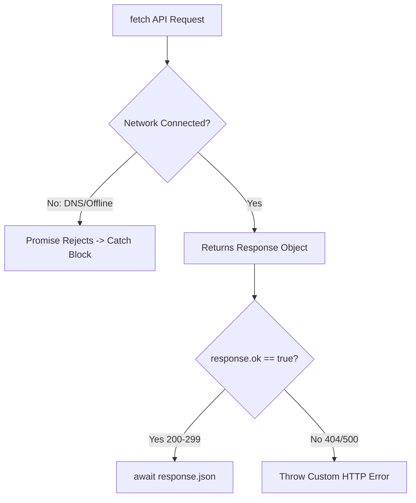

# Fetch Api And Http Network Requests

> **Course**: Git Fundamentals | **Module**: Introduction | **Difficulty**: beginner

---

- **Estimated Time**: 55 Minutes (20m Reading | 25m Practice | 10m Quiz)
- **Difficulty Level**: ⭐⭐ Intermediate
- **Prerequisites**: [Lesson 8.4 Event Delegation](file:///d:/My%20Drive/all%20files/PROJECT%20FILES/notes/docs/curriculum/_03_javascript/_03_30_event_delegation_and_custom_events.md)
- **XP Reward**: +60 XP

### Learning Objectives
By the end of this lesson, you will be able to:
1. Make asynchronous HTTP requests using the native **Fetch API**.
2. Configure HTTP verbs (`GET`, `POST`, `PUT`, `DELETE`) and request headers (`Content-Type`).
3. Identify the `fetch()` HTTP status code trap and validate `response.ok`.
4. Cancel pending in-flight requests using **`AbortController`**.

---

---

Open VS Code or Node.js 18+ REPL.

---

---

### 3.1 The `fetch()` HTTP Status Code Trap
Unlike older libraries like Axios, a `fetch()` Promise does **NOT** reject on HTTP 404 or 500 error status codes! A `fetch()` Promise ONLY rejects on network level failures (e.g. DNS failure, offline network).

To handle HTTP server errors properly, engineers must manually inspect the **`response.ok`** boolean property:

```javascript
const response = await fetch(url);
if (!response.ok) {
  throw new Error(`HTTP Error! Status: ${response.status}`);
}
const data = await response.json();
```

---

---



---

---

```javascript
// Fetch API POST Request & AbortController Demonstration

async function postTelemetryData(url, payload) {
  // 1. Setup Request Timeout via AbortController
  const controller = new AbortController();
  const timeoutId = setTimeout(() => controller.abort(), 5000); // 5s Timeout

  try {
    const response = await fetch(url, {
      method: "POST",
      headers: {
        "Content-Type": "application/json",
        "Authorization": "Bearer SECURE_TOKEN_90210"
      },
      body: JSON.stringify(payload),
      signal: controller.signal // Link abort signal!
    });

    clearTimeout(timeoutId); // Clear timeout on response arrival

    // 2. Validate HTTP Status Code
    if (!response.ok) {
      throw new Error(`HTTP Request Failed! Status Code: ${response.status}`);
    }

    const result = await response.json();
    return result;

  } catch (error) {
    if (error.name === "AbortError") {
      console.error("Network Error: Request timed out after 5000ms!");
    } else {
      console.error("Fetch Error:", error.message);
    }
  }
}

// Example Execution
postTelemetryData("https://jsonplaceholder.typicode.com/posts", {
  deviceId: "ESP32-A1",
  temperature: 24.8
});
```

---

---

- **Microservice API Integration**: Single Page Applications fetch real-time telemetry JSON from backend REST APIs, configuring bearer authorization headers and handling network timeouts gracefully.

---

---

1. Save code as `fetch_demo.js`.
2. Run `node fetch_demo.js` $\to$ Inspect HTTP POST request response and JSON parsing!

---

---

| Bug / Error | Root Cause | Engineering Solution |
| :--- | :--- | :--- |
| **Silent HTTP 404 Failures** | Assuming `fetch()` automatically throws an error on 404 Not Found responses. | Always check `if (!response.ok)` before parsing JSON. |

---

---

- **Use `AbortController` for Timeouts**: Prevents hanging requests from consuming memory.

---

---

### Q1: Why does `fetch()` not reject when a server returns a 404 or 500 error code?
**Answer**: `fetch()` models HTTP protocol compliance. An HTTP 404 or 500 status code is a valid HTTP response from the server, so the Promise fulfills with a `Response` object. A `fetch()` Promise only rejects if the request could not be completed at the network transport layer (e.g. no internet connection or invalid domain).

---

---

```json
{
  "quiz_title": "Lesson 9.1 Fetch API Assessment",
  "questions": [
    {
      "question_id": "Q1",
      "type": "multiple_choice",
      "question_text": "Which boolean property on the Fetch Response object verifies an HTTP status code between 200 and 299?",
      "options": ["response.success", "response.ok", "response.valid", "response.status200"],
      "correct_answer_index": 1,
      "explanation": "response.ok is true if the HTTP status is between 200 and 299."
    }
  ]
}
```

---

---

Build a resilient API wrapper function supporting automatic request timeouts via `AbortController`.

---

---

**Front**: What web API component allows canceling an active in-flight `fetch()` request?
**Back**: `AbortController` (passed via the `signal` option).
<!-- flashcard:end -->

---

---

```javascript
const res = await fetch(url);
if (!res.ok) throw new Error(res.status);
const data = await res.json();
```

---
