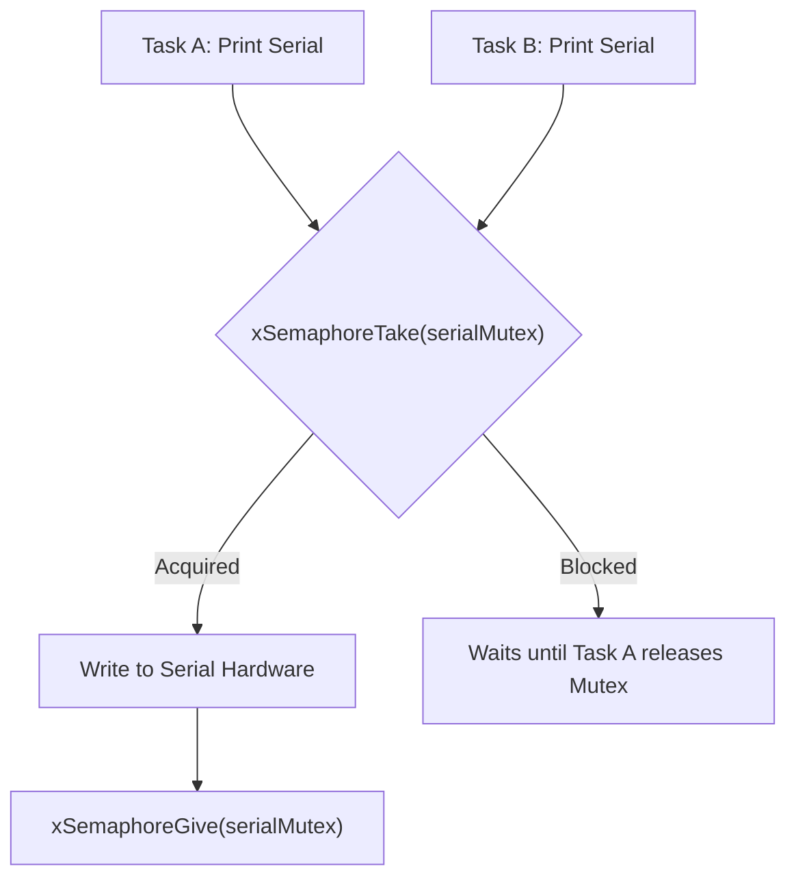

# Freertos Semaphores Mutexes And Locks

> **Course**: Git Fundamentals | **Module**: Introduction | **Difficulty**: beginner

---

- **Estimated Time**: 55 Minutes (20m Reading | 25m Practice | 10m Quiz)
- **Difficulty Level**: ⭐⭐⭐ Advanced
- **Prerequisites**: [Lesson 4.1 FreeRTOS Queues](file:///d:/My%20Drive/all%20files/PROJECT%20FILES/notes/docs/curriculum/_06_iot_hardware/_06_08_freertos_queues_and_inter_task_messaging.md)
- **XP Reward**: +70 XP

### Learning Objectives
By the end of this lesson, you will be able to:
1. Identify shared hardware peripheral race conditions (e.g. concurrent Serial/I2C access).
2. Protect shared resources using **Mutexes (`xSemaphoreCreateMutex()`)**.
3. Synchronize hardware ISR events using **Binary Semaphores (`xSemaphoreCreateBinary()`)**.
4. Understand how Mutexes prevent **Priority Inversion** via **Priority Inheritance**.
5. Acquire and release locks using `xSemaphoreTake()` and `xSemaphoreGive()`.

---

---

Open PlatformIO in VS Code.

---

---

### 3.1 Binary Semaphores vs Mutexes

```
┌─────────────────────────────────────────────────────────────────────────────┐
│                       MUTEX vs BINARY SEMAPHORE MATRIX                      │
├─────────────────┬───────────────────────────────┬───────────────────────────┤
│ Primitive       │ Primary Purpose               │ Ownership & Mechanics     │
├─────────────────┼───────────────────────────────┼───────────────────────────┤
│ **Mutex**       │ Mutual Exclusion for Shared   │ Has Ownership. The task   │
│                 │ Resources (Serial, I2C, SPI)  │ taking the lock MUST give │
│                 │                               │ it back. Enables Priority │
│                 │                               │ Inheritance!              │
├─────────────────┼───────────────────────────────┼───────────────────────────┤
│ **Binary**      │ Task Synchronization          │ No Ownership. One task    │
│ **Semaphore**   │ (Signaling ISR completion)    │ (or ISR) gives token;     │
│                 │                               │ another task takes it!    │
└─────────────────┴───────────────────────────────┴───────────────────────────┘
```

### 3.2 What is Priority Inversion?
**Priority Inversion** occurs when a low-priority task holds a shared resource lock needed by a high-priority task, while a medium-priority task preempts the low-priority task—effectively delaying the high-priority task!

FreeRTOS **Mutexes** automatically temporarily boost the low-priority task's priority to match the high-priority task until the Mutex is released (**Priority Inheritance**).

---

---



---

---

```cpp
// FreeRTOS Mutex Resource Protection (main.cpp)
#include <Arduino.h>

SemaphoreHandle_t serialMutex = NULL;

// Shared Peripheral Function protected by Mutex
void safeSerialPrint(const char *taskName, const char *message) {
  // Acquire Mutex Lock (Wait up to 1000ms if locked by another task)
  if (xSemaphoreTake(serialMutex, pdMS_TO_TICKS(1000)) == pdTRUE) {
    // --- CRITICAL SECTION START ---
    Serial.printf("[%s]: ", taskName);
    Serial.println(message);
    // --- CRITICAL SECTION END ---

    // Release Mutex Lock
    xSemaphoreGive(serialMutex);
  } else {
    Serial.printf("[ERROR]: %s failed to acquire Serial Mutex!\n", taskName);
  }
}

void TaskWorkerA(void *pvParameters) {
  for (;;) {
    safeSerialPrint("Task Worker A", "Executing critical I2C sensor read operation.");
    vTaskDelay(pdMS_TO_TICKS(1000));
  }
}

void TaskWorkerB(void *pvParameters) {
  for (;;) {
    safeSerialPrint("Task Worker B", "Writing telemetry log payload.");
    vTaskDelay(pdMS_TO_TICKS(1500));
  }
}

void setup() {
  Serial.begin(115200);
  delay(1000);

  // Create Mutex Semaphore
  serialMutex = xSemaphoreCreateMutex();

  if (serialMutex != NULL) {
    Serial.println("[Mutex Created]: Launching Concurrent Worker Tasks...");

    xTaskCreatePinnedToCore(TaskWorkerA, "WorkerA", 3072, NULL, 2, NULL, 1);
    xTaskCreatePinnedToCore(TaskWorkerB, "WorkerB", 3072, NULL, 2, NULL, 1);
  }
}

void loop() {
  vTaskDelete(NULL);
}
```

---

---

- **Multi-Task I2C Bus Protection**: Robotic controllers use Mutex locks around `Wire.beginTransmission()` and `Wire.endTransmission()` to prevent concurrent tasks from corrupting I2C bus transactions.

---

---

1. Save code as `src/main.cpp`.
2. Upload via PlatformIO.
3. Open Serial Monitor $\to$ Observe clean, interleaved, uncorrupted serial log lines from both Worker A and Worker B!

---

---

| Bug / Error | Root Cause | Engineering Solution |
| :--- | :--- | :--- |
| **System Deadlock** | Task A acquires Mutex 1 and waits for Mutex 2, while Task B acquires Mutex 2 and waits for Mutex 1. | Always acquire multiple Mutex locks in identical sequential order across all tasks. |

---

---

- **Keep Critical Sections Short**: Minimize code executed between `xSemaphoreTake()` and `xSemaphoreGive()`.

---

---

### Q1: What is Priority Inversion and how do FreeRTOS Mutexes resolve it?
**Answer**: Priority Inversion occurs when a high-priority task is blocked waiting for a low-priority task to release a lock, but medium-priority tasks pre-empt the low-priority task, causing the high-priority task to wait indefinitely. FreeRTOS Mutexes implement Priority Inheritance: when a high-priority task attempts to take a Mutex held by a low-priority task, the scheduler temporarily elevates the low-priority task's priority to match the high-priority task until the Mutex is released.

---

---

```json
{
  "quiz_title": "Lesson 4.2 Mutexes & Locks Assessment",
  "questions": [
    {
      "question_id": "Q1",
      "type": "multiple_choice",
      "question_text": "Which FreeRTOS function creates a Mutex with built-in Priority Inheritance?",
      "options": ["xSemaphoreCreateBinary()", "xSemaphoreCreateMutex()", "xQueueCreate()", "vMutexInit()"],
      "correct_answer_index": 1,
      "explanation": "xSemaphoreCreateMutex() creates Mutexes with Priority Inheritance."
    }
  ]
}
```

---

---

Protect shared I2C bus access across two FreeRTOS tasks using a Mutex.

---

---

**Front**: What function acquires a FreeRTOS Semaphore or Mutex lock?
**Back**: `xSemaphoreTake(handle, timeoutTicks)`.
<!-- flashcard:end -->

---

---

```cpp
SemaphoreHandle_t mutex = xSemaphoreCreateMutex();
if (xSemaphoreTake(mutex, pdMS_TO_TICKS(100)) == pdTRUE) {
    // Critical Section
    xSemaphoreGive(mutex);
}
```

---
