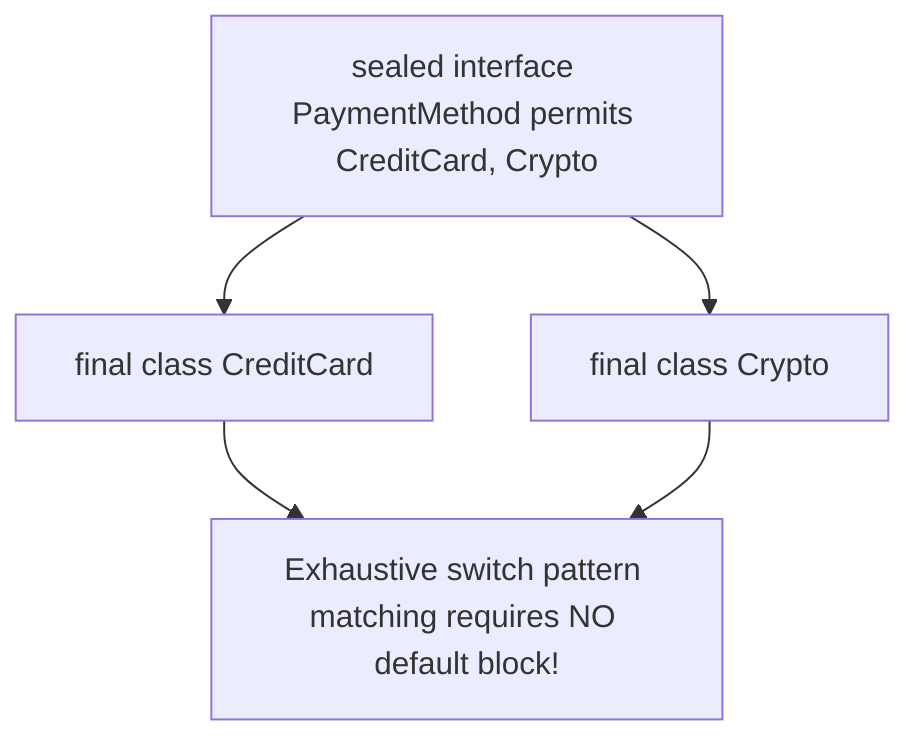

# Java21 Sealed Classes And Interfaces

> **Course**: Git Fundamentals | **Module**: Introduction | **Difficulty**: beginner

---

- **Estimated Time**: 45 Minutes (15m Reading | 20m Practice | 10m Quiz)
- **Difficulty Level**: ⭐⭐⭐ Advanced
- **Prerequisites**: Java Inheritance & Interfaces
- **XP Reward**: +60 XP

### Learning Objectives
By the end of this lesson, you will be able to:
1. Restrict class inheritance hierarchies using Java 21 **Sealed Classes** and `permits` clauses.
2. Enforce permitted subclass modifiers (`final`, `sealed`, or `non-sealed`).
3. Leverage **Exhaustive Pattern Matching for `switch`** without needing a fallback `default` block.

---

---

Ensure JDK 21 LTS is active.

---

---

### 3.1 Controlled Class Hierarchies
Before Java 17/21, a public class could be extended by *any* subclass across the codebase unless declared `final`. **Sealed Classes** allow domain architects to explicitly restrict inheritance to a closed set of permitted subclasses:

```java
// Permitted inheritance hierarchy
public sealed interface PaymentMethod permits CreditCard, BankTransfer, Crypto {}

public final class CreditCard implements PaymentMethod {}
public final class BankTransfer implements PaymentMethod {}
public final class Crypto implements PaymentMethod {}
```

### 3.2 Subclass Modifiers
Every subclass specified in a `permits` list MUST choose one of 3 modifiers:
1. **`final`**: Cannot be extended further.
2. **`sealed`**: Extends hierarchy under its own `permits` clause.
3. **`non-sealed`**: Re-opens hierarchy for unrestricted extension.

---

---



---

---

```java
// Java 21 Sealed Hierarchy & Exhaustive Switch Pattern Matching

public sealed interface Shape permits Circle, Rectangle, Triangle {}

public final record Circle(double radius) implements Shape {}
public final record Rectangle(double width, double height) implements Shape {}
public final record Triangle(double base, double height) implements Shape {}

class SealedDemo {
    // Exhaustive Switch: Compiler guarantees all permitted shapes are handled!
    public static double calculateArea(Shape shape) {
        return switch (shape) {
            case Circle c -> Math.PI * c.radius() * c.radius();
            case Rectangle r -> r.width() * r.height();
            case Triangle t -> 0.5 * t.base() * t.height();
            // NO default case required because Shape is sealed and exhaustive!
        };
    }

    public static void main(String[] args) {
        Shape c = new Circle(5.0);
        System.out.println("Circle Area: " + calculateArea(c));
    }
}
```

---

---

- **Enterprise Payment Gateway Domain Modeling**: Modeling strict domain events (`PaymentPending`, `PaymentApproved`, `PaymentDeclined`) where new unhandled subclasses must be prevented at compile time.

---

---

1. Save code as `SealedDemo.java`.
2. Compile and run: `javac SealedDemo.java` $\to$ `java SealedDemo`.

---

---

| Bug / Error | Root Cause | Engineering Solution |
| :--- | :--- | :--- |
| **`An extension of a sealed class must be final, sealed, or non-sealed`** | Permitted subclass missing one of the 3 required modifiers. | Add `final`, `sealed`, or `non-sealed` to the subclass header. |

---

---

- **Combine Sealed Classes with Records**: Ideal for modeling immutable algebraic data types (ADTs).

---

---

### Q1: Why does exhaustive pattern matching on a sealed class eliminate the need for a `default` case in switch expressions?
**Answer**: Because the compiler knows every possible subclass permitted by the sealed hierarchy. If all permitted subclasses are covered by `case` arms, the switch is guaranteed to be exhaustive, allowing the compiler to omit the `default` fallback safely.

---

---

```json
{
  "quiz_title": "Lesson 2.4 Sealed Classes Assessment",
  "questions": [
    {
      "question_id": "Q1",
      "type": "multiple_choice",
      "question_text": "Which modifier re-opens a sealed subclass hierarchy for unrestricted extension by any class?",
      "options": ["final", "open", "non-sealed", "unrestricted"],
      "correct_answer_index": 2,
      "explanation": "non-sealed re-opens a class hierarchy."
    }
  ]
}
```

---

---

Build a sealed domain state machine for an e-commerce order workflow.

---

---

**Front**: What keyword specifies allowed subclasses in a sealed class header?
**Back**: `permits`
<!-- flashcard:end -->

---

---

```java
public sealed interface Result permits Success, Failure {}
```

---
