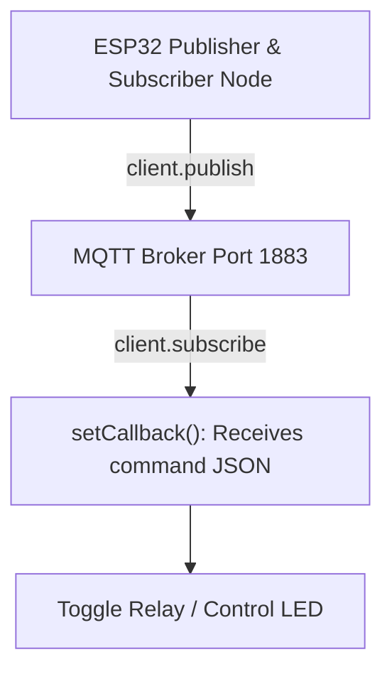

# Mqtt Protocol And Pubsubclient

> **Course**: Git Fundamentals | **Module**: Introduction | **Difficulty**: beginner

---

- **Estimated Time**: 55 Minutes (20m Reading | 25m Practice | 10m Quiz)
- **Difficulty Level**: ⭐⭐ Intermediate
- **Prerequisites**: [Lesson 6.1 HTTP REST Client](file:///d:/My%20Drive/all%20files/PROJECT%20FILES/notes/docs/curriculum/_06_iot_hardware/_06_12_http_rest_client_requests.md)
- **XP Reward**: +60 XP

### Learning Objectives
By the end of this lesson, you will be able to:
1. Explain the **Publish/Subscribe (Pub/Sub)** architecture of the MQTT 3.1.1 protocol.
2. Connect the ESP32 to an MQTT Broker using **`PubSubClient`**.
3. Publish sensor telemetry to topic hierarchies (`devices/esp32-01/telemetry`).
4. Subscribe to control command topics and execute callback functions (`client.setCallback()`).
5. Maintain keep-alive ping cycles via **`client.loop()`**.

---

---

Include `knolleary/PubSubClient @ ^2.8` and `bblanchon/ArduinoJson @ ^7.0.0` in `platformio.ini`.

---

---

### 3.1 What is MQTT?
Unlike HTTP client-server polling, **MQTT (Message Queuing Telemetry Transport)** is an extremely lightweight ISO standard binary publish/subscribe messaging protocol designed specifically for constrained IoT microcontrollers and low-bandwidth networks.

```
┌─────────────────────────────────────────────────────────────────────────────┐
│                          MQTT PUBLISH / SUBSCRIBE ARCHITECTURE               │
├─────────────────────────────────────────────────────────────────────────────┤
│ ESP32 Sensor Node ──► Publish `telemetry/temp` = 25.4°C                     │
│                             │                                               │
│                             ▼                                               │
│                 MQTT BROKER (Mosquitto / EMQX)                              │
│                             │                                               │
│                             ├─► Subscriber 1 (Web Dashboard) receives data │
│                             └─► Subscriber 2 (Database Logger) receives data│
└─────────────────────────────────────────────────────────────────────────────┘
```

---

---



---

---

```cpp
// ESP32 MQTT PubSubClient Implementation (main.cpp)
#include <Arduino.h>
#include <WiFi.h>
#include <PubSubClient.h>
#include <ArduinoJson.h>

const char *WIFI_SSID = "YOUR_WIFI_SSID";
const char *WIFI_PASS = "YOUR_WIFI_PASSWORD";

// Public MQTT Test Broker (or your Mosquitto IP!)
const char *MQTT_BROKER = "test.mosquitto.org";
const int MQTT_PORT = 1883;

const char *TOPIC_TELEMETRY = "nodes/esp32-node1/telemetry";
const char *TOPIC_COMMANDS = "nodes/esp32-node1/commands";

WiFiClient espClient;
PubSubClient mqttClient(espClient);

// 1. MQTT Command Callback Function (Triggered when a message arrives!)
void mqttCallback(char *topic, byte *payload, unsigned int length) {
  Serial.printf("\n[MQTT Command Received]: Topic '%s'\n", topic);

  // Convert payload byte array to String
  String message;
  for (unsigned int i = 0; i < length; i++) {
    message += (char)payload[i];
  }
  Serial.printf("  -> Payload: %s\n", message.c_str());

  // Parse Command JSON using ArduinoJson 7
  JsonDocument doc;
  DeserializationError err = deserializeJson(doc, message);
  if (!err) {
    bool relayState = doc["relay"];
    digitalWrite(GPIO_NUM_2, relayState ? HIGH : LOW);
    Serial.printf("  -> Actuator Toggled: LED = %s\n", relayState ? "ON" : "OFF");
  }
}

void reconnectMQTT() {
  while (!mqttClient.connected()) {
    Serial.print("[MQTT]: Connecting to broker...");
    String clientId = "ESP32Client-" + String(random(0xffff), HEX);

    if (mqttClient.connect(clientId.c_str())) {
      Serial.println(" CONNECTED!");
      // Subscribe to control commands topic
      mqttClient.subscribe(TOPIC_COMMANDS);
      Serial.printf("  -> Subscribed to topic: %s\n", TOPIC_COMMANDS);
    } else {
      Serial.printf(" FAILED! state=%d. Retrying in 5 seconds...\n", mqttClient.state());
      delay(5000);
    }
  }
}

void setup() {
  Serial.begin(115200);
  pinMode(GPIO_NUM_2, OUTPUT);

  WiFi.mode(WIFI_STA);
  WiFi.begin(WIFI_SSID, WIFI_PASS);

  while (WiFi.status() != WL_CONNECTED) {
    delay(500);
  }

  // 2. Configure MQTT Server & Callback
  mqttClient.setServer(MQTT_BROKER, MQTT_PORT);
  mqttClient.setCallback(mqttCallback);
}

void loop() {
  if (!mqttClient.connected()) {
    reconnectMQTT();
  }

  // 3. Keep-alive processing loop (MUST be called continuously!)
  mqttClient.loop();

  // Publish telemetry every 5 seconds
  static uint32_t lastPublish = 0;
  if (millis() - lastPublish > 5000) {
    lastPublish = millis();

    JsonDocument doc;
    doc["node_id"] = "ESP32-NODE1";
    doc["temperature"] = 26.2;
    doc["rssi"] = WiFi.RSSI();

    String jsonString;
    serializeJson(doc, jsonString);

    mqttClient.publish(TOPIC_TELEMETRY, jsonString.c_str());
    Serial.printf("[MQTT Published]: %s\n", jsonString.c_str());
  }
}
```

---

---

- **Smart Factory Sensor & Actuator Networks**: Industrial automation networks use MQTT brokers (Mosquitto/EMQX) to route thousands of high-frequency motor vibration telemetry messages per second to cloud analytics pipelines.

---

---

1. Add `knolleary/PubSubClient@^2.8` to `platformio.ini`.
2. Upload program via PlatformIO.
3. Open Serial Monitor $\to$ Observe successful connection to `test.mosquitto.org` and live topic publishing!

---

---

| Bug / Error | Root Cause | Engineering Solution |
| :--- | :--- | :--- |
| **MQTT Disconnects / Commands Not Received** | Forgetting to invoke `mqttClient.loop()` regularly inside the main `loop()` or FreeRTOS task loop. | Call `mqttClient.loop()` on every loop iteration to maintain the keep-alive connection and process incoming packet buffers. |

---

---

- **Always Call `mqttClient.loop()`**: Never omit `mqttClient.loop()`—it services keep-alive pings and incoming subscriptions.

---

---

### Q1: Compare MQTT and HTTP protocols for resource-constrained IoT devices.
**Answer**: HTTP is a request/response protocol requiring heavy text header overhead (several hundred bytes per request) and client-initiated polling, which drains battery and increases latency. MQTT is a binary pub/sub protocol with a minimal 2-byte header, persistent TCP socket connections, low overhead, and real-time bi-directional message delivery, making it far superior for microcontrollers.

---

---

```json
{
  "quiz_title": "Lesson 6.2 ESP32 MQTT Assessment",
  "questions": [
    {
      "question_id": "Q1",
      "type": "multiple_choice",
      "question_text": "Which method must be called repeatedly inside loop() to process incoming MQTT messages and maintain keep-alive pings?",
      "options": ["mqttClient.poll()", "mqttClient.loop()", "mqttClient.keepAlive()", "mqttClient.check()"],
      "correct_answer_index": 1,
      "explanation": "mqttClient.loop() maintains connection pings and processes incoming messages."
    }
  ]
}
```

---

---

Publish sensor JSON payloads to an MQTT broker and subscribe to an actuator command topic.

---

---

**Front**: What method registers an incoming message callback in the `PubSubClient` library?
**Back**: `mqttClient.setCallback(mqttCallbackFunction)`.
<!-- flashcard:end -->

---

---

```cpp
mqttClient.setServer("broker.hivemq.com", 1883);
mqttClient.setCallback(callback);
mqttClient.publish("topic/data", "msg");
mqttClient.loop();
```

---
