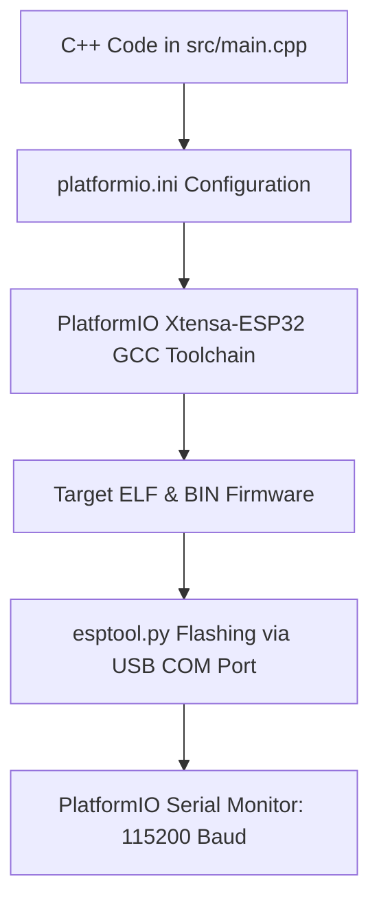

# Platformio Espidf Toolchain Setup

> **Course**: Git Fundamentals | **Module**: Introduction | **Difficulty**: beginner

---

- **Estimated Time**: 45 Minutes (15m Reading | 20m Practice | 10m Quiz)
- **Difficulty Level**: ⭐ Beginner
- **Prerequisites**: [Lesson 1.1 ESP32 Architecture](file:///d:/My%20Drive/all%20files/PROJECT%20FILES/notes/docs/curriculum/_06_iot_hardware/_06_01_esp32_architecture_and_pinout.md)
- **XP Reward**: +50 XP

### Learning Objectives
By the end of this lesson, you will be able to:
1. Configure the **PlatformIO IDE** extension in VS Code.
2. Structure project configuration files (**`platformio.ini`**).
3. Choose between the **Arduino Framework** and native **ESP-IDF Framework**.
4. Compile, flash firmware, and monitor serial output at **115200 baud**.

---

---

Install **VS Code** and the **PlatformIO IDE** extension. Install USB-to-UART drivers (**CP210x** or **CH340**) for your ESP32 board.

---

---

### 3.1 Embedded Development Frameworks
When developing for ESP32, embedded engineers choose between two primary frameworks:

1. **Arduino Framework (`framework = arduino`)**: High-level wrapper abstractions designed for rapid prototyping and access to thousands of open-source sensor libraries.
2. **ESP-IDF Native Framework (`framework = espidf`)**: Espressif's official C/C++ IoT Development Framework based on FreeRTOS. Offers maximum performance, granular power management, and direct register access.

```
┌─────────────────────────────────────────────────────────────────────────────┐
│                          PLATFORMIO BUILD PIPELINE                          │
├─────────────────────────────────────────────────────────────────────────────┤
│ C++ Source Code (`src/main.cpp`) + Config (`platformio.ini`)                 │
│                                    │                                        │
│                                    ▼                                        │
│ GCC Xtensa Cross-Compiler ──► Compiles `.elf` ──► Extracts Firmware `.bin`  │
│                                    │                                        │
│                                    ▼                                        │
│ `esptool.py` ──► Flashes `.bin` over USB Serial COM Port ──► ESP32 Flash    │
└─────────────────────────────────────────────────────────────────────────────┘
```

---

---



---

---

### File: `platformio.ini` (PlatformIO Configuration File)

```ini
[env:esp32dev]
platform = espressif32
board = esp32dev
framework = arduino

; Serial Monitor Baud Rate
monitor_speed = 115200

; Flash Memory Partition & Upload Parameters
upload_speed = 921600
board_build.partitions = default.csv

; External Library Dependencies
lib_deps =
    bblanchon/ArduinoJson @ ^7.0.0
```

### File: `src/main.cpp` (Embedded Entrypoint)

```cpp
#include <Arduino.h>

#define LED_PIN 2 // Onboard Blue LED on ESP32 DevKit v1

void setup() {
  pinMode(LED_PIN, OUTPUT);
  Serial.begin(115200);
  Serial.println("\n[PlatformIO Setup Complete]: ESP32 Firmware Running.");
}

void loop() {
  digitalWrite(LED_PIN, HIGH);
  Serial.println("[Status]: LED ON");
  delay(1000);

  digitalWrite(LED_PIN, LOW);
  Serial.println("[Status]: LED OFF");
  delay(1000);
}
```

---

---

- **Professional Firmware CI/CD**: Industrial firmware teams use `platformio run` CLI commands in GitHub Actions to compile and run automated unit tests against multiple ESP32 hardware target variants automatically.

---

---

1. Create a new project in PlatformIO VS Code.
2. Paste `platformio.ini` and `src/main.cpp`.
3. Click PlatformIO **Build** and **Upload and Monitor** $\to$ Observe onboard blue LED blinking and serial monitor logs!

---

---

| Bug / Error | Root Cause | Engineering Solution |
| :--- | :--- | :--- |
| **Garbage Characters in Serial Monitor** | `monitor_speed` in `platformio.ini` does not match `Serial.begin()` baud rate code. | Ensure both `platformio.ini` (`monitor_speed = 115200`) and code (`Serial.begin(115200)`) match. |

---

---

- **Use 115200 Baud Rate**: Standardize on 115200 baud for ESP32 serial communication for clean output without buffer overruns.

---

---

### Q1: Why is PlatformIO preferred over Arduino IDE for professional embedded engineering?
**Answer**: PlatformIO integrates into modern IDEs (VS Code), supports git version control, uses a declarative configuration file (`platformio.ini`), supports automated dependency management, enables multi-board build environments, and provides advanced debugging tools (GDB) and unit testing frameworks out of the box.

---

---

```json
{
  "quiz_title": "Lesson 1.2 Toolchain Setup Assessment",
  "questions": [
    {
      "question_id": "Q1",
      "type": "multiple_choice",
      "question_text": "Which configuration file defines board targets, frameworks, and baud rates in PlatformIO?",
      "options": ["config.json", "platformio.ini", "Makefile", "CMakeLists.txt"],
      "correct_answer_index": 1,
      "explanation": "platformio.ini contains project configuration settings."
    }
  ]
}
```

---

---

Configure a `platformio.ini` file specifying `esp32dev` board target and `115200` monitor speed.

---

---

**Front**: What tool handles serial flashing of `.bin` firmware files to ESP32 over USB?
**Back**: `esptool.py`.
<!-- flashcard:end -->

---

---

```ini
[env:esp32dev]
platform = espressif32
board = esp32dev
framework = arduino
monitor_speed = 115200
```

---
