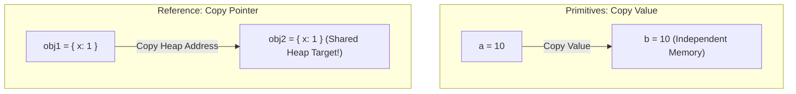

# Primitive And Reference Data Types

> **Course**: Git Fundamentals | **Module**: Introduction | **Difficulty**: beginner

---

- **Estimated Time**: 55 Minutes (20m Reading | 25m Practice | 10m Quiz)
- **Difficulty Level**: ⭐⭐ Intermediate
- **Prerequisites**: [Lesson 2.1 Variable Declarations](file:///d:/My%20Drive/all%20files/PROJECT%20FILES/notes/docs/curriculum/_03_javascript/_03_04_variable_declarations_and_scoping.md)
- **XP Reward**: +60 XP

### Learning Objectives
By the end of this lesson, you will be able to:
1. Identify JavaScript's 7 primitive data types (`Number`, `String`, `Boolean`, `Undefined`, `Null`, `Symbol`, `BigInt`).
2. Differentiate Pass-by-Value (Primitives) from Pass-by-Reference (Objects/Arrays).
3. Safely check data types using `typeof`, `instanceof`, and `Array.isArray()`.
4. Create unique object property keys using `Symbol()`.
5. Perform high-precision integer calculations using `BigInt` (e.g. `9007199254740991n`).

---

---

Open Node.js REPL to execute type checking commands.

---

---

### 3.1 Primitives vs Reference Types

```
┌─────────────────────────────────────────────────────────────────────────────┐
│                     PRIMITIVES VS REFERENCE TYPES MATRIX                    │
├─────────────────┬──────────────────────────────────┬────────────────────────┤
│ Characteristic  │ Primitive Types (7 Types)        │ Reference Types        │
├─────────────────┼──────────────────────────────────┼────────────────────────┤
│ Types           │ Number, String, Boolean,         │ Object, Array,         │
│                 │ Undefined, Null, Symbol, BigInt  │ Function, Date, RegEx  │
├─────────────────┼──────────────────────────────────┼────────────────────────┤
│ Memory Storage  │ Call Stack (Direct Value)        │ Memory Heap (Pointer)  │
│ Immutability    │ Immutable (Value cannot change)  │ Mutable                │
│ Assignment      │ Copied by VALUE                  │ Copied by REFERENCE    │
└─────────────────┴──────────────────────────────────┴────────────────────────┘
```

> [!CAUTION]
> **`typeof null` Bug**: `typeof null` returns `"object"` due to a legacy 1995 V8/JS C-pointer implementation detail. To check for `null`, use strict equality: `val === null`.

---

---



---

---

```javascript
// 1. Symbol & BigInt
const ID_KEY = Symbol("id");
const sensorNode = {
  [ID_KEY]: 101,
  name: "ESP32 Gateway"
};

const massiveInteger = 9007199254740995n; // BigInt literal

// 2. Type Checking Matrix
console.log(typeof "hello"); // "string"
console.log(typeof 42);      // "number"
console.log(typeof null);    // "object" (Legacy quirk!)
console.log(Array.isArray([1, 2, 3])); // true (Safe array check!)
console.log(sensorNode instanceof Object); // true
```

---

---

- **64-bit BigInt Telemetry IDs**: High-throughput distributed systems (Kafka, PostgreSQL 64-bit BIGINTs) use JavaScript `BigInt` to prevent integer overflow truncation.

---

---

1. Save code as `types_demo.js`.
2. Run `node types_demo.js` $\to$ Inspect type outputs in console.

---

---

| Bug / Error | Root Cause | Engineering Solution |
| :--- | :--- | :--- |
| **`typeof []` returns `"object"`** | Arrays are objects in JavaScript. | Use `Array.isArray(arr)` to verify arrays. |

---

---

- **Use `Array.isArray()`**: Never rely on `typeof` for checking array instances.

---

---

### Q1: What are the 7 primitive data types in JavaScript?
**Answer**: Number, String, Boolean, Undefined, Null, Symbol, and BigInt.

---

---

```json
{
  "quiz_title": "Lesson 2.2 Data Types Assessment",
  "questions": [
    {
      "question_id": "Q1",
      "type": "multiple_choice",
      "question_text": "Which method is the reliable standard for checking if a value is an Array?",
      "options": ["typeof val === 'array'", "Array.isArray(val)", "val instanceof Array", "val.type === 'array'"],
      "correct_answer_index": 1,
      "explanation": "Array.isArray(val) safely checks if an entity is an Array."
    }
  ]
}
```

---

---

Build a deep-clone utility function that recursively copies nested objects without reference mutation.

---

---

**Front**: What does `typeof null` return in JavaScript?
**Back**: `"object"` (a historical language bug; check `val === null` instead).
<!-- flashcard:end -->

---

---

```javascript
Array.isArray(data); // True
val === null; // True null check
```

---
