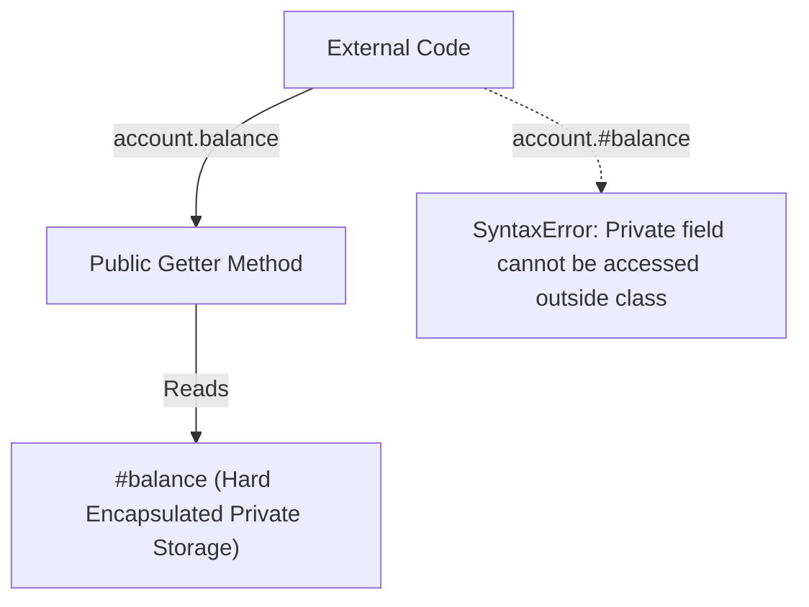

# Private Fields Getters Setters Static Members

> **Course**: Git Fundamentals | **Module**: Introduction | **Difficulty**: beginner

---

- **Estimated Time**: 45 Minutes (15m Reading | 20m Practice | 10m Quiz)
- **Difficulty Level**: ⭐⭐ Intermediate
- **Prerequisites**: [Lesson 7.3 Inheritance](file:///d:/My%20Drive/all%20files/PROJECT%20FILES/notes/docs/curriculum/_03_javascript/_03_25_inheritance_method_overriding_and_super.md)
- **XP Reward**: +50 XP

### Learning Objectives
By the end of this lesson, you will be able to:
1. Enforce true hard encapsulation using **Private Instance Fields (`#field`)**.
2. Write **Private Methods (`#method()`)** accessible only within the class body.
3. Intercept property access and validation using **Getters** (`get`) and **Setters** (`set`).
4. Implement utility methods and factory patterns using the **`static`** keyword.

---

---

Open Node.js REPL to test ES2022 private class fields.

---

---

### 3.1 Hard Encapsulation (`#privateField`)
Before ES2022, private properties were indicated by convention (`_privateProp`), but remained publicly accessible. Modern JavaScript enforces true hard encapsulation at the language level using the hash `#` prefix:

```javascript
class BankAccount {
  #balance = 0; // Truly private field!

  constructor(initialBalance) {
    this.#balance = initialBalance;
  }

  // Getter Accessor
  get balance() {
    return this.#balance;
  }

  // Setter Accessor with Validation
  set balance(amount) {
    if (amount < 0) throw new Error("Negative balance invalid");
    this.#balance = amount;
  }
}
```

Attempting to read `account.#balance` outside the class throws a compile-time `SyntaxError`.

---

---



---

---

```javascript
// Private Fields & Static Factory Method Demonstration

class SecureTelemetryNode {
  // Private Instance Field
  #apiKey;
  
  // Static Field
  static #MAX_NODES = 100;
  static nodeCount = 0;

  constructor(nodeId, apiKey) {
    this.nodeId = nodeId;
    this.#apiKey = apiKey;
    SecureTelemetryNode.nodeCount++;
  }

  // Private Method
  #signPayload(payload) {
    return `[SIGNED:${this.#apiKey}]: ${payload}`;
  }

  // Public Method utilizing private method
  transmit(data) {
    const signed = this.#signPayload(JSON.stringify(data));
    return `Transmitting ${signed}`;
  }

  // Static Factory Method
  static createDefaultNode(id) {
    return new SecureTelemetryNode(id, "DEFAULT_KEY_90210");
  }
}

const node = SecureTelemetryNode.createDefaultNode("ESP32-99");
console.log(node.transmit({ temp: 22.4 }));

// console.log(node.#apiKey); // SyntaxError: Private field '#apiKey' must be declared in an enclosing class
```

---

---

- **Database Connection Pools**: Hiding internal socket pools and authorization tokens behind private `#token` fields ensures developers cannot corrupt or leak connection strings.

---

---

1. Save code as `private_demo.js`.
2. Run `node private_demo.js` $\to$ Observe clean static factory creation and private signing!

---

---

| Bug / Error | Root Cause | Engineering Solution |
| :--- | :--- | :--- |
| **`SyntaxError: Private field '#X' must be declared in an enclosing class`** | Attempting to access `#field` outside the class boundary. | Use public getters or methods to expose controlled read-only access. |

---

---

- **Use `#` for Sensitive Properties**: Guarantees true privacy without depending on naming conventions.

---

---

### Q1: How do modern `#` private fields in JavaScript differ from the legacy `_` prefix convention?
**Answer**: The underscore prefix (`_prop`) was purely a human naming convention—the property remained 100% public and accessible at runtime. The hash prefix (`#prop`) enforces hard language-level encapsulation enforced by V8; attempting to access `#prop` outside the class body throws a `SyntaxError`.

---

---

```json
{
  "quiz_title": "Lesson 7.4 Private Fields Assessment",
  "questions": [
    {
      "question_id": "Q1",
      "type": "multiple_choice",
      "question_text": "Which character prefix defines a hard private class field in modern JavaScript?",
      "options": ["_", "#", "$", "private"],
      "correct_answer_index": 1,
      "explanation": "The hash prefix # defines private class fields."
    }
  ]
}
```

---

---

Build a secure PasswordHasher class encapsulating salt generation behind private `#` fields.

---

---

**Front**: Can static class methods access instance properties using `this`?
**Back**: No. Inside a static method, `this` refers to the Class constructor itself, not an instance.
<!-- flashcard:end -->

---

---

```javascript
class User {
  #secret;
  static create() { return new User(); }
}
```

---
