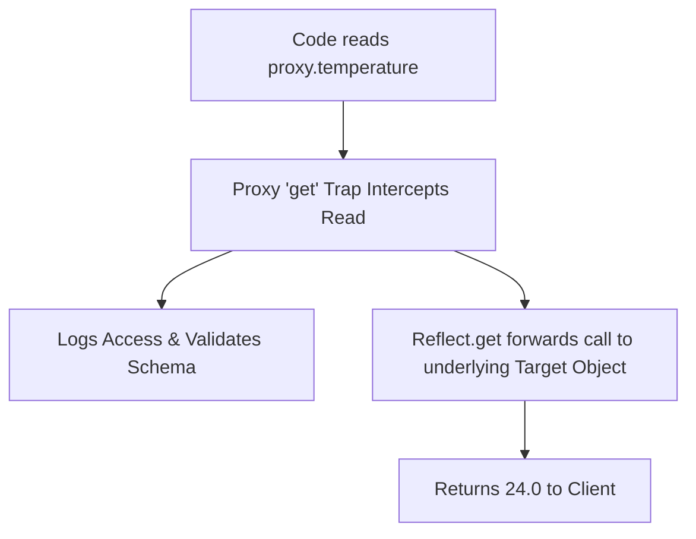

# Proxy And Reflect Api Metaprogramming

> **Course**: Git Fundamentals | **Module**: Introduction | **Difficulty**: beginner

---

- **Estimated Time**: 55 Minutes (20m Reading | 25m Practice | 10m Quiz)
- **Difficulty Level**: ⭐⭐⭐ Advanced
- **Prerequisites**: [Lesson 11.4 Web Security](file:///d:/My%20Drive/all%20files/PROJECT%20FILES/notes/docs/curriculum/_03_javascript/_03_41_web_security_xss_csrf_csp_mitigation.md)
- **XP Reward**: +70 XP

### Learning Objectives
By the end of this lesson, you will be able to:
1. Intercept object operations using **`new Proxy(target, handler)`**.
2. Write custom Proxy traps for `get`, `set`, `has`, and `deleteProperty`.
3. Delegate default operations safely using the **`Reflect` API**.
4. Build a lightweight **Reactive State Engine** (similar to Vue 3 Reactivity).

---

---

Open Node.js REPL.

---

---

### 3.1 What is Meta-Programming?
Meta-programming allows code to inspect, intercept, and modify the core behavior of fundamental programming operations (property lookup, assignment, function invocation) at runtime.

### 3.2 Proxy Traps & Reflect API
- **Proxy**: Wraps a target object and intercepts internal operations via custom handler traps.
- **Reflect**: Provides static methods mirroring Proxy traps to forward default object operations safely.

```javascript
const target = { temperature: 24.0 };

const handler = {
  get(target, prop, receiver) {
    console.log(`[READ Access]: Property ${prop}`);
    return Reflect.get(target, prop, receiver); // Forward to default behavior!
  },
  set(target, prop, value, receiver) {
    if (prop === "temperature" && typeof value !== "number") {
      throw new TypeError("Temperature must be a numeric value!");
    }
    console.log(`[WRITE Access]: ${prop} = ${value}`);
    return Reflect.set(target, prop, value, receiver);
  }
};

const proxySensor = new Proxy(target, handler);
```

---

---



---

---

```javascript
// Building a Micro Reactive State Engine with Proxy & Reflect

function createReactiveStore(initialState, onStateChange) {
  return new Proxy(initialState, {
    get(target, prop, receiver) {
      return Reflect.get(target, prop, receiver);
    },
    set(target, prop, value, receiver) {
      const oldValue = target[prop];
      const success = Reflect.set(target, prop, value, receiver);

      if (success && oldValue !== value) {
        // Trigger reactive UI re-render callback!
        onStateChange(prop, value, oldValue);
      }
      return success;
    }
  });
}

// Instantiate Reactive Store
const state = createReactiveStore({ activeNodes: 0, alertStatus: "OK" }, (key, val, oldVal) => {
  console.log(`[REACTIVE UPDATE]: ${key} changed from '${oldVal}' -> '${val}'`);
});

state.activeNodes = 5;      // [REACTIVE UPDATE]: activeNodes changed from '0' -> '5'
state.alertStatus = "WARN"; // [REACTIVE UPDATE]: alertStatus changed from 'OK' -> 'WARN'
```

---

---

- **Vue.js 3 Reactivity System**: Vue 3's reactive state engine (`reactive()`) is built entirely on ES6 Proxies, intercepting property access to track dependencies and trigger virtual DOM re-renders automatically.

---

---

1. Save code as `proxy_demo.js`.
2. Run `node proxy_demo.js` $\to$ Observe reactive state update logs on property mutations!

---

---

| Bug / Error | Root Cause | Engineering Solution |
| :--- | :--- | :--- |
| **`TypeError: 'set' on proxy: trap returned falsish`** | Forgetting to return `true` or `Reflect.set(...)` in strict mode inside a `set` trap. | Always return `Reflect.set(target, prop, val, receiver)` from `set` traps. |

---

---

- **Pair Proxy Traps with `Reflect`**: Guarantees default object behavior and `this` binding context are preserved.

---

---

### Q1: Why should you use `Reflect` methods inside Proxy handler traps instead of accessing the target directly?
**Answer**: `Reflect` methods mirror the exact internal signature of Proxy traps and handle receiver `this` binding correctly. Accessing `target[prop]` directly inside a trap breaks prototype chain inheritance and custom getter/setter `this` context binding.

---

---

```json
{
  "quiz_title": "Lesson 12.1 Proxy & Reflect Assessment",
  "questions": [
    {
      "question_id": "Q1",
      "type": "multiple_choice",
      "question_text": "Which Proxy trap intercepts property assignment operations (`obj.prop = val`)?",
      "options": ["get", "set", "has", "apply"],
      "correct_answer_index": 1,
      "explanation": "The set trap intercepts property assignments."
    }
  ]
}
```

---

---

Build a schema validation proxy throwing errors when setting un-declared object properties.

---

---

**Front**: Which Proxy trap intercepts the `in` operator (`'key' in proxy`)?
**Back**: The `has(target, prop)` trap.
<!-- flashcard:end -->

---

---

```javascript
const proxy = new Proxy(target, {
  set(t, p, v, r) { return Reflect.set(t, p, v, r); }
});
```

---
