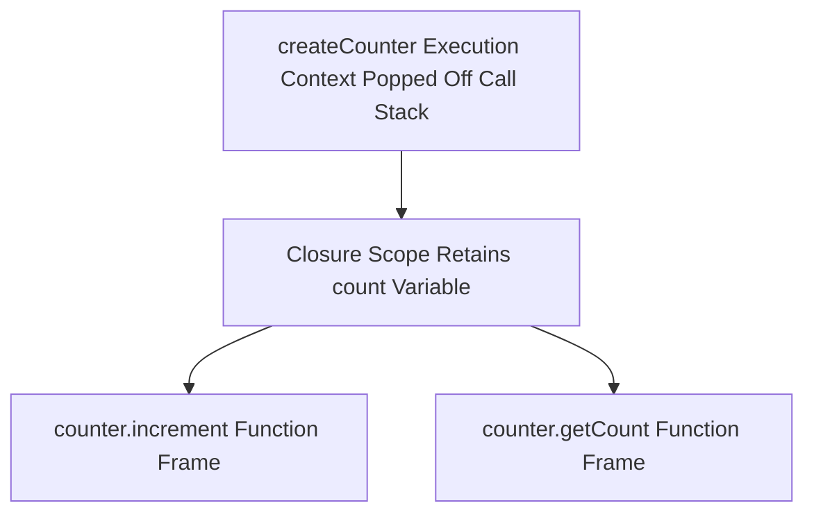

# Scope Chain And Closures

> **Course**: Git Fundamentals | **Module**: Introduction | **Difficulty**: beginner

---

- **Estimated Time**: 55 Minutes (20m Reading | 25m Practice | 10m Quiz)
- **Difficulty Level**: ⭐⭐⭐ Advanced
- **Prerequisites**: [Lesson 4.2 Parameters & Arguments](file:///d:/My%20Drive/all%20files/PROJECT%20FILES/notes/docs/curriculum/_03_javascript/_03_12_parameters_arguments_and_return_values.md)
- **XP Reward**: +70 XP

### Learning Objectives
By the end of this lesson, you will be able to:
1. Trace **Lexical Scoping** and the Scope Chain resolution algorithm.
2. Define a **Closure** and explain how inner functions retain references to outer scope variables.
3. Encapsulate private state variables using closure module patterns.
4. Identify and fix Stale Closures in event handlers and asynchronous loops.

---

---

Open Node.js REPL to test closure state retention.

---

---

### 3.1 Lexical Scoping & Scope Chain
JavaScript uses **Lexical Scoping** (Static Scoping): variable scope is determined by the physical location of the code in the source file. If a variable is not found in the current Execution Context, V8 traverses up the **Scope Chain** to the outer lexical environment.

### 3.2 What is a Closure?
A **Closure** is the combination of a function bundled together with references to its surrounding **Lexical Environment**. A closure gives an inner function access to an outer function's scope even *after* the outer function has finished executing and returned!

```javascript
function createCounter() {
  let count = 0; // Private state variable trapped in closure!

  return {
    increment() { count++; return count; },
    decrement() { count--; return count; },
    getCount()   { return count; }
  };
}

const counter = createCounter(); // createCounter() execution context is popped off Call Stack!
counter.increment(); // 1 (count is retained via Closure!)
```

---

---



---

---

```javascript
// Closure Encapsulation & Stale Closure Fix

// 1. Private Data Encapsulation Pattern
function createIdGenerator(prefix) {
  let sequenceId = 1000; // Completely private variable!

  return function generateNextId() {
    sequenceId++;
    return `${prefix}-${sequenceId}`;
  };
}

const getIotId = createIdGenerator("ESP32");
console.log(getIotId()); // "ESP32-1001"
console.log(getIotId()); // "ESP32-1002"

// 2. Fixing Stale Closure in Asynchronous Loops (Using 'let' vs 'var')
for (let i = 1; i <= 3; i++) {
  // 'let' creates a fresh block-scoped binding per iteration!
  setTimeout(() => {
    console.log(`Async Timer #${i}`);
  }, i * 100);
}
```

---

---

- **React Hooks (`useState`, `useEffect`)**: React internal hooks rely entirely on JavaScript closures to retain component state between virtual DOM re-render cycles.

---

---

1. Save code as `closures_demo.js`.
2. Run `node closures_demo.js` $\to$ Inspect private sequence ID generation and loop timers!

---

---

| Bug / Error | Root Cause | Engineering Solution |
| :--- | :--- | :--- |
| **Stale Closure Bugs in Timers/Events** | Using `var` inside a loop or caching old state references inside a long-lived closure callback. | Use `let` for block scoping or pass updated state arguments explicitly. |

---

---

- **Use Closures for Private State**: Protect variables from global namespace pollution.

---

---

### Q1: What is a JavaScript Closure and how does it retain memory?
**Answer**: A closure is a function that retains access to its outer lexical environment even after the outer function has finished executing. V8 retains closure variables in the heap because the inner function holds an active reference to the outer environment's variable environment.

---

---

```json
{
  "quiz_title": "Lesson 4.3 Closures Assessment",
  "questions": [
    {
      "question_id": "Q1",
      "type": "multiple_choice",
      "question_text": "What type of scoping does JavaScript use to resolve variable references?",
      "options": ["Dynamic Scoping", "Lexical (Static) Scoping", "Global Scoping", "Runtime Scoping"],
      "correct_answer_index": 1,
      "explanation": "JavaScript uses Lexical (Static) Scoping based on source code physical location."
    }
  ]
}
```

---

---

Build a memoization cache decorator function (`memoize(fn)`) using closures.

---

---

**Front**: Does a closure hold a copy of a variable or a live reference?
**Back**: A live reference to the variable in the outer lexical environment.
<!-- flashcard:end -->

---

---

```javascript
function outer() {
  let x = 10;
  return () => x;
}
```

---
