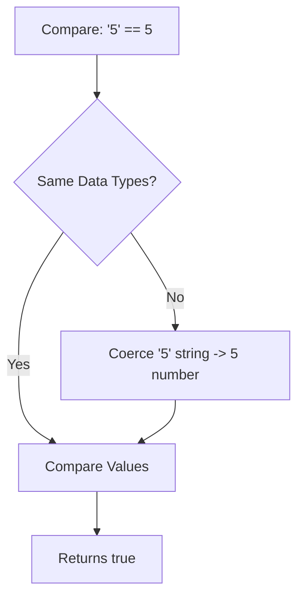

# Type Coercion And Comparison Operations

> **Course**: Git Fundamentals | **Module**: Introduction | **Difficulty**: beginner

---

- **Estimated Time**: 55 Minutes (20m Reading | 25m Practice | 10m Quiz)
- **Difficulty Level**: ⭐⭐ Intermediate
- **Prerequisites**: [Lesson 2.2 Primitive & Reference Types](file:///d:/My%20Drive/all%20files/PROJECT%20FILES/notes/docs/curriculum/_03_javascript/_03_05_primitive_and_reference_data_types.md)
- **XP Reward**: +60 XP

### Learning Objectives
By the end of this lesson, you will be able to:
1. Distinguish between Implicit Coercion (automatic) and Explicit Conversion (manual).
2. Memorize JavaScript's **8 Falsy Values**.
3. Evaluate the Abstract Equality Algorithm (`==`) vs Strict Equality (`===`).
4. Trace Object-to-Primitive Coercion via `[Symbol.toPrimitive]`, `valueOf()`, and `toString()`.

---

---

Open Node.js REPL to test type coercion equality expressions.

---

---

### 3.1 The 8 Falsy Values in JavaScript
Everything in JavaScript is **Truthy** except for these **8 Falsy Values**:

1. `false`
2. `0`
3. `-0`
4. `0n` (BigInt zero)
5. `""` (Empty string)
6. `null`
7. `undefined`
8. `NaN`

> [!NOTE]
> Empty arrays `[]` and empty objects `{}` are **TRUTHY**! `Boolean([])` evaluates to `true`.

### 3.2 Abstract (`==`) vs Strict (`===`) Equality
- `===` (Strict Equality): Checks both **Type** and **Value** without coercion (`"5" === 5` $\to$ `false`).
- `==` (Abstract Equality): Attempts implicit type conversion before comparing values (`"5" == 5` $\to$ `true`).

---

---



---

---

```javascript
// Type Coercion & Comparison Matrix

// 1. Implicit String & Number Coercion
console.log("5" + 2); // "52" (String Concatenation wins on + operator!)
console.log("5" - 2); // 3    (Numeric Subtraction forces Number coercion!)

// 2. Truthy vs Falsy Tricky Comparisons
console.log(Boolean([])); // true (Empty array is Truthy!)
console.log([] == false); // true (Coerced: [] -> "" -> 0, false -> 0 -> 0 == 0!)

// 3. Strict Equality Best Practice
console.log("5" === 5);   // false (No coercion!)
```

---

---

- **Production Linter Rules**: Enterprise ESLint rules enforce `eqeqeq: ["error", "always"]` to ban Abstract Equality (`==`) and prevent subtle type coercion bugs.

---

---

1. Save code as `coercion_demo.js`.
2. Run `node coercion_demo.js` $\to$ Inspect implicit type conversion results!

---

---

| Bug / Error | Root Cause | Engineering Solution |
| :--- | :--- | :--- |
| **Unexpected `==` Coercion Bugs** | Using `==` which implicitly coerces operands. | Always use `===` (Strict Equality). |

---

---

- **Always Use Strict Equality (`===`)**: Eliminates unexpected implicit coercion.

---

---

### Q1: What are the 8 falsy values in JavaScript?
**Answer**: `false`, `0`, `-0`, `0n`, `""`, `null`, `undefined`, and `NaN`.

---

---

```json
{
  "quiz_title": "Lesson 2.3 Type Coercion Assessment",
  "questions": [
    {
      "question_id": "Q1",
      "type": "multiple_choice",
      "question_text": "What does `Boolean([])` evaluate to in JavaScript?",
      "options": ["false", "true", "undefined", "NaN"],
      "correct_answer_index": 1,
      "explanation": "Empty arrays are objects and evaluate to Truthy."
    }
  ]
}
```

---

---

Build an explicit type validation pipeline for incoming JSON HTTP request payloads.

---

---

**Front**: What is the result of `"10" - 5` vs `"10" + 5`?
**Back**: `"10" - 5` equals `5` (Number). `"10" + 5` equals `"105"` (String).
<!-- flashcard:end -->

---

---

```javascript
if (x === true) {} // Always use strict equality ===
```

---
