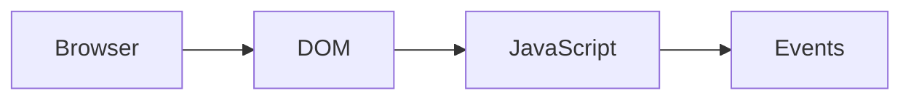

# Style Guide

> All notes in `CURRICULUM/` must follow these rules precisely.

---

## 1. File Naming

- All filenames use underscores — no spaces, no hyphens
- Prefix: module number and lesson number — e.g. `_01_01_`, `_03_12_`
- All lowercase
- Extension: `.md`

```
✅  _01_01_web_architecture_and_protocols.md
✅  _03_27_dom_tree_navigation_and_selection.md
❌  DOM-Tree-Navigation.md
❌  01. DOM Navigation.md
```

> **Do NOT rename existing files.** Only fill stub content.

---

## 2. Heading Hierarchy

| Level | Usage | Rule |
|---|---|---|
| `#` H1 | Lesson title | Exactly ONE per file |
| `##` H2 | Major sections (Overview, Theory, etc.) | From the template |
| `###` H3 | Sub-sections | As needed |
| `####` H4 | Fine breakdowns | Only when necessary |

- Never skip heading levels (e.g. H2 → H4)
- Use sentence case: `## Internal working` not `## Internal Working`

---

## 3. Code Blocks

Every code block **must** have a language identifier:

```html
<!-- HTML example -->
<section class="hero">
  <h1>Welcome</h1>
</section>
```

```javascript
// JavaScript example
const greet = (name) => `Hello, ${name}`;
```

```css
/* CSS example */
.card {
    display: flex;
    gap: 1rem;
}
```

```jsx
// React/JSX example
function Button({ label, onClick }) {
    return <button onClick={onClick}>{label}</button>;
}
```

Allowed identifiers: `html`, `css`, `scss`, `javascript`, `jsx`, `json`, `bash`, `text`, `sql`, `mermaid`

- All examples must be **runnable** — no pseudocode
- Use 4-space indentation for all languages
- Include explanatory comments on key lines

---

## 4. Diagrams

Use **Mermaid** for all diagrams:



> **Diagram:** [One sentence describing what the diagram shows.]

- Always follow a diagram with the `> **Diagram:**` caption line
- Keep diagrams simple — one concept per diagram

---

## 5. Tables

Use GFM pipe tables with a header row and separator:

```markdown
| Header 1 | Header 2 | Header 3 |
|---|---|---|
| Value | Value | Value |
```

---

## 6. Emphasis

| Format | Usage |
|---|---|
| **Bold** | Key terms on first use, important warnings |
| *Italic* | Book titles, slight emphasis |
| `Inline code` | All code identifiers, HTML attributes, CSS properties, method names |

---

## 7. Blockquotes

Use for definitions, warnings, and tips:

```markdown
> **Definition:** The DOM (Document Object Model) is a tree-structured...

> **Warning:** Never use `innerHTML` with untrusted input — XSS risk.

> **Tip:** Use `querySelectorAll` instead of `getElementsByClassName` for more flexible selection.
```

---

## 8. Metadata Block

Every note must start with a metadata blockquote on line 3 (after the H1):

```markdown
# Lesson Title

> **Course:** HTML5 Essentials | **Module:** Module 3 — Forms | **Difficulty:** intermediate
```

---

## 9. Section Order

Follow the `NOTE_TEMPLATE.md` section order exactly:

1. H1 Title
2. Metadata blockquote
3. Overview
4. Learning Objectives
5. Prerequisites
6. Theory
7. Internal Working / How It Works
8. Architecture (if applicable)
9. Code Examples
10. Hands-on Practice
11. Real-world Example
12. Best Practices
13. Common Mistakes
14. Interview Questions
15. Summary
16. Cheat Sheet
17. References

---

## 10. Depth Guidelines by Course

| Course | Audience Assumption | Depth |
|---|---|---|
| HTML5 | No prior web knowledge | Beginner — explain every attribute |
| CSS3 | Knows HTML5 | Beginner → Intermediate |
| Bootstrap | Knows HTML5 + CSS3 | Intermediate — practical focus |
| JavaScript | Knows HTML5 + CSS3 | Intermediate → Advanced — include internals |
| jQuery | Knows JavaScript basics | Intermediate — compare to vanilla JS |
| React.js | Knows JavaScript well | Intermediate → Advanced — component mindset |

---

## 11. References Format

Always use:

```markdown
## References

- [MDN Web Docs — Topic Name](https://developer.mozilla.org/en-US/docs/...)
- [Official Docs — Library Name](https://link/)
- [Article Title — Author Name](https://link/)
```

No bare URLs — all references must be markdown links with descriptive text.
