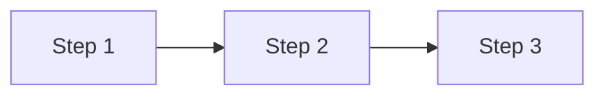

# Note Template

> **Instructions:** Use this template when writing notes for stub files.  
> Look at the existing notes in `curriculum/01-setup-and-overview/` as examples
> of the expected style and depth.

---

# [Lesson Title]

> **Course**: Python Programming | **Module**: [Module Name] | **Difficulty**: beginner / intermediate / advanced

---

[Write 2–4 sentences introducing the concept. Explain what it is and why it matters.]

---

## Key Concepts

[Explain the main theory. Use bullet points, tables, and diagrams as needed.]

> **Definition:** [Term] is [clear one-sentence explanation].

| [Column A] | [Column B] | [Column C] |
|---|---|---|
| [Value] | [Value] | [Value] |

---

## Architecture / How It Works

[Explain the internal mechanism step by step.]



> **Diagram:** [One sentence describing the diagram.]

---

## Code Examples

### Example 1 — [Descriptive Name]

```python
# [Short description of what this demonstrates]
# [Key line comments explaining the important parts]

def example():
    pass
```

### Example 2 — [Descriptive Name]

```python
# [Second example covering a different case]
```

---

## Best Practices

- **[Practice]:** [Explanation]
- **[Practice]:** [Explanation]
- **[Practice]:** [Explanation]

---

## Common Mistakes

| Mistake | Why It's Wrong | Correct Approach |
|---|---|---|
| [Mistake 1] | [Reason] | [Fix] |
| [Mistake 2] | [Reason] | [Fix] |

---

## Exercise

1. [Exercise step 1]
2. [Exercise step 2]
3. [Exercise step 3]

---

> **Reference:** [Official Python docs or relevant RFC link]
