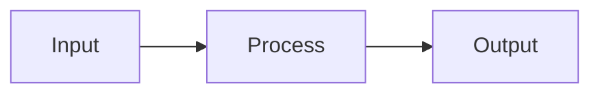

# Style Guide

> **Scope:** All lesson notes inside `curriculum/`

---

## 1. Markdown Rules

- All files must be valid GitHub Flavored Markdown (GFM).
- Every file must end with a single blank line.
- No trailing spaces on any line.
- Use `---` for horizontal rules.
- One blank line before and after every heading, code block, table, and blockquote.

---

## 2. Heading Levels

| Level | Usage |
|---|---|
| `#` H1 | File title (lesson name) — exactly ONE per file |
| `##` H2 | Major sections |
| `###` H3 | Sub-sections |
| `####` H4 | Further breakdowns |

**Rules:**
- H1 must be the first line of the file.
- Never skip heading levels (no H2 → H4).
- Use sentence case: `## Theory and concepts` not `## Theory And Concepts`.

---

## 3. File Naming

- Prefix: two-digit number (e.g. `01_`, `02_`)
- Words separated by underscores
- All lowercase
- Extension: `.md`

```
✅ _01_01_python_overview.md
✅ _04_03_asyncio.md
❌ PythonOverview.md
❌ 1_overview.md
```

**Do NOT rename existing files.** Only fill existing stubs.

---

## 4. Code Blocks

- Every code block must have a language identifier.

```python
# Python example
def greet(name: str) -> str:
    return f"Hello, {name}"
```

Common identifiers: `python`, `bash`, `json`, `yaml`, `text`, `sql`

- All examples must be runnable (not pseudocode).
- Use 4-space indentation for Python.
- Inline code: use backticks for `function_names()`, `variable_names`, `module.method()`.

---

## 5. Diagrams

- Use **Mermaid** for all diagrams.



> **Diagram:** [One sentence describing the diagram]

---

## 6. Tables

- Use GFM pipe tables with a header row.
- Use `|---|---|` separator row.

---

## 7. Existing Notes

> ⚠️ **Do NOT modify files that already have content.**  
> Only write into stub files listed in `MISSING_NOTES.md`.

The existing notes follow a concise format with:
- Heading (H1)
- Metadata blockquote (Course, Module, Difficulty)
- `---` separator
- Content sections separated by `---`
- Tables and code blocks as needed

New notes for stub files should follow the same pattern for consistency.

---

## 8. Emphasis

| Format | Usage |
|---|---|
| **Bold** | Key terms on first definition |
| *Italic* | Titles, slight emphasis |
| `Inline code` | Code identifiers |

---

## 9. Blockquotes

Use for definitions, key rules, or warnings:

```markdown
> **Definition:** A generator is a function that uses `yield`...
```
