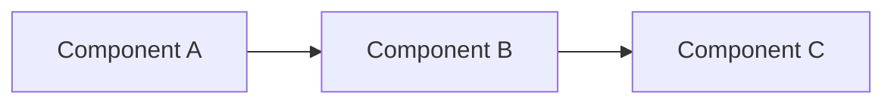
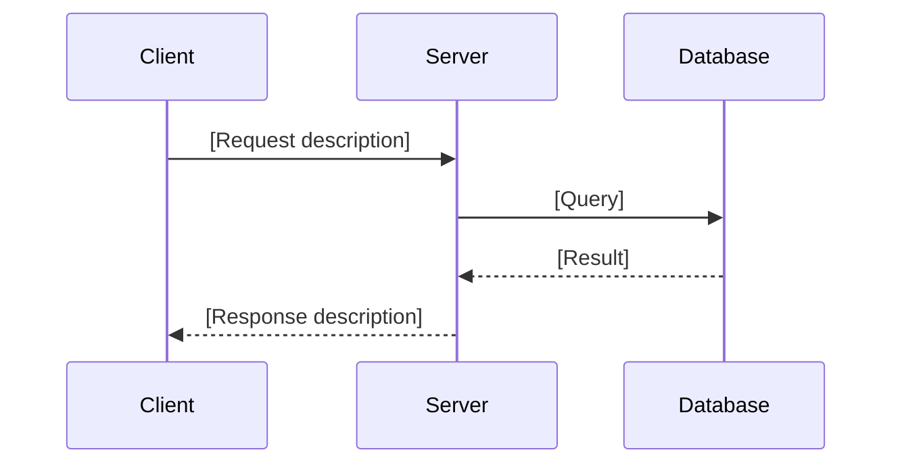

# Note Template

> **Instructions:** Every lesson note must follow this exact template.  
> Replace all `[PLACEHOLDER]` text with actual content.  
> Do not remove any section heading.  
> If a section is not applicable, write `N/A` rather than deleting it.

---

# [Lesson Title]

> **Module:** [Module Number and Name]  
> **Lesson:** [Lesson Number within Module]  
> **Estimated Time:** [X] minutes  
> **Difficulty:** Beginner / Intermediate / Advanced

---

## Overview

[Write 2–4 sentences summarizing what this lesson covers and why it matters.
Explain the real-world problem this concept solves. Do not repeat the lesson title.]

---

## Learning Objectives

By the end of this lesson, the learner will be able to:

- [Objective 1 — use an action verb: explain, implement, design, compare, apply]
- [Objective 2]
- [Objective 3]
- [Add more as needed, minimum 3]

---

## Prerequisites

Before starting this lesson, the learner should:

- Know: [specific concept already covered in an earlier lesson]
- Know: [another prerequisite]
- Have installed: [software, if any]

---

## Theory

### [Sub-section 1 — Core Concept Name]

[Explain the theory clearly. Use plain language. Assume intermediate-level reader.
Use diagrams where the flow is complex. Use bullet points for lists of properties.
Use tables for comparisons.]

[Example of a definition blockquote:]

> **Definition:** [Term] is [clear explanation in one or two sentences].

[Example of a comparison table:]

| Approach | Pros | Cons | Use Case |
|---|---|---|---|
| [A] | [Pro] | [Con] | [When to use] |
| [B] | [Pro] | [Con] | [When to use] |

### [Sub-section 2 — Next Concept]

[Continue building on the previous sub-section.]

---

## Architecture

### How It Works — System View

[Include a Mermaid diagram showing the high-level architecture or flow.]



> **Diagram:** [One sentence describing what the diagram shows.]

### Request/Response Flow (if applicable)

[Include a sequence diagram if this lesson involves HTTP communication.]



> **Diagram:** [One sentence describing what the diagram shows.]

---

## Internal Working

### How [Concept] Works Internally

[Explain the internal mechanism. What happens step by step under the hood.
Be specific. If there is a state machine, show it with a stateDiagram.
If there is an algorithm, describe each step.]

**Step-by-step breakdown:**

1. [Step 1 — what happens]
2. [Step 2 — what happens]
3. [Step 3 — what happens]
4. [Continue as needed]

---

## Examples

### Example 1 — [Descriptive Name]

[Brief explanation of what this example demonstrates.]

```python
# Example: [Short description]
# [Explain the key lines with inline comments]

def example_function():
    """
    [Docstring explaining what this function does.]
    """
    # Step 1: [What this line does]
    result = some_operation()
    
    # Step 2: [What this line does]
    return result
```

**Expected output:**

```text
[Show what the output or response looks like]
```

### Example 2 — [Descriptive Name]

[A second example covering a different aspect or edge case.]

```python
# [Code here]
```

---

## Real World Example

### Scenario: [Real-World Use Case Title]

[Describe a realistic scenario where this concept is used in production.
Name a real system or well-known service if possible (e.g., "GitHub uses webhooks to...").
Keep it grounded and practical.]

```python
# Production-style implementation example
# [Code reflecting real-world patterns]
```

**Why this matters in production:**

- [Point 1]
- [Point 2]
- [Point 3]

---

## Hands-on Practice

### Exercise 1 — [Exercise Title]

**Goal:** [What the learner will build or implement]

**Steps:**

1. [Step 1]
2. [Step 2]
3. [Step 3]
4. [Continue as needed]

**Expected result:**

[Describe or show what a correct implementation produces]

### Exercise 2 — [Exercise Title]

**Goal:** [What the learner will build or implement]

**Steps:**

1. [Step 1]
2. [Step 2]

---

## Best Practices

- **[Practice Name]:** [Explanation of why this practice matters and how to apply it]
- **[Practice Name]:** [Explanation]
- **[Practice Name]:** [Explanation]
- [Add at least 4–6 best practices specific to this lesson topic]

---

## Common Mistakes

| Mistake | Why It's Wrong | Correct Approach |
|---|---|---|
| [Mistake 1] | [Explanation] | [What to do instead] |
| [Mistake 2] | [Explanation] | [What to do instead] |
| [Mistake 3] | [Explanation] | [What to do instead] |
| [Add at least 3–5 mistakes] | | |

---

## Summary

[Write 3–6 sentences summarizing the entire lesson. Cover:
- What the concept is
- Why it matters
- The key pattern or approach
- What comes next (optional forward reference)]

---

## Cheat Sheet

```text
[A quick-reference block with the most important facts, commands, or patterns from this lesson.
Use plain text format. Keep it concise — this is the "reference card".]

TOPIC: [Lesson Topic]

Key points:
  - [Point 1]
  - [Point 2]
  - [Point 3]

Key commands / code patterns:
  [Pattern 1]: [One-liner description]
  [Pattern 2]: [One-liner description]

Quick reference table:
  [Term A] → [Meaning]
  [Term B] → [Meaning]
```

---

## References

- [Official documentation or RFC](https://link-to-source)
- [Another reference](https://link-to-source)
- [Book or article if applicable](https://link-to-source)
- [At least 2 references required per lesson]
