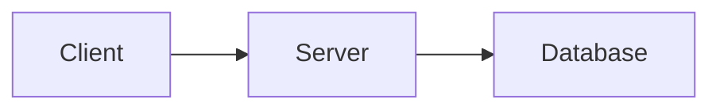

# Style Guide

> **Scope:** All lesson notes inside `OUTPUT/curriculum/`

---

## 1. Markdown Rules

### 1.1. General

- All files must be valid GitHub Flavored Markdown (GFM).
- No HTML tags unless absolutely required (e.g., for a table with merged cells).
- Every file must end with a single blank line.
- No trailing spaces on any line.
- Use `---` (three dashes) for horizontal rules. No `***` or `___`.

### 1.2. Line Length

- No strict line length limit.
- Do not break sentences in the middle of a word.
- Wrap long code lines with continuation comments if needed.

### 1.3. Blank Lines

- One blank line between paragraphs.
- One blank line before and after every heading.
- One blank line before and after every code block.
- One blank line before and after every table.
- One blank line before and after every blockquote.

---

## 2. Heading Levels

| Level | Usage |
|---|---|
| `#` H1 | File title (lesson name) — exactly ONE per file |
| `##` H2 | Major sections (Overview, Theory, Examples, etc.) |
| `###` H3 | Sub-sections within a major section |
| `####` H4 | Further breakdowns (Architecture sub-parts, etc.) |
| `#####` H5 | Rarely used — only for very deep nesting |

**Rules:**

- H1 must be the first line of the file (no blank line above it).
- Never skip heading levels (e.g., no going from H2 directly to H4).
- Use sentence case for all headings: `## Theory and concepts` not `## Theory And Concepts`.
- Never use heading levels for styling (bold instead).

---

## 3. Naming Rules

### 3.1. Folder Names

- All lowercase.
- Words separated by hyphens (`-`).
- Starts with a two-digit module number.

```
✅ 01-http-protocol
✅ 04-auth
❌ 01_HTTP_Protocol
❌ HTTPProtocol
```

### 3.2. File Names

- All lowercase.
- Words separated by underscores (`_`).
- Starts with a two-digit lesson number.
- Extension: `.md`

```
✅ 01_http_fundamentals.md
✅ 03_request_response_cycle.md
❌ 01-http-fundamentals.md
❌ HTTPFundamentals.md
❌ 1_http.md
```

### 3.3. Image File Names

- All lowercase.
- Words separated by underscores.
- Include the lesson number prefix.

```
✅ 01_http_request_flow.png
✅ 04_jwt_structure.svg
❌ HTTPDiagram.PNG
```

---

## 4. Code Block Rules

### 4.1. Language Annotation

Every code block must have a language identifier.

````markdown
```python
def example():
    pass
```
````

Common identifiers:

| Language | Identifier |
|---|---|
| Python | `python` |
| JSON | `json` |
| Bash / Shell | `bash` |
| SQL | `sql` |
| HTTP | `http` |
| YAML | `yaml` |
| Plain text | `text` |
| Terminal output | `text` |

### 4.2. Code Block Content

- All code examples must be complete and runnable (or clearly marked as pseudocode).
- Use `# ...` for Python comments explaining key lines.
- Do not use `...` as placeholder — write the actual code.
- File paths inside code blocks use forward slashes (`/`).
- Use 4-space indentation for Python.
- Use 2-space indentation for JSON, YAML.

### 4.3. Inline Code

Use backtick inline code for:
- Function names: `get_user()`
- Variable names: `request_id`
- File names: `main.py`
- HTTP methods: `GET`, `POST`
- Status codes: `200 OK`, `404 Not Found`
- Config keys: `DATABASE_URL`
- Package names: `fastapi`, `pydantic`

---

## 5. Diagram Rules

- Diagrams must be created using **Mermaid** (preferred) or **ASCII art**.
- No image-based diagrams unless there is no Mermaid equivalent.
- Every diagram must have a descriptive caption immediately below it.

```markdown

> **Diagram:** Basic three-tier request flow
```

Common Mermaid diagram types:

| Type | Usage |
|---|---|
| `flowchart` | Request flows, pipelines |
| `sequenceDiagram` | HTTP request/response exchanges |
| `erDiagram` | Database schemas |
| `stateDiagram-v2` | State machines (circuit breaker, auth flow) |

---

## 6. Image Rules

- Images must be stored in an `assets/` subfolder within the lesson folder.
- Reference images with a relative path.
- Every image must have alt text.

```markdown

```

- Do not use images for content that can be expressed as Mermaid diagrams.
- Do not use images for code — always use code blocks.

---

## 7. Table Rules

- Use GFM pipe tables.
- Every table must have a header row.
- Align columns using spaces for readability in source.
- Do not use tables for code comparisons — use code blocks instead.

```markdown
| Column A | Column B | Column C |
|---|---|---|
| Value 1 | Value 2 | Value 3 |
```

---

## 8. Blockquote Rules

Use blockquotes for:
- Important definitions
- Key rules or warnings
- Quotes from specifications or standards

```markdown
> **Definition:** A JWT (JSON Web Token) is a compact, URL-safe token...
```

---

## 9. Link Rules

- Use reference-style links for long URLs:
  ```markdown
  See the [RFC 7807 specification][rfc7807].
  
  [rfc7807]: https://datatracker.ietf.org/doc/html/rfc7807
  ```
- All external links must use `https://`.
- Internal cross-references use relative paths.

---

## 10. Emphasis Rules

| Format | Usage |
|---|---|
| **Bold** | Key terms on first definition, critical warnings |
| *Italic* | Titles of external documents, slight emphasis |
| `Inline code` | Code identifiers (never use for general emphasis) |
| ~~Strikethrough~~ | Deprecated or removed content |

Do NOT use bold or italic for general emphasis — rewrite the sentence instead.
