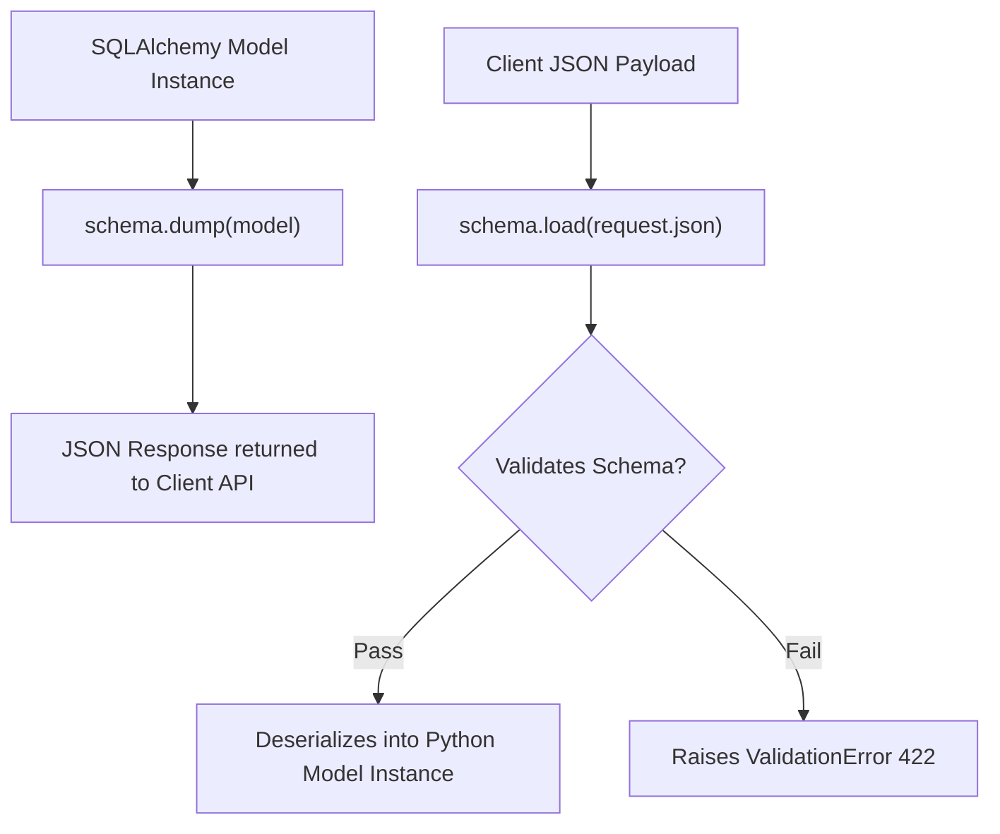

# Api Serialization With Flask Marshmallow

> **Course**: Git Fundamentals | **Module**: Introduction | **Difficulty**: beginner

---

- **Estimated Time**: 55 Minutes (20m Reading | 25m Practice | 10m Quiz)
- **Difficulty Level**: ⭐⭐ Intermediate
- **Prerequisites**: [Lesson 9.1 RESTful APIs](file:///d:/My%20Drive/all%20files/PROJECT%20FILES/notes/docs/curriculum/_04_flask/_04_19_restful_api_principles_and_resource_routing.md)
- **XP Reward**: +60 XP

### Learning Objectives
By the end of this lesson, you will be able to:
1. Integrate the **Flask-Marshmallow** extension.
2. Differentiate between **Serialization** (dump) and **Deserialization** (load).
3. Auto-generate schemas from SQLAlchemy models using `SQLAlchemyAutoSchema`.
4. Serialize nested database relationships using `fields.Nested()`.

---

---

Install `Flask-Marshmallow` and `marshmallow-sqlalchemy`:

```bash
pip install Flask-Marshmallow marshmallow-sqlalchemy
```

---

---

### 3.1 Serialization vs Deserialization
Manually converting SQLAlchemy models into Python dictionaries (`{"id": node.id, ...}`) requires tedious, bug-prone boilerplate code.

**Marshmallow** provides a declarative schema layer that handles both directions automatically:
- **Serialization (`schema.dump(obj)`)**: Converts complex Python objects / SQLAlchemy models into plain JSON-serializable dictionaries.
- **Deserialization (`schema.load(data)`)**: Validates incoming client JSON payloads and converts them into typed Python data structures or model instances.

```
┌─────────────────────────────────────────────────────────────────────────────┐
│                    FLASK-MARSHMALLOW SERIALIZATION PIPELINE                 │
├─────────────────────────────────────────────────────────────────────────────┤
│ Database Model Instance ──► `schema.dump(model)` ──► Clean JSON Response    │
│ Client JSON Payload     ──► `schema.load(json)` ──► Validated Model Object  │
└─────────────────────────────────────────────────────────────────────────────┘
```

---

---



---

---

### File 1: `schemas.py` (Flask-Marshmallow Schemas)

```python
from flask_marshmallow import Marshmallow
from marshmallow import fields
from models import DeviceNode, TelemetryReading

ma = Marshmallow()

class TelemetryReadingSchema(ma.SQLAlchemyAutoSchema):
    class Meta:
        model = TelemetryReading
        load_instance = True
        include_fk = True # Include foreign keys in output

class DeviceNodeSchema(ma.SQLAlchemyAutoSchema):
    # Nested relationship serialization!
    readings = fields.Nested(TelemetryReadingSchema, many=True)

    class Meta:
        model = DeviceNode
        load_instance = True

# Instantiated single & list schemas
node_schema = DeviceNodeSchema()
nodes_schema = DeviceNodeSchema(many=True)
```

### File 2: `routes.py` (Using Schemas in API Views)

```python
from flask import jsonify, request
from models import DeviceNode
from schemas import node_schema, nodes_schema

def get_all_nodes_api():
    nodes = DeviceNode.query.all()
    # dump() converts list of SQLAlchemy objects into JSON-compatible list of dicts!
    return jsonify(nodes_schema.dump(nodes)), 200

def create_node_api():
    try:
        # load() validates JSON payload and instantiates a new DeviceNode object!
        new_node = node_schema.load(request.json)
        # db.session.add(new_node); db.session.commit()
        return jsonify(node_schema.dump(new_node)), 201
    except ma.ValidationError as err:
        return jsonify({"errors": err.messages}), 422
```

---

---

- **Microservice API Data Transfer Objects (DTOs)**: API backends use Marshmallow schemas to strip internal sensitive model columns (like password hashes) before sending JSON responses to clients.

---

---

1. Save `schemas.py`.
2. Execute `node_schema.dump(device_instance)` in Python REPL $\to$ Inspect clean serialized output dictionary!

---

---

| Bug / Error | Root Cause | Engineering Solution |
| :--- | :--- | :--- |
| **`TypeError: Object of type Model is not JSON serializable`** | Returning a raw SQLAlchemy model instance directly in `jsonify(model)`. | Pass model through schema first: `jsonify(node_schema.dump(model))`. |

---

---

- **Use `many=True` for Iterables**: Pass `many=True` when serializing lists or query result sets.

---

---

### Q1: What is the primary role of Marshmallow schemas in a Flask REST API?
**Answer**: Marshmallow schemas act as a serialization, deserialization, and validation layer. They transform complex database model instances into JSON DTOs for client responses, and validate incoming client JSON payloads before creating model instances.

---

---

```json
{
  "quiz_title": "Lesson 9.2 Serialization Assessment",
  "questions": [
    {
      "question_id": "Q1",
      "type": "multiple_choice",
      "question_text": "Which Marshmallow schema method converts a Python object or SQLAlchemy model into a JSON-compatible dictionary?",
      "options": ["schema.load()", "schema.dump()", "schema.convert()", "schema.serialize()"],
      "correct_answer_index": 1,
      "explanation": "schema.dump() performs serialization to a dictionary."
    }
  ]
}
```

---

---

Build a Marshmallow schema serializing a User model with nested UserPosts.

---

---

**Front**: What parameter must be passed when instantiating a Marshmallow schema to serialize a list of objects?
**Back**: `many=True` (e.g. `schema = MySchema(many=True)`).
<!-- flashcard:end -->

---

---

```python
class UserSchema(ma.SQLAlchemyAutoSchema):
    class Meta: model = User
data = UserSchema().dump(user_obj)
```

---
