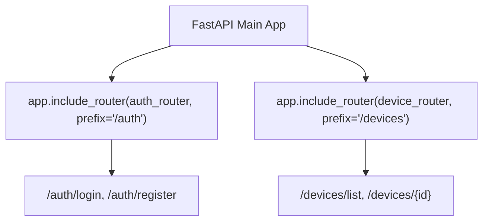

# Apirouter Architecture And Prefixes

> **Course**: Git Fundamentals | **Module**: Introduction | **Difficulty**: beginner

---

- **Estimated Time**: 45 Minutes (15m Reading | 20m Practice | 10m Quiz)
- **Prerequisites**: [Lesson 5.2 JWT Auth](file:///d:/My%20Drive/all%20files/PROJECT%20FILES/notes/docs/curriculum/_05_fastapi/_05_10_jwt_authentication_and_current_user.md)
- **XP Reward**: +50 XP

### Learning Objectives
By the end of this lesson, you will be able to:
1. Modularize routes using **`APIRouter()`**.
2. Register routers on the main application instance using **`app.include_router()`**.
3. Configure router parameters (`prefix`, `tags`, `responses`).
4. Apply router-level security dependencies using `dependencies=[Depends(...)]`.

---

---

Open Python REPL or VS Code.

---

---

### 3.1 What is an APIRouter?
In large microservice applications, defining all routes on a single `app = FastAPI()` instance leads to giant, unmaintainable Python files.

An **`APIRouter`** acts like a "mini FastAPI app"—a self-contained set of operations, tags, and dependencies that can be included in the main application using `app.include_router()`:

```
┌─────────────────────────────────────────────────────────────────────────────┐
│                          FASTAPI APIROUTER ARCHITECTURE                     │
├─────────────────────────────────────────────────────────────────────────────┤
│ Main FastAPI App (`app = FastAPI()`)                                        │
│   ├── `app.include_router(auth_router, prefix="/api/v1/auth")`             │
│   ├── `app.include_router(devices_router, prefix="/api/v1/devices")`       │
│   └── `app.include_router(telemetry_router, prefix="/api/v1/telemetry")`   │
└─────────────────────────────────────────────────────────────────────────────┘
```

---

---



---

---

### File 1: `routers/devices.py` (APIRouter Module)

```python
from fastapi import APIRouter, Depends, status

# 1. Instantiate APIRouter
router = APIRouter(
    prefix="/devices",
    tags=["Devices & Hardware Nodes"],
    responses={404: {"description": "Device Node Not Found"}}
)

@router.get("/")
def list_devices():
    return [{"id": 101, "code": "ESP32-A"}]

@router.post("/", status_code=status.HTTP_201_CREATED)
def create_device(code: str):
    return {"id": 102, "code": code, "status": "CREATED"}
```

### File 2: `main.py` (Main FastAPI App Registering Router)

```python
from fastapi import FastAPI
from routers.devices import router as devices_router

app = FastAPI(title="Modular APIRouter Application")

# 2. Register Router on Main FastAPI App with Global Prefix
app.include_router(devices_router, prefix="/api/v1")

@app.get("/")
def root():
    return {"message": "IoT Gateway API System Online"}
```

---

---

- **Enterprise Microservice Organization**: Production backends divide routes into independent router modules (`users.py`, `billing.py`, `telemetry.py`), mounting them on the main app with versioned URL prefixes (`/api/v1`).

---

---

1. Save `routers/devices.py` and `main.py`.
2. Run `uvicorn main:app --reload` $\to$ Inspect `/docs` to see endpoints grouped under "Devices & Hardware Nodes" with `/api/v1/devices` prefix!

---

---

| Bug / Error | Root Cause | Engineering Solution |
| :--- | :--- | :--- |
| **Duplicate Path Prefixes (`/api/v1/devices/devices`)** | Declaring `prefix="/devices"` in `APIRouter()` AND `prefix="/api/v1/devices"` in `app.include_router()`. | Define base prefix once in `include_router` or combine cleanly (`prefix="/api/v1"` in app, `prefix="/devices"` in router). |

---

---

- **Group Routers in a `routers/` Folder**: Keep router modules organized in a dedicated directory.

---

---

### Q1: How does `APIRouter` in FastAPI differ from Flask's `Blueprint`?
**Answer**: `APIRouter` in FastAPI serves a similar modular purpose to Flask's `Blueprint`, but with native integration for OpenAPI documentation and Dependency Injection. Routers allow passing `dependencies=[Depends(...)]` directly at the router level, automatically applying security or logging dependencies to every endpoint within that router.

---

---

```json
{
  "quiz_title": "Lesson 6.1 APIRouter Assessment",
  "questions": [
    {
      "question_id": "Q1",
      "type": "multiple_choice",
      "question_text": "Which FastAPI app method registers an APIRouter module onto the main application?",
      "options": ["app.register_router()", "app.include_router()", "app.add_router()", "app.mount()"],
      "correct_answer_index": 1,
      "explanation": "app.include_router() includes APIRouter modules."
    }
  ]
}
```

---

---

Modularize a monolithic FastAPI app into `auth_router` and `devices_router`.

---

---

**Front**: What parameter on `app.include_router()` attaches a security dependency to all routes in that router?
**Back**: `dependencies=[Depends(my_security_dep)]`.
<!-- flashcard:end -->

---

---

```python
router = APIRouter(prefix="/items", tags=["Items"])
@router.get("/")
def get_items(): return []
app.include_router(router, prefix="/api/v1")
```

---
