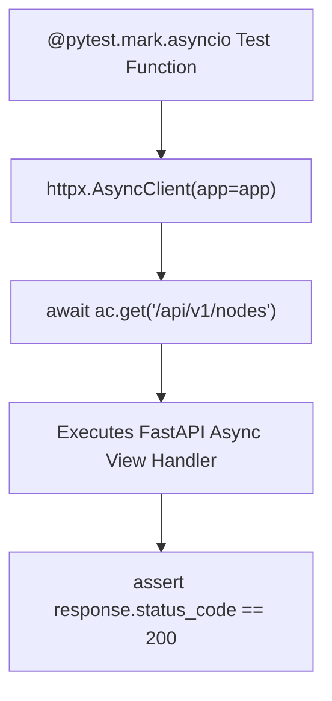

# Async Testing With Pytest And Httpx

> **Course**: Git Fundamentals | **Module**: Introduction | **Difficulty**: beginner

---

- **Estimated Time**: 55 Minutes (20m Reading | 25m Practice | 10m Quiz)
- **Difficulty Level**: ⭐⭐ Intermediate
- **Prerequisites**: [Lesson 9.2 Real-Time Connection Manager](file:///d:/My%20Drive/all%20files/PROJECT%20FILES/notes/docs/curriculum/_05_fastapi/_05_18_realtime_connection_manager_and_broadcasting.md)
- **XP Reward**: +60 XP

### Learning Objectives
By the end of this lesson, you will be able to:
1. Configure **Pytest** for asynchronous test execution using **`pytest-asyncio`**.
2. Simulate asynchronous HTTP requests using **`httpx.AsyncClient`**.
3. Write test functions using **`@pytest.mark.asyncio`**.
4. Test async database operations and assert JSON status codes.

---

---

Install `pytest`, `pytest-asyncio`, and `httpx`:

```bash
pip install pytest pytest-asyncio httpx
```

---

---

### 3.1 Why `httpx.AsyncClient` over Starlette `TestClient`?
FastAPI's built-in `TestClient` uses `requests` under the hood, which executes test requests synchronously.

When testing `async def` endpoints, async database sessions, or async yield dependencies, using **`httpx.AsyncClient`** runs test requests natively inside an asynchronous `asyncio` event loop. This allows seamlessly using `await` inside Pytest test functions:

```
┌─────────────────────────────────────────────────────────────────────────────┐
│                       HTTPX.ASYNC_CLIENT TESTING FLOW                       │
├─────────────────────────────────────────────────────────────────────────────┤
│ `@pytest.mark.asyncio` Test Function                                        │
│   ──► `async with AsyncClient(app=app, base_url="http://test") as ac:`       │
│   ──► `response = await ac.get("/api/v1/sensors")` (Native Async Request!) │
│   ──► `assert response.status_code == 200`                                  │
└─────────────────────────────────────────────────────────────────────────────┘
```

---

---



---

---

### File 1: `conftest.py` (Pytest Async Fixtures)

```python
import pytest
from typing import AsyncGenerator
from httpx import AsyncClient, ASGITransport
from main import app

# Configure pytest-asyncio mode
pytest_plugins = ("pytest_asyncio",)

@pytest.fixture
async def async_client() -> AsyncGenerator[AsyncClient, None]:
    # Transport handles direct ASGI in-memory communication!
    transport = ASGITransport(app=app)
    async with AsyncClient(transport=transport, base_url="http://testserver") as ac:
        yield ac
```

### File 2: `test_main.py` (Async Test Cases)

```python
import pytest
from httpx import AsyncClient

# Mark test function as async for pytest-asyncio!
@pytest.mark.asyncio
async def test_read_root(async_client: AsyncClient):
    # Perform native async GET request using await!
    response = await async_client.get("/")
    
    assert response.status_code == 200
    assert response.json()["status"] == "ONLINE"

@pytest.mark.asyncio
async def test_create_sensor(async_client: AsyncClient):
    payload = {"code": "TEST-ESP32", "location": "Test Lab"}
    
    response = await async_client.post("/api/v1/sensors", json=payload)
    
    assert response.status_code == 201
    data = response.json()
    assert data["code"] == "TEST-ESP32"
```

---

---

- **Async CI/CD Testing Pipelines**: Enterprise GitHub Actions workflows run `pytest` with `pytest-asyncio` and `httpx.AsyncClient` to test hundreds of async endpoints in seconds without spinning up a live Uvicorn web server.

---

---

1. Save `conftest.py` and `test_main.py`.
2. Run `pytest` in terminal $\to$ Observe 2 passed async test cases executed natively in an event loop!

---

---

| Bug / Error | Root Cause | Engineering Solution |
| :--- | :--- | :--- |
| **`PytestUnhandledCoroutineWarning`** | Writing `async def test_fn()` without marking it with `@pytest.mark.asyncio`. | Annotate all async test functions with `@pytest.mark.asyncio`. |

---

---

- **Use `ASGITransport(app=app)` in `httpx` v0.27+**: Use `ASGITransport` when initializing `httpx.AsyncClient` in modern `httpx` versions.

---

---

### Q1: Why is `httpx.AsyncClient` preferred over `TestClient` when testing async FastAPI applications with Pytest?
**Answer**: Starlette's `TestClient` executes test calls synchronously using `requests`, which blocks the thread and prevents awaiting async operations inside Pytest fixtures or test functions. `httpx.AsyncClient` executes HTTP requests natively within the `asyncio` event loop, enabling full `async/await` syntax inside test cases.

---

---

```json
{
  "quiz_title": "Lesson 10.1 Async Testing Assessment",
  "questions": [
    {
      "question_id": "Q1",
      "type": "multiple_choice",
      "question_text": "Which Pytest decorator marks a test function as asynchronous for execution by pytest-asyncio?",
      "options": ["@pytest.mark.asyncio", "@pytest.async_test", "@pytest.mark.async", "@async_test"],
      "correct_answer_index": 0,
      "explanation": "@pytest.mark.asyncio marks async test functions."
    }
  ]
}
```

---

---

Build an async Pytest test suite using `httpx.AsyncClient` testing async CRUD endpoints.

---

---

**Front**: What HTTP client class performs native async in-memory testing for FastAPI in Pytest?
**Back**: `httpx.AsyncClient(transport=ASGITransport(app=app), base_url="http://test")`.
<!-- flashcard:end -->

---

---

```python
@pytest.mark.asyncio
async def test_api(async_client: AsyncClient):
    res = await async_client.get("/")
    assert res.status_code == 200
```

---
