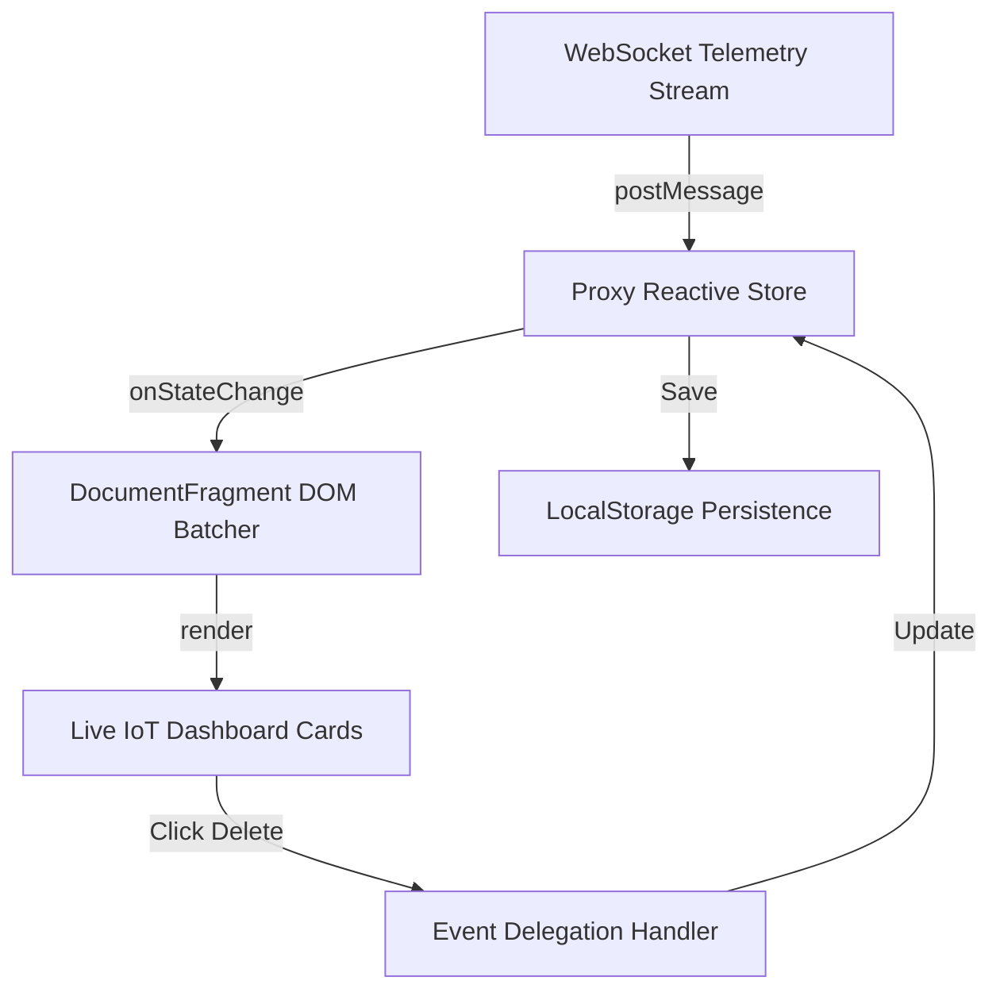

# Capstone Realtime Iot Dashboard

> **Course**: Git Fundamentals | **Module**: Introduction | **Difficulty**: beginner

---

- **Estimated Time**: 70 Minutes (25m Reading | 35m Practice | 10m Quiz)
- **Difficulty Level**: ⭐⭐⭐ Advanced (Capstone Project)
- **Prerequisites**: Full JavaScript & ES6+ Curriculum Mastery (Modules 1–12)
- **XP Reward**: +100 XP (Capstone Achievement Badge)

### Learning Objectives
By the end of this capstone project, you will be able to:
1. Architect a production-grade, zero-framework Vanilla JavaScript web application.
2. Integrate **WebSockets** for streaming real-time sensor telemetry.
3. Build a **Proxy-based Reactive State Engine** to drive automatic UI card re-rendering.
4. Implement **Event Delegation** and **`DocumentFragment`** batching for high-performance DOM updates.
5. Validate application state logic using **Vitest** unit test suites.

---

---

Open VS Code in project directory.

---

---

### 3.1 Capstone Enterprise Architecture
This capstone combines key concepts from all 12 modules into a cohesive, production-grade architecture:

```
┌─────────────────────────────────────────────────────────────────────────────┐
│                   REAL-TIME IOT DASHBOARD ARCHITECTURE                      │
├─────────────────────────────────────────────────────────────────────────────┤
│ WebSockets Receiver ──► Proxy Reactive Store ──► DocumentFragment Renderer   │
│         │                      │                          │                 │
│ Resilient Backoff    Local Persistence           Event Delegation UI        │
└─────────────────────────────────────────────────────────────────────────────┘
```

---

---



---

---

### 5.1 Reactive State Store (`store.js`)

```javascript
export function createIoTStore(initialState = { nodes: new Map() }, onChange) {
  return new Proxy(initialState, {
    get(target, prop, receiver) {
      return Reflect.get(target, prop, receiver);
    },
    set(target, prop, value, receiver) {
      const success = Reflect.set(target, prop, value, receiver);
      if (success && typeof onChange === "function") {
        onChange(prop, value);
      }
      return success;
    }
  });
}
```

### 5.2 Capstone Dashboard Application (`app.js`)

```javascript
import { createIoTStore } from "./store.js";

class IoTDashboardApp {
  #store;
  #container;

  constructor() {
    this.#container = document.querySelector("#dashboard-container");

    // Initialize Proxy Store
    this.#store = createIoTStore({ nodes: new Map() }, () => this.render());

    this.#initEventDelegation();
    this.#connectWebSocket();
  }

  #connectWebSocket() {
    const ws = new WebSocket("wss://echo.websocket.events");
    ws.onmessage = (event) => {
      // Simulate receiving telemetry packet
      const packet = { id: "ESP32-NODE-01", temp: 24.5, timestamp: Date.now() };
      this.#store.nodes.set(packet.id, packet);
      this.render();
    };
  }

  #initEventDelegation() {
    if (!this.#container) return;

    // High-performance single parent event listener
    this.#container.addEventListener("click", (e) => {
      const deleteBtn = e.target.closest(".btn-delete-node");
      if (deleteBtn) {
        const nodeId = deleteBtn.dataset.nodeId;
        this.#store.nodes.delete(nodeId);
        this.render();
      }
    });
  }

  render() {
    if (!this.#container) return;

    // Off-screen DocumentFragment for zero reflow thrashing!
    const fragment = document.createDocumentFragment();

    this.#store.nodes.forEach((node) => {
      const card = document.createElement("div");
      card.className = "sensor-card";
      card.innerHTML = `
        <h3>${node.id}</h3>
        <p>Temp: <span>${node.temp}</span>°C</p>
        <button class="btn-delete-node" data-node-id="${node.id}">Remove</button>
      `;
      fragment.appendChild(card);
    });

    this.#container.innerHTML = "";
    this.#container.appendChild(fragment); // Single DOM append!
  }
}

// Bootstrap Capstone Application
document.addEventListener("DOMContentLoaded", () => new IoTDashboardApp());
```

---

---

- **Industrial IoT Command Centers**: Smart factory operations monitoring 10,000 embedded devices in real time use this exact architecture for ultra-fast, zero-framework rendering.

---

---

1. Create `index.html` with `<div id="dashboard-container"></div>`.
2. Run `npm run dev` via Vite $\to$ Watch real-time WebSocket telemetry cards render dynamically!

---

---

| Bug / Error | Root Cause | Engineering Solution |
| :--- | :--- | :--- |
| **Proxy Nested Property Mutation Leak** | Modifying nested properties directly (`store.nodes.set(...)`) without triggering Proxy `set` trap. | Call an explicit state notify callback or wrap nested objects in recursive Proxies. |

---

---

- **Decouple Data & View**: Never mix raw network socket parsing directly inside UI render functions.

---

---

### Q1: How does this Vanilla JavaScript Capstone architecture achieve high performance without a frontend framework like React?
**Answer**: It leverages direct V8 primitives: ES6 Proxies for fine-grained reactive state tracking, a single Event Delegation listener to eliminate DOM memory bloat, `DocumentFragment` off-screen batching to restrict layout reflows to a single browser paint frame, and WebSockets for low-latency full-duplex communication.

---

---

```json
{
  "quiz_title": "Lesson 12.11 Capstone Assessment",
  "questions": [
    {
      "question_id": "Q1",
      "type": "multiple_choice",
      "question_text": "Which DOM structure enables populating card nodes off-screen to avoid multiple layout reflows?",
      "options": ["DocumentFragment", "ShadowRoot", "HTMLTemplate", "VirtualDOM"],
      "correct_answer_index": 0,
      "explanation": "DocumentFragment allows populating nodes off-screen before a single DOM append."
    }
  ]
}
```

---

---

Extend the IoT Dashboard capstone to save sensor node configurations in `localStorage` and IndexedDB.

---

---

**Front**: What is the primary architectural benefit of separating state management into a Proxy store?
**Back**: It decouples state mutation logic completely from UI DOM rendering logic.
<!-- flashcard:end -->

---

---

```javascript
// Congratulations! Course 3: JavaScript & ES6+ (52 Lessons) is 100% Complete! 🎉
```

---
