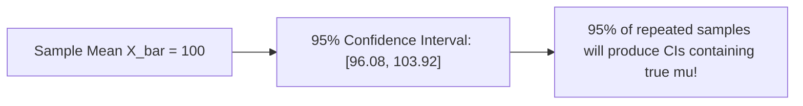

# Estimation And Confidence Intervals

> **Course**: Git Fundamentals | **Module**: Introduction | **Difficulty**: beginner

---

- **Estimated Time**: 55 Minutes (20m Reading | 25m Practice | 10m Quiz)
- **Difficulty Level**: ⭐⭐ Intermediate
- **Prerequisites**: [Lesson 1.2.3 CLT & Joint Distributions](file:///d:/My%20Drive/all%20files/PROJECT%20FILES/notes/docs/curriculum/_08_ds_math/_01_07_joint_marginal_and_conditional_distributions.md)
- **XP Reward**: +60 XP

### Learning Objectives
By the end of this lesson, you will be able to:
1. Evaluate Point Estimator properties (Unbiasedness, Efficiency, Consistency, MSE).
2. Derive Maximum Likelihood Estimation (MLE) log-likelihood functions.
3. Construct 95% Confidence Intervals for population means and proportions.
4. Calculate required sample sizes for a target Margin of Error.

---

---

Open VS Code and install SciPy.

---

---

### 3.1 Point Estimation & MLE
- **Unbiased Estimator**: $E[\hat{\theta}] = \theta$. Sample mean $\bar{X}$ is an unbiased estimator of population mean $\mu$.
- **Maximum Likelihood Estimation (MLE)**: Finds parameter $\theta$ that maximizes the probability of observing sample data $X$:

$$L(\theta) = \prod_{i=1}^n f(x_i \mid \theta) \implies \ell(\theta) = \sum_{i=1}^n \ln f(x_i \mid \theta)$$

### 3.2 Confidence Intervals (CI)
A $(1-\alpha)$ Confidence Interval provides a range $[L, U]$ likely to contain the true population parameter $\mu$:

$$\text{CI}_{95\%} = \bar{X} \pm z_{\alpha/2} \left( \frac{s}{\sqrt{n}} \right)$$

For $95\%$ confidence level, $z_{0.025} = 1.96$.

---

---



---

---

```python
import numpy as np
from scipy import stats

# Sample Dataset
data = np.array([12, 15, 14, 10, 13, 16, 11, 14, 15, 13])
n = len(data)
mean = np.mean(data)
sem = stats.sem(data) # Standard Error of the Mean (s / sqrt(n))

# 95% Confidence Interval using Student's t-distribution
ci_95 = stats.t.interval(0.95, df=n-1, loc=mean, scale=sem)

print(f"Sample Mean: {mean:.2f}")
print(f"95% Confidence Interval: [{ci_95[0]:.2f}, {ci_95[1]:.2f}]")
```

---

---

- **Product Latency Benchmarks**: Measuring API response times (P95) with confidence intervals ensures microservices meet SLA guarantees.

---

---

1. Save code as `ci_demo.py`.
2. Run `python ci_demo.py` $\to$ Inspect calculated 95% Confidence Interval bounds!

---

---

| Bug / Error | Root Cause | Engineering Solution |
| :--- | :--- | :--- |
| **Misinterpreting CI as Probability** | Stating "There is a 95% probability true $\mu$ is in this specific interval". | A specific interval either contains $\mu$ or does not. 95% refers to the long-run procedure success rate. |

---

---

- **Use Student's $t$ for $n < 30$**: Accounts for sample standard deviation uncertainty.

---

---

### Q1: What is the correct interpretation of a 95% Confidence Interval?
**Answer**: If we repeat the experiment 100 times and construct 100 confidence intervals, approximately 95 of those intervals will contain the true population parameter $\mu$.

---

---

```json
{
  "quiz_title": "Lesson 1.3.1 Confidence Intervals Assessment",
  "questions": [
    {
      "question_id": "Q1",
      "type": "multiple_choice",
      "question_text": "What $z$-score is associated with a 95% Confidence Interval under a normal distribution?",
      "options": ["1.645", "1.96", "2.576", "1.00"],
      "correct_answer_index": 1,
      "explanation": "z = 1.96 corresponds to a 95% confidence level."
    }
  ]
}
```

---

---

Calculate sample size requirements for an A/B test targeting a 2% margin of error.

---

---

**Front**: What function computes a confidence interval in `scipy.stats`?
**Back**: `stats.t.interval(confidence, df, loc, scale)`
<!-- flashcard:end -->

---

---

```python
ci = stats.t.interval(0.95, df=len(data)-1, loc=np.mean(data), scale=stats.sem(data))
```

---
