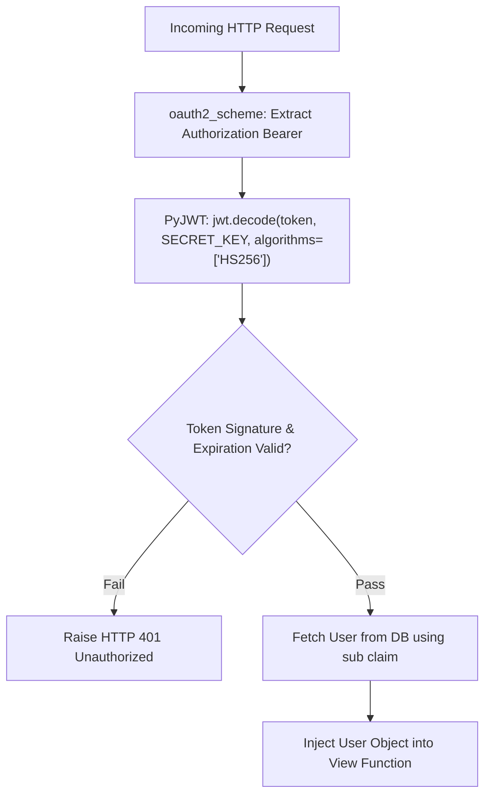

# Jwt Authentication And Current User

> **Course**: Git Fundamentals | **Module**: Introduction | **Difficulty**: beginner

---

- **Estimated Time**: 55 Minutes (20m Reading | 25m Practice | 10m Quiz)
- **Difficulty Level**: ⭐⭐⭐ Advanced
- **Prerequisites**: [Lesson 5.1 OAuth2 Password Bearer](file:///d:/My%20Drive/all%20files/PROJECT%20FILES/notes/docs/curriculum/_05_fastapi/_05_09_oauth2_password_bearer_and_hashing.md)
- **XP Reward**: +70 XP

### Learning Objectives
By the end of this lesson, you will be able to:
1. Encode and decode JWT tokens using **PyJWT** (`jwt.encode()`, `jwt.decode()`).
2. Add expiration claims (`exp`) and token metadata claims (`sub`).
3. Construct a reusable **`get_current_user`** dependency pipeline.
4. Implement **Role-Based Access Control (RBAC)** to restrict endpoints based on user roles (`ADMIN`, `OPERATOR`).

---

---

Install `pyjwt`:

```bash
pip install pyjwt
```

---

---

### 3.1 The `get_current_user` Dependency Pipeline
In FastAPI, authentication is implemented cleanly using Dependency Injection. Instead of writing authentication logic inside view functions, you create a `get_current_user` dependency.

This dependency:
1. Receives the raw Bearer token via `oauth2_scheme = OAuth2PasswordBearer(tokenUrl="token")`.
2. Decodes and verifies the JWT token using `jwt.decode()`.
3. Queries the user record from the database.
4. Injects the authenticated `User` model object directly into any protected view function!

```
┌─────────────────────────────────────────────────────────────────────────────┐
│                    FASTAPI GET_CURRENT_USER DEPENDENCY PIPELINE             │
├─────────────────────────────────────────────────────────────────────────────┤
│ Protected Route ──► `current_user: User = Depends(get_current_user)`         │
│                 ──► `get_current_user` depends on `oauth2_scheme`           │
│                 ──► Decodes JWT `sub` ──► Fetches User from DB              │
│                 ──► Injects validated `User` object into route              │
└─────────────────────────────────────────────────────────────────────────────┘
```

---

---



---

---

```python
# FastAPI JWT & Current User Dependency Pipeline (jwt_auth_demo.py)
from datetime import datetime, timedelta, timezone
import jwt
from fastapi import FastAPI, Depends, HTTPException, status
from fastapi.security import OAuth2PasswordBearer
from pydantic import BaseModel

app = FastAPI(title="JWT Authentication API")

SECRET_KEY = "jwt-secret-key-super-secure-90210"
ALGORITHM = "HS256"
ACCESS_TOKEN_EXPIRE_MINUTES = 30

oauth2_scheme = OAuth2PasswordBearer(tokenUrl="token")

# Pydantic Schemas
class User(BaseModel):
    username: str
    email: str
    role: str
    is_active: bool = True

class TokenData(BaseModel):
    username: str | None = None

# Mock Database
USERS_DB = {
    "operator_dev": User(username="operator_dev", email="op@telemetry.io", role="OPERATOR"),
    "admin_dev": User(username="admin_dev", email="admin@telemetry.io", role="ADMIN")
}

# 1. JWT Encoding Helper
def create_access_token(data: dict, expires_delta: timedelta | None = None) -> str:
    to_encode = data.copy()
    expire = datetime.now(timezone.utc) + (expires_delta or timedelta(minutes=15))
    to_encode.update({"exp": expire})
    return jwt.encode(to_encode, SECRET_KEY, algorithm=ALGORITHM)

# 2. Reusable get_current_user Dependency
def get_current_user(token: str = Depends(oauth2_scheme)) -> User:
    credentials_exception = HTTPException(
        status_code=status.HTTP_401_UNAUTHORIZED,
        detail="Could not validate credentials",
        headers={"WWW-Authenticate": "Bearer"},
    )
    try:
        # Decode and verify JWT signature & expiration!
        payload = jwt.decode(token, SECRET_KEY, algorithms=[ALGORITHM])
        username: str = payload.get("sub")
        if username is None:
            raise credentials_exception
    except jwt.PyJWTError:
        raise credentials_exception

    user = USERS_DB.get(username)
    if user is None:
        raise credentials_exception
    return user

# 3. Role-Based Access Control (RBAC) Sub-Dependency
def get_current_admin_user(current_user: User = Depends(get_current_user)) -> User:
    if current_user.role != "ADMIN":
        raise HTTPException(
            status_code=status.HTTP_403_FORBIDDEN,
            detail="Operation restricted to ADMIN users only!"
        )
    return current_user

# 4. Protected Endpoints
@app.get("/api/v1/users/me")
def read_current_user(current_user: User = Depends(get_current_user)):
    return {"user": current_user}

@app.get("/api/v1/admin/dashboard")
def admin_dashboard(admin: User = Depends(get_current_admin_user)):
    return {"message": f"Welcome to Admin Panel, {admin.username}!"}
```

---

---

- **Role-Based API Access Control (RBAC)**: Enterprise backends use sub-dependencies like `get_current_admin_user` to restrict sensitive microservice operations (such as device firmware updates or user deletion) to authorized roles.

---

---

1. Save code as `jwt_auth_demo.py`.
2. Generate token for `operator_dev` $\to$ Access `/api/v1/admin/dashboard` $\to$ Inspect HTTP 403 Forbidden response!

---

---

| Bug / Error | Root Cause | Engineering Solution |
| :--- | :--- | :--- |
| **`ExpiredSignatureError`** | Using a token whose `exp` timestamp has passed. | Handle `jwt.PyJWTError` exceptions and issue new access tokens via refresh endpoints. |

---

---

- **Use Sub-Dependencies for RBAC**: Chain `get_current_admin_user` off `get_current_user` to keep security logic modular and reusable.

---

---

### Q1: How does FastAPI implement Role-Based Access Control (RBAC) cleanly using Dependency Injection?
**Answer**: FastAPI implements RBAC by chaining sub-dependencies. A base `get_current_user` dependency decodes the JWT token and fetches the `User` object. A secondary sub-dependency (`get_current_admin_user`) depends on `get_current_user`, inspects `current_user.role`, and raises an `HTTPException(403 Forbidden)` if the role is insufficient.

---

---

```json
{
  "quiz_title": "Lesson 5.2 JWT Auth Assessment",
  "questions": [
    {
      "question_id": "Q1",
      "type": "multiple_choice",
      "question_text": "Which standard claim in a JWT payload stores the subject/user identity?",
      "options": ["id", "sub", "user", "username"],
      "correct_answer_index": 1,
      "explanation": "sub (Subject) is the standard JWT claim for user identity."
    }
  ]
}
```

---

---

Build a `get_current_user` dependency pipeline verifying JWT signatures and user active status.

---

---

**Front**: Which PyJWT exception catches expired or invalid token signatures?
**Back**: `jwt.PyJWTError` (or `jwt.ExpiredSignatureError`).
<!-- flashcard:end -->

---

---

```python
token = jwt.encode({"sub": user.username}, SECRET_KEY, algorithm="HS256")
payload = jwt.decode(token, SECRET_KEY, algorithms=["HS256"])
```

---
