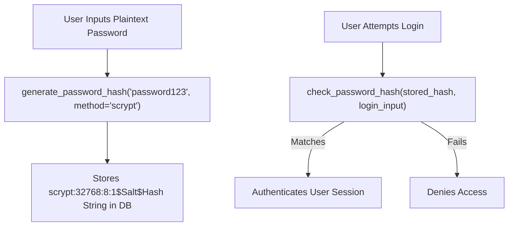

# Password Hashing And Cookie Security

> **Course**: Git Fundamentals | **Module**: Introduction | **Difficulty**: beginner

---

- **Estimated Time**: 45 Minutes (15m Reading | 20m Practice | 10m Quiz)
- **Difficulty Level**: ⭐⭐ Intermediate
- **Prerequisites**: [Lesson 7.1 User Authentication](file:///d:/My%20Drive/all%20files/PROJECT%20FILES/notes/docs/curriculum/_04_flask/_04_15_user_authentication_with_flask_login.md)
- **XP Reward**: +50 XP

### Learning Objectives
By the end of this lesson, you will be able to:
1. Explain why plain-text passwords must **NEVER** be stored in a database.
2. Hash and verify passwords using Werkzeug's `generate_password_hash()` and `check_password_hash()`.
3. Configure Flask session cookie security flags (`HttpOnly`, `Secure`, `SameSite`).
4. Manage secret keys securely using cryptographic signatures.

---

---

Open Python REPL or VS Code.

---

---

### 3.1 One-Way Password Hashing & Salting
A **Hash Function** is a one-way mathematical function that transforms arbitrary input strings into fixed-length cryptographic hashes. **Salting** appends a unique random string to each password before hashing, preventing Rainbow Table dictionary attacks.

Werkzeug uses modern, memory-hard hashing algorithms like **scrypt** or **pbkdf2:sha256**:

```
┌─────────────────────────────────────────────────────────────────────────────┐
│                        WERKZEUG HASHING & VERIFICATION                      │
├─────────────────────────────────────────────────────────────────────────────┤
│ Plaintext Password + Random Salt ──► `generate_password_hash()` ──► Hash    │
│ Login Verification ──► `check_password_hash(stored_hash, input_password)`  │
└─────────────────────────────────────────────────────────────────────────────┘
```

### 3.2 Flask Session Cookie Security Configuration
To protect session cookies against theft and cross-site attacks, set these 3 critical security flags in `config.py`:

- **`SESSION_COOKIE_HTTPONLY = True`**: Prevents client-side JavaScript (XSS) from reading session cookies.
- **`SESSION_COOKIE_SECURE = True`**: Restricts cookie transmission strictly over HTTPS connections.
- **`SESSION_COOKIE_SAMESITE = 'Lax'`**: Prevents Cross-Site Request Forgery (CSRF) attacks.

---

---



---

---

### File: `security_demo.py` (Password Hashing & Cookie Security Config)

```python
from werkzeug.security import generate_password_hash, check_password_hash
from flask import Flask

app = Flask(__name__)

# 1. Production Cookie Security Configuration
app.config.update(
    SECRET_KEY="cryptographically-strong-random-key-90210",
    SESSION_COOKIE_HTTPONLY=True,  # Prevents JS XSS access
    SESSION_COOKIE_SECURE=True,    # Restricts to HTTPS only
    SESSION_COOKIE_SAMESITE="Lax"  # Mitigates CSRF attacks
)

# 2. Model Password Property Setter/Getter Pattern
class UserSecurityModel:
    def __init__(self, username):
        self.username = username
        self.password_hash = None

    def set_password(self, plaintext_password):
        # Generates salted scrypt hash string
        self.password_hash = generate_password_hash(plaintext_password, method="scrypt")

    def verify_password(self, plaintext_password):
        # Safely verifies password against stored salt and hash
        return check_password_hash(self.password_hash, plaintext_password)

# Test Execution
user = UserSecurityModel("admin_dev")
user.set_password("SuperSecretP@ssword2026")

print("Generated Hash String:", user.password_hash)
print("Correct Password Verify:", user.verify_password("SuperSecretP@ssword2026")) # True
print("Wrong Password Verify:", user.verify_password("WrongPassword"))              # False
```

---

---

- **Security Audit Compliance**: Enterprise web backends undergo strict penetration testing requiring scrypt/bcrypt password hashing and `HttpOnly; Secure; SameSite=Lax` cookie flags to comply with PCI-DSS and SOC2 standards.

---

---

1. Save code as `security_demo.py`.
2. Run `python security_demo.py` $\to$ Inspect generated scrypt hash string and verification output!

---

---

| Bug / Error | Root Cause | Engineering Solution |
| :--- | :--- | :--- |
| **`ValueError: password_hash column too short`** | Defining a database column `db.String(30)` for password hashes. | Salted scrypt/bcrypt hashes require at least `db.String(256)` column length. |

---

---

- **Use At Least `db.String(256)`**: Always ensure database columns for password hashes have sufficient character length.

---

---

### Q1: Why is storing plain MD5 or SHA-256 hashes of passwords insecure, and how does Werkzeug address this?
**Answer**: Plain MD5 or SHA-256 hashes are fast and unsalted, making them vulnerable to pre-computed Rainbow Table dictionary attacks and GPU brute-force cracking. Werkzeug uses salted, memory-hard algorithms (scrypt / PBKDF2) that append a unique salt and introduce artificial computational work factors, rendering brute-force cracking computationally infeasible.

---

---

```json
{
  "quiz_title": "Lesson 7.2 Password Hashing Assessment",
  "questions": [
    {
      "question_id": "Q1",
      "type": "multiple_choice",
      "question_text": "Which Werkzeug function safely verifies a plaintext password against a stored cryptographic hash string?",
      "options": ["verify_hash()", "check_password_hash()", "validate_password()", "decode_hash()"],
      "correct_answer_index": 1,
      "explanation": "check_password_hash() verifies plaintext passwords against stored hashes."
    }
  ]
}
```

---

---

Implement password hashing property getters and setters on a User model.

---

---

**Front**: Which Flask session cookie setting prevents client-side JavaScript from accessing cookies?
**Back**: `SESSION_COOKIE_HTTPONLY = True`.
<!-- flashcard:end -->

---

---

```python
hash_str = generate_password_hash("pass")
is_valid = check_password_hash(hash_str, "pass")
```

---
