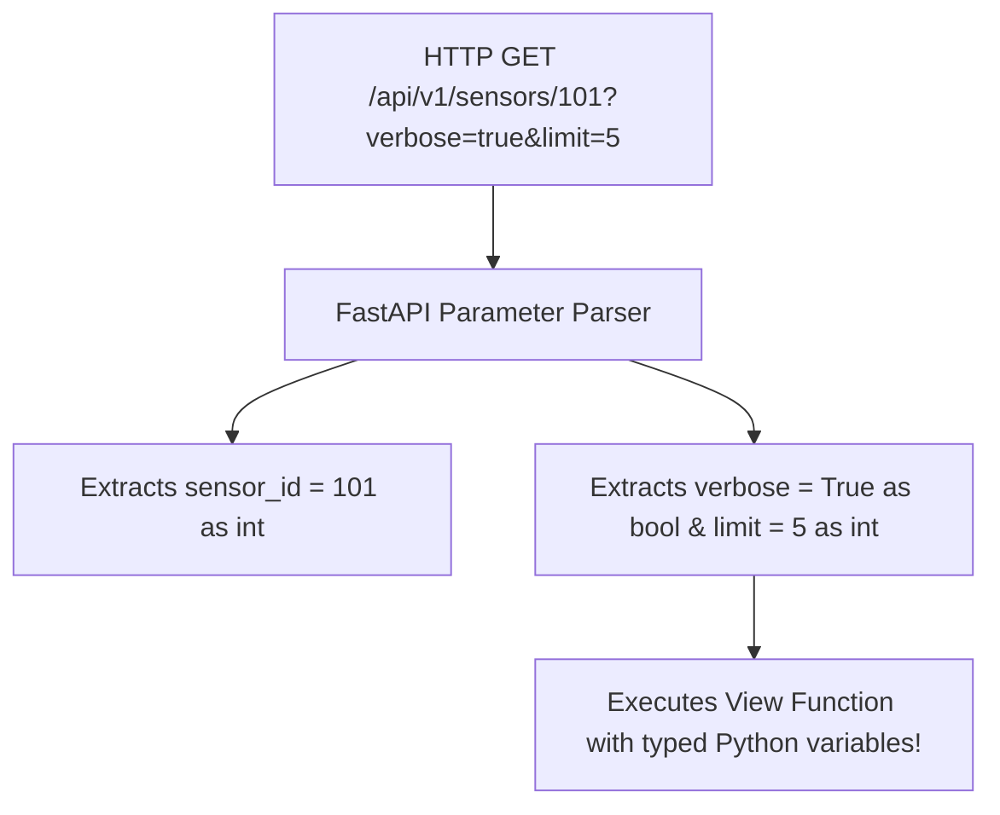

# Path And Query Parameters

> **Course**: Git Fundamentals | **Module**: Introduction | **Difficulty**: beginner

---

- **Estimated Time**: 45 Minutes (15m Reading | 20m Practice | 10m Quiz)
- **Difficulty Level**: ⭐ Beginner
- **Prerequisites**: [Lesson 1.2 FastAPI Routing](file:///d:/My%20Drive/all%20files/PROJECT%20FILES/notes/docs/curriculum/_05_fastapi/_05_02_fastapi_app_instantiation_routing_and_openapi.md)
- **XP Reward**: +50 XP

### Learning Objectives
By the end of this lesson, you will be able to:
1. Define dynamic path parameters using `/resource/{param_id}` syntax.
2. Declare query parameters (`?limit=10&active=true`) using function argument type hints.
3. Leverage automatic type casting (`int`, `float`, `bool`, `UUID`).
4. Apply validation constraints using **`Path()`** and **`Query()`** metadata functions.

---

---

Open Python REPL or VS Code.

---

---

### 3.1 Parameter Parsing & Automatic Type Conversion
In standard frameworks, path and query parameters are extracted as raw strings (`"42"`), requiring manual `int("42")` casting and error handling.

FastAPI inspects Python type hints on function arguments:
- If an argument is declared in the path (`/items/{item_id}`), it is parsed as a **Path Parameter**.
- If an argument is NOT in the path (`def get_items(limit: int = 10)`), it is parsed as a **Query String Parameter**.
- FastAPI converts string inputs into target Python types automatically and returns an HTTP 422 error if conversion fails.

```
┌─────────────────────────────────────────────────────────────────────────────┐
│                       FASTAPI PARAMETER DECLARATION MATRIX                  │
├─────────────────┬─────────────────────────────────┬─────────────────────────┤
│ Declaration     │ Function Signature              │ Source & Type           │
├─────────────────┼─────────────────────────────────┼─────────────────────────┤
│ `/nodes/{id}`   │ `def fn(id: int)`               │ Path parameter (`int`)  │
│ `/nodes`        │ `def fn(page: int = 1)`         │ Query param (`int`)     │
│ `/nodes`        │ `def fn(q: str | None = None)`  │ Optional Query param    │
└─────────────────┴─────────────────────────────────┴─────────────────────────┘
```

---

---



---

---

```python
# FastAPI Path & Query Parameter Validation (params_demo.py)
from uuid import UUID
from fastapi import FastAPI, Path, Query, status

app = FastAPI(title="Parameter Validation API")

# 1. Typed Path Parameter with Path() Validation Rules
@app.get("/api/v1/sensors/{sensor_id}")
def get_sensor_by_id(
    sensor_id: int = Path(
        ...,
        title="Sensor ID",
        ge=1,       # Greater than or equal to 1
        le=10000,   # Less than or equal to 10000
        description="The unique integer ID of the sensor hardware node"
    )
):
    return {"sensor_id": sensor_id, "type": str(type(sensor_id))}

# 2. Query Parameters with Query() Constraints
@app.get("/api/v1/telemetry")
def filter_telemetry(
    limit: int = Query(default=10, ge=1, le=100),
    page: int = Query(default=1, ge=1),
    active_only: bool = Query(default=True),
    search: str | None = Query(default=None, min_length=3, max_length=50)
):
    return {
        "page": page,
        "limit": limit,
        "active_only": active_only,
        "search_term": search
    }

# 3. UUID Path Parameter
@app.get("/api/v1/devices/{device_uuid}")
def get_device_by_uuid(device_uuid: UUID):
    # device_uuid is automatically parsed into a Python uuid.UUID object!
    return {"device_uuid": str(device_uuid), "is_valid_uuid": True}
```

---

---

- **Microservice Filtering & Pagination**: Production REST APIs use `Query(ge=1, le=100)` to enforce page size limits, preventing clients from requesting millions of database records in a single query.

---

---

1. Save code as `params_demo.py`.
2. Run `uvicorn params_demo:app --reload`.
3. Navigate to `/api/v1/sensors/0` $\to$ Inspect automatic HTTP 422 Validation Error response!

---

---

| Bug / Error | Root Cause | Engineering Solution |
| :--- | :--- | :--- |
| **HTTP 422 Unprocessable Entity** | Passing a non-integer string (`/sensors/abc`) to a parameter annotated with `: int`. | Ensure client requests supply arguments matching declared Python types. |

---

---

- **Use Python 3.10+ Union Syntax (`str | None`)**: Use `str | None = None` for clean optional query parameter declarations.

---

---

### Q1: How does FastAPI differentiate between a Path Parameter and a Query Parameter in a route function?
**Answer**: FastAPI inspects the route path string decorator (e.g. `@app.get("/items/{item_id}")`). Any function parameter whose name matches a variable inside `{...}` in the path decorator is treated as a Path Parameter. Any parameter not matching the path string is parsed as a Query String Parameter.

---

---

```json
{
  "quiz_title": "Lesson 2.1 Parameters Assessment",
  "questions": [
    {
      "question_id": "Q1",
      "type": "multiple_choice",
      "question_text": "How does FastAPI treat a function parameter that is NOT declared in the route path decorator?",
      "options": ["Path Parameter", "Query Parameter", "Header Parameter", "Body Parameter"],
      "correct_answer_index": 1,
      "explanation": "Parameters not in the path template are parsed as Query Parameters."
    }
  ]
}
```

---

---

Build an endpoint with `Path(ge=1)` and optional `Query(min_length=3)` parameter validations.

---

---

**Front**: What HTTP status code does FastAPI automatically return when path or query parameter validation fails?
**Back**: HTTP 422 Unprocessable Entity.
<!-- flashcard:end -->

---

---

```python
@app.get("/item/{id}")
def item(id: int = Path(..., ge=1), q: str | None = Query(None)):
    return {"id": id, "q": q}
```

---
