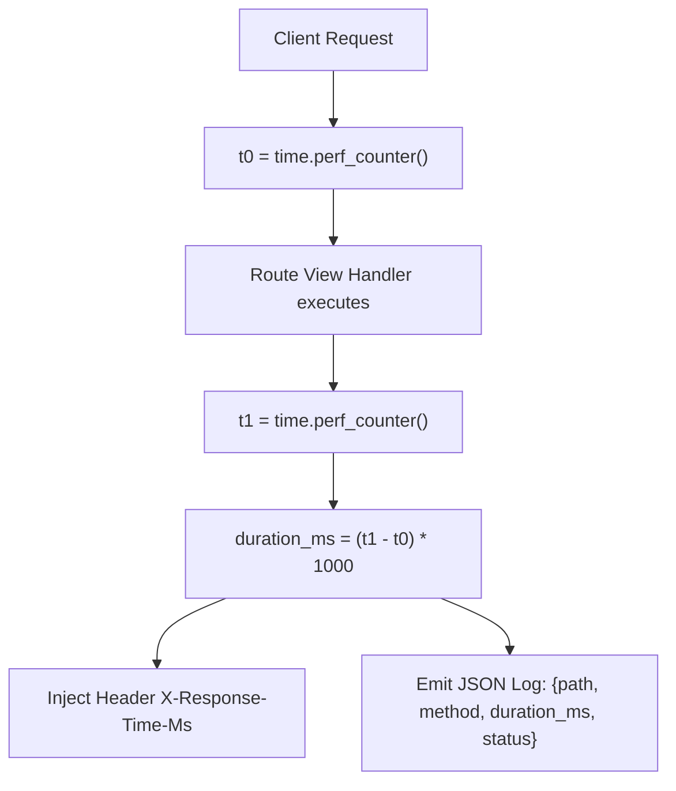

# Request Timing Headers And Performance Logging

> **Course**: Git Fundamentals | **Module**: Introduction | **Difficulty**: beginner

---

- **Estimated Time**: 45 Minutes (15m Reading | 20m Practice | 10m Quiz)
- **Difficulty Level**: ⭐⭐ Intermediate
- **Prerequisites**: [Lesson 7.1 Middleware & CORS](file:///d:/My%20Drive/all%20files/PROJECT%20FILES/notes/docs/curriculum/_05_fastapi/_05_13_asynchronous_middleware_and_cors.md)
- **XP Reward**: +50 XP

### Learning Objectives
By the end of this lesson, you will be able to:
1. Measure high-precision API request latencies using **`time.perf_counter()`**.
2. Inject custom diagnostic headers (`Server-Timing`, `X-Response-Time-Ms`) into HTTP responses.
3. Build structured JSON access logging middleware for observability platforms.
4. Protect endpoints against Denial-of-Service attacks using **`slowapi`** rate limiting.

---

---

Install `slowapi`:

```bash
pip install slowapi
```

---

---

### 3.1 High-Precision Latency Tracking
In microservices, understanding API latency bottlenecks is essential for maintaining SLAs. Standard `time.time()` lacks high-resolution precision and can jump due to system clock synchronization.

**`time.perf_counter()`** provides a monotonic high-resolution clock designed specifically for measuring short execution intervals in nanoseconds:

```
┌─────────────────────────────────────────────────────────────────────────────┐
│                    PERFORMANCE MONITORING MIDDLEWARE PIPELINE               │
├─────────────────────────────────────────────────────────────────────────────┤
│ 1. Request Arrives ──► Record `t0 = time.perf_counter()`                    │
│ 2. `await call_next(request)` executes route handler                        │
│ 3. Response Ready  ──► Record `t1 = time.perf_counter()`                    │
│                    ──► Duration = `(t1 - t0) * 1000` (Milliseconds)        │
│                    ──► Inject `X-Response-Time-Ms: 1.45ms` Header          │
└─────────────────────────────────────────────────────────────────────────────┘
```

---

---



---

---

```python
# Latency Tracking & slowapi Rate Limiting (perf_demo.py)
import time
import logging
from fastapi import FastAPI, Request
from slowapi import Limiter, _rate_limit_exceeded_handler
from slowapi.util import get_remote_address
from slowapi.errors import RateLimitExceeded

# 1. Initialize SlowAPI Limiter
limiter = Limiter(key_func=get_remote_address)

app = FastAPI(title="Performance & Rate Limiting API")
app.state.limiter = limiter
app.add_exception_handler(RateLimitExceeded, _rate_limit_exceeded_handler)

# Configure Logger
logging.basicConfig(level=logging.INFO)
logger = logging.getLogger("api_access")

# 2. Performance & Access Logging Middleware
@app.middleware("http")
def performance_logging_middleware(request: Request, call_next):
    start_time = time.perf_counter()

    response = call_next(request)

    duration_ms = (time.perf_counter() - start_time) * 1000.0
    response.headers["X-Response-Time-Ms"] = f"{duration_ms:.2f}ms"

    # Structured Access Log Emission
    logger.info(
        f"[ACCESS]: Method={request.method} Path={request.url.path} "
        f"Status={response.status_code} Latency={duration_ms:.2f}ms"
    )

    return response

# 3. Rate Limited Endpoint (5 requests per minute per IP!)
@app.get("/api/v1/limited-resource")
@limiter.limit("5/minute")
def limited_endpoint(request: Request):
    return {"message": "Rate limited endpoint accessed successfully"}
```

---

---

- **Microservice APM Observability**: Production FastAPI applications emit structured JSON logs to Datadog and Elastic APM, leveraging `X-Response-Time-Ms` headers to trigger automated scaling alerts when latencies exceed 200ms.

---

---

1. Save code as `perf_demo.py`.
2. Run `uvicorn perf_demo:app --reload`.
3. Refresh `/api/v1/limited-resource` 6 times in 1 minute $\to$ Observe HTTP 429 Too Many Requests response on 6th request!

---

---

| Bug / Error | Root Cause | Engineering Solution |
| :--- | :--- | :--- |
| **`AttributeError: 'Request' has no attribute 'state'` in SlowAPI** | Forgetting to pass `request: Request` into the view function signature when using `@limiter.limit()`. | Always include `request: Request` in functions annotated with `@limiter.limit()`. |

---

---

- **Use `time.perf_counter()` for Benchmarking**: Always use `time.perf_counter()` instead of `time.time()` for accurate high-precision execution timing.

---

---

### Q1: Why is `time.perf_counter()` preferred over `time.time()` for measuring code latency?
**Answer**: `time.time()` reads the system wall-clock time, which is subject to Network Time Protocol (NTP) adjustments and clock drifts that can cause negative or inaccurate latency calculations. `time.perf_counter()` reads a CPU-based monotonic clock that never runs backwards and provides nanosecond-level precision.

---

---

```json
{
  "quiz_title": "Lesson 7.2 Performance Assessment",
  "questions": [
    {
      "question_id": "Q1",
      "type": "multiple_choice",
      "question_text": "Which Python function provides high-precision monotonic timing for measuring code execution latency?",
      "options": ["time.time()", "time.perf_counter()", "time.clock()", "time.now()"],
      "correct_answer_index": 1,
      "explanation": "time.perf_counter() provides high-precision monotonic timing."
    }
  ]
}
```

---

---

Implement rate limiting (10/min) and performance logging middleware on an API endpoint.

---

---

**Front**: What HTTP status code is returned when a client exceeds a SlowAPI rate limit?
**Back**: HTTP 429 Too Many Requests.
<!-- flashcard:end -->

---

---

```python
t0 = time.perf_counter()
res = await call_next(req)
ms = (time.perf_counter() - t0) * 1000
res.headers["X-Latency-Ms"] = f"{ms:.2f}"
```

---
