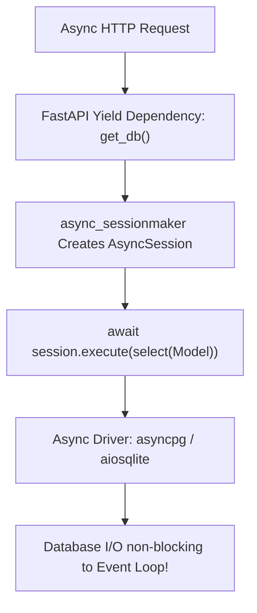

# Sqlalchemy 20 Async Engine And Asyncpg

> **Course**: Git Fundamentals | **Module**: Introduction | **Difficulty**: beginner

---

- **Estimated Time**: 55 Minutes (20m Reading | 25m Practice | 10m Quiz)
- **Difficulty Level**: ⭐⭐⭐ Advanced
- **Prerequisites**: [Lesson 3.2 Sub-Dependencies](file:///d:/My%20Drive/all%20files/PROJECT%20FILES/notes/docs/curriculum/_05_fastapi/_05_06_sub_dependencies_security_and_yield_cleanups.md)
- **XP Reward**: +70 XP

### Learning Objectives
By the end of this lesson, you will be able to:
1. Explain why traditional synchronous database drivers block FastAPI's async event loop.
2. Configure **SQLAlchemy 2.0** with **`create_async_engine()`**.
3. Use asynchronous database drivers (**`asyncpg`** for PostgreSQL, **`aiosqlite`** for SQLite).
4. Create an **`async_sessionmaker`** and inject **`AsyncSession`** instances using FastAPI yield dependencies.

---

---

Install `sqlalchemy`, `asyncpg`, and `aiosqlite`:

```bash
pip install "sqlalchemy>=2.0" asyncpg aiosqlite
```

---

---

### 3.1 Synchronous vs Asynchronous Database Drivers
FastAPI's high performance relies on its non-blocking event loop. If an `async def` endpoint uses a synchronous database driver (like standard `psycopg2` or `sqlite3`), database queries block the event loop thread—completely defeating the purpose of async I/O!

**SQLAlchemy 2.0** introduces native async support. Combined with async drivers like **`asyncpg`** (PostgreSQL) or **`aiosqlite`** (SQLite), database queries execute non-blockingly:

```
┌─────────────────────────────────────────────────────────────────────────────┐
│                    ASYNC DATABASE CONNECTION MATRIX                         │
├─────────────────┬──────────────────────────────────┬────────────────────────┤
│ Database        │ Async Driver Package             │ Async Connection URI   │
├─────────────────┼──────────────────────────────────┼────────────────────────┤
│ SQLite          │ `aiosqlite`                      │ `sqlite+aiosqlite:///` │
│ PostgreSQL      │ `asyncpg`                        │ `postgresql+asyncpg://`│
│ MySQL           │ `asyncmy`                        │ `mysql+asyncmy://`     │
└─────────────────┴──────────────────────────────────┴────────────────────────┘
```

---

---



---

---

### File 1: `database.py` (SQLAlchemy 2.0 Async Engine & Dependency)

```python
from typing import AsyncGenerator
from sqlalchemy.ext.asyncio import create_async_engine, AsyncSession, async_sessionmaker
from sqlalchemy.orm import DeclarativeBase

# Async Database URI (sqlite+aiosqlite for local testing; postgresql+asyncpg for prod!)
DATABASE_URL = "sqlite+aiosqlite:///./async_telemetry.db"

# 1. Instantiate SQLAlchemy 2.0 Async Engine
engine = create_async_engine(
    DATABASE_URL,
    echo=True, # Logs SQL queries during development
    future=True
)

# 2. Configure Async Session Maker Factory
AsyncSessionLocal = async_sessionmaker(
    bind=engine,
    class_=AsyncSession,
    expire_on_commit=False # Prevents lazy-loading errors after commit!
)

# 3. Base Declarative Class
class Base(DeclarativeBase):
    pass

# 4. FastAPI Yield Dependency for Injecting AsyncSession
async def get_async_db() -> AsyncGenerator[AsyncSession, None]:
    async with AsyncSessionLocal() as session:
        try:
            yield session
        finally:
            await session.close()
```

### File 2: `main.py` (Using AsyncSession in Route)

```python
from fastapi import FastAPI, Depends
from sqlalchemy.ext.asyncio import AsyncSession
from sqlalchemy import text
from database import get_async_db

app = FastAPI(title="Async DB API")

@app.get("/api/v1/db-health")
async def check_db_health(db: AsyncSession = Depends(get_async_db)):
    # Execute non-blocking SQL query using await!
    result = await db.execute(text("SELECT 1"))
    value = result.scalar()
    return {"status": "HEALTHY", "result": value}
```

---

---

- **High-Concurrency Telemetry Services**: Production FastAPI microservices connect to PostgreSQL database clusters using `postgresql+asyncpg://`, enabling hundreds of concurrent web requests to execute non-blocking database queries simultaneously.

---

---

1. Save `database.py` and `main.py`.
2. Run `uvicorn main:app --reload`.
3. Navigate to `/api/v1/db-health` $\to$ Inspect terminal logs for non-blocking async SQL execution!

---

---

| Bug / Error | Root Cause | Engineering Solution |
| :--- | :--- | :--- |
| **`MissingGreenlet: Missing greenlet context`** | Attempting to access lazy-loaded relational attributes synchronously on an AsyncSession model. | Use explicit `selectinload()` or `joinedload()` eager loading strategies in async queries. |

---

---

- **Set `expire_on_commit=False`**: Prevents SQLAlchemy from expiring model attribute instances after `commit()`, avoiding `MissingGreenlet` errors in async code.

---

---

### Q1: Why is `asyncpg` significantly faster than `psycopg2` when used with FastAPI?
**Answer**: `psycopg2` is a synchronous C-extension driver that blocks Python's thread during database network I/O. `asyncpg` is built specifically for `asyncio` from the ground up, utilizing PostgreSQL's binary protocol directly without intermediate abstractions, enabling fast non-blocking I/O and handling massive concurrent connection loads efficiently.

---

---

```json
{
  "quiz_title": "Lesson 4.1 Async Database Assessment",
  "questions": [
    {
      "question_id": "Q1",
      "type": "multiple_choice",
      "question_text": "Which SQLAlchemy 2.0 function instantiates an asynchronous database engine?",
      "options": ["create_engine()", "create_async_engine()", "init_async_db()", "AsyncEngine()"],
      "correct_answer_index": 1,
      "explanation": "create_async_engine() creates async SQLAlchemy engines."
    }
  ]
}
```

---

---

Configure an async engine with `aiosqlite` and a yield dependency providing `AsyncSession`.

---

---

**Front**: What parameter on `async_sessionmaker` prevents `MissingGreenlet` errors after committing an async session?
**Back**: `expire_on_commit=False`.
<!-- flashcard:end -->

---

---

```python
engine = create_async_engine("sqlite+aiosqlite:///app.db")
async_session = async_sessionmaker(engine, class_=AsyncSession)
```

---
