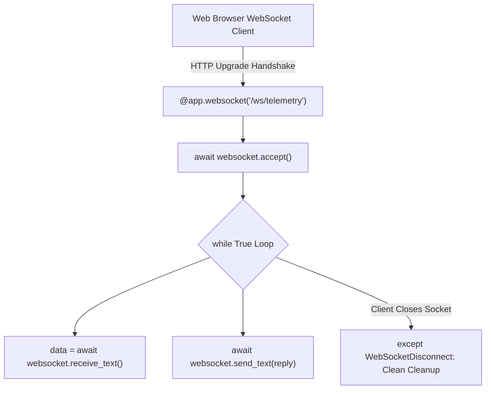

# Websockets Protocol And Endpoint Handling

> **Course**: Git Fundamentals | **Module**: Introduction | **Difficulty**: beginner

---

- **Estimated Time**: 55 Minutes (20m Reading | 25m Practice | 10m Quiz)
- **Difficulty Level**: ⭐⭐⭐ Advanced
- **Prerequisites**: [Lesson 8.2 Lifespan Handlers](file:///d:/My%20Drive/all%20files/PROJECT%20FILES/notes/docs/curriculum/_05_fastapi/_05_16_lifespan_event_handlers.md)
- **XP Reward**: +70 XP

### Learning Objectives
By the end of this lesson, you will be able to:
1. Explain the **Full-Duplex WebSocket (`ws://` / `wss://`)** protocol lifecycle.
2. Define WebSocket route endpoints using **`@app.websocket()`**.
3. Accept connections and exchange text/JSON messages using `websocket.accept()`, `websocket.receive_text()`, and `websocket.send_text()`.
4. Handle abrupt client disconnects cleanly using **`WebSocketDisconnect`**.

---

---

Open Python REPL or VS Code.

---

---

### 3.1 HTTP Polling vs Full-Duplex WebSockets
Traditional HTTP request-response architecture requires clients to constantly poll the server for new data.

**WebSockets (RFC 6455)** establish a persistent, low-latency, full-duplex TCP connection over a single socket after an initial HTTP upgrade handshake. Both client and server can send messages independently at any time:

```
┌─────────────────────────────────────────────────────────────────────────────┐
│                          WEBSOCKET HANDSHAKE & DUPLEX FLOW                  │
├─────────────────────────────────────────────────────────────────────────────┤
│ 1. HTTP GET `/ws` (Header: `Upgrade: websocket`) ──► Handshake Accepted     │
│ 2. Persistent TCP Connection Established (`ws://host/ws`)                   │
│    ├── Client ──► `websocket.send_json({"command": "START"})`               │
│    └── Server ──► `websocket.send_json({"temp": 24.5})` (Bi-directional!)  │
└─────────────────────────────────────────────────────────────────────────────┘
```

---

---



---

---

```python
# FastAPI WebSocket Endpoint (websocket_demo.py)
from fastapi import FastAPI, WebSocket, WebSocketDisconnect

app = FastAPI(title="WebSocket Telemetry API")

@app.websocket("/ws/telemetry/{client_id}")
async def websocket_telemetry_endpoint(websocket: WebSocket, client_id: str):
    # 1. Accept incoming WebSocket connection handshake
    await websocket.accept()
    print(f"[WebSocket Connected]: Client {client_id} connected.")
    
    try:
        # 2. Continuous Bi-Directional Message Loop
        while True:
            # Receive text message from client
            data = await websocket.receive_text()
            print(f"[Message Received from {client_id}]: {data}")

            # Send real-time response back to client
            response_payload = f"Echo [{client_id}]: Processed telemetry '{data}'"
            await websocket.send_text(response_payload)

    except WebSocketDisconnect:
        # 3. Clean disconnect handling when client closes tab/socket
        print(f"[WebSocket Disconnected]: Client {client_id} closed connection.")
```

---

---

- **Real-Time IoT Telemetry Dashboards**: Web applications stream live temperature readings, factory machine status, and sensor alerts directly to browser dashboards over WebSockets without polling overhead.

---

---

1. Save code as `websocket_demo.py`.
2. Run `uvicorn websocket_demo:app --reload`.
3. Open browser console and execute: `let ws = new WebSocket("ws://localhost:8000/ws/telemetry/node1"); ws.onmessage = e => console.log(e.data); ws.send("24.5C");` $\to$ Inspect live websocket echo response!

---

---

| Bug / Error | Root Cause | Engineering Solution |
| :--- | :--- | :--- |
| **`RuntimeError: Unexpected ASGI message 'websocket.send'`** | Forgetting to call `await websocket.accept()` before trying to send or receive messages. | Always call `await websocket.accept()` as the first operation inside `@app.websocket`. |

---

---

- **Always Handle `WebSocketDisconnect`**: Wrap `while True` loops in `try...except WebSocketDisconnect` to prevent unhandled tracebacks when clients disconnect.

---

---

### Q1: What is the purpose of `await websocket.accept()` in a FastAPI WebSocket endpoint?
**Answer**: `await websocket.accept()` completes the HTTP-to-WebSocket protocol upgrade handshake (returning HTTP 101 Switching Protocols). Calling `accept()` establishes the persistent full-duplex TCP socket, allowing subsequent `send_*()` and `receive_*()` calls to exchange data.

---

---

```json
{
  "quiz_title": "Lesson 9.1 WebSockets Assessment",
  "questions": [
    {
      "question_id": "Q1",
      "type": "multiple_choice",
      "question_text": "Which exception is raised when a WebSocket client abruptly closes its connection?",
      "options": ["ConnectionResetError", "WebSocketDisconnect", "SocketClosedError", "HTTPException"],
      "correct_answer_index": 1,
      "explanation": "WebSocketDisconnect is raised when clients disconnect."
    }
  ]
}
```

---

---

Build an echo WebSocket endpoint receiving JSON sensor payloads and returning status confirmations.

---

---

**Front**: What decorator defines a WebSocket endpoint in FastAPI?
**Back**: `@app.websocket("/path")`.
<!-- flashcard:end -->

---

---

```python
@app.websocket("/ws")
async def ws_endpoint(ws: WebSocket):
    await ws.accept()
    data = await ws.receive_text()
    await ws.send_text(f"Echo {data}")
```

---
