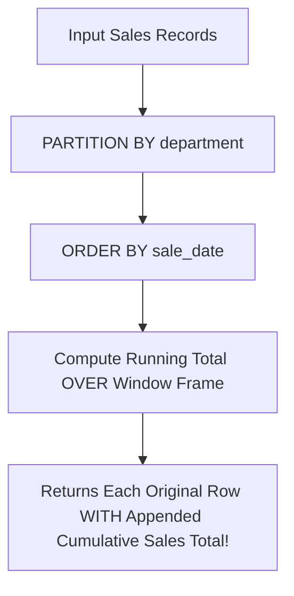

```yaml
schema_version: "2.0"
metadata:
  lesson_id: "SQL-MOD03-LES01"
  course_slug: "course-05-mysql"
  course_title: "Course 5: Database Architecture with MySQL 8.4"
  module_slug: "mod-03-modern-analytical-sql"
  module_title: "Module 3 - Modern Analytical SQL & Window Functions"
  lesson_slug: "mysql8-analytical-window-functions"
  lesson_title: "Lesson 3.1 MySQL 8.4 Analytical Window Functions"
  sort_order: 301

pedagogy:
  difficulty: "intermediate"
  estimated_time:
    reading_minutes: 20
    practice_minutes: 25
    quiz_minutes: 10
    total_minutes: 55
  bloom_taxonomy_level: "Apply"
  xp_reward: 60

prerequisites:
  required_lesson_ids:
    - "SQL-MOD02-LES01"
  required_skills:
    - "SQL Grouping (GROUP BY) & Aggregations"

skills_acquired:
  - "Window Function Syntax (`OVER(PARTITION BY ... ORDER BY ...)`)"
  - "Ranking Functions (`ROW_NUMBER()`, `RANK()`, `DENSE_RANK()`, `NTILE()`)"
  - "Value Functions (`LAG()`, `LEAD()`, `FIRST_VALUE()`, `LAST_VALUE()`)"
  - "Running Totals & Moving Averages"

dependencies:
  software:
    - "VS Code / MySQL Workbench"
    - "MySQL Server 8.0+"
  hardware: []

seo_and_social:
  meta_title: "MySQL 8 Window Functions: OVER, PARTITION BY, ROW_NUMBER, RANK, LAG & LEAD"
  meta_description: "Master MySQL 8.4 Window Functions: OVER clause, PARTITION BY, ORDER BY, ROW_NUMBER(), RANK(), DENSE_RANK(), LAG(), LEAD(), and running totals."
  keywords: ["MySQL 8 Window Functions", "OVER PARTITION BY", "ROW_NUMBER RANK", "LAG LEAD SQL", "Analytical SQL", "Running Total"]

assessment_config:
  has_quiz: true
  has_lab: true
  has_flashcards: true
  pass_score_percentage: 80
```

# Lesson 3.1 MySQL 8.4 Analytical Window Functions

## 1. Overview & Learning Objectives [id: overview]

- **Estimated Time**: 55 Minutes (20m Reading | 25m Practice | 10m Quiz)
- **Difficulty Level**: ⭐⭐ Intermediate
- **Prerequisites**: SQL `GROUP BY` Aggregations
- **XP Reward**: +60 XP

### Learning Objectives
By the end of this lesson, you will be able to:
1. Understand how **Window Functions** compute aggregate values across subset partitions without collapsing individual table rows.
2. Execute Ranking Functions (`ROW_NUMBER()`, `RANK()`, `DENSE_RANK()`).
3. Access adjacent row values using `LAG()` and `LEAD()`.
4. Calculate Cumulative Running Totals and Moving Averages using window frame specifications (`ROWS BETWEEN`).

---

## 2. Environment & Prerequisites [id: prerequisites]

Ensure MySQL Server 8.0+ is running.

---

## 3. Theoretical Foundations [id: theory]

### 3.1 `GROUP BY` vs Window Functions (`OVER`)
Traditional `GROUP BY` queries collapse multiple rows into a single summary row. **Window Functions** perform calculations across a partition of rows while retaining individual row identities in the result set:

$$\text{FUNCTION}() \overbrace{\text{OVER}}^{\text{Window Definition}} \left( \text{PARTITION BY } \text{dept} \text{ ORDER BY } \text{salary DESC} \right)$$

```
┌─────────────────────────────────────────────────────────────────────────────┐
│                       RANKING FUNCTIONS COMPARISON MATRIX                   │
├─────────────────┬───────────────────────────────────────────────────────────┤
│ Function        │ Behavior on Tied Values                                   │
├─────────────────┼───────────────────────────────────────────────────────────┤
│ `ROW_NUMBER()`  │ Always sequential unique integers (1, 2, 3, 4)           │
│ `RANK()`        │ Tied values get same rank; SKIPS subsequent ranks (1, 2, 2, 4)│
│ `DENSE_RANK()`  │ Tied values get same rank; NO gaps in sequence (1, 2, 2, 3)  │
└─────────────────┴───────────────────────────────────────────────────────────┘
```

---

## 4. Architecture & Diagram Visualizations [id: diagram]



---

## 5. Code & Hardware Implementation [id: syntax]

```sql
-- MySQL 8.4 Analytical Window Functions Queries

-- 1. Top 2 Highest Paid Employees Per Department (DENSE_RANK)
WITH RankedEmployees AS (
    SELECT 
        emp_id,
        name,
        department_id,
        salary,
        DENSE_RANK() OVER(
            PARTITION BY department_id 
            ORDER BY salary DESC
        ) AS salary_rank
    FROM employees
)
SELECT * FROM RankedEmployees WHERE salary_rank <= 2;

-- 2. Sales Growth Comparison vs Previous Month (LAG)
SELECT 
    sale_month,
    revenue,
    LAG(revenue, 1, 0.0) OVER(ORDER BY sale_month) AS prev_month_revenue,
    revenue - LAG(revenue, 1, 0.0) OVER(ORDER BY sale_month) AS month_over_month_diff
FROM monthly_sales;

-- 3. Cumulative Running Total
SELECT 
    transaction_date,
    amount,
    SUM(amount) OVER(
        ORDER BY transaction_date 
        ROWS BETWEEN UNBOUNDED PRECEDING AND CURRENT ROW
    ) AS running_balance
FROM bank_transactions;
```

---

## 6. Enterprise Real-World Applications [id: examples]

- **Financial Ledger Balance Analytics**: Calculating real-time running customer balances and Month-over-Month (MoM) revenue growth metrics in enterprise data warehouses.

---

## 7. Guided Step-by-Step Hands-On Exercise [id: exercises]

1. Connect to MySQL Workbench or MySQL CLI.
2. Execute the `DENSE_RANK()` and `LAG()` queries $\to$ Observe row-level analytical metrics!

---

## 8. Common Pitfalls & Troubleshooting [id: common_mistakes]

| Bug / Error | Root Cause | Engineering Solution |
| :--- | :--- | :--- |
| **`ERROR 1064 (42000): You have an error in your SQL syntax`** | Running window functions on legacy MySQL 5.7. | Upgrade server to MySQL 8.0 or 8.4 LTS. |

---

## 9. Best Practices & Optimization [id: best_practices]

- **Use CTEs with Window Functions**: Wrap window function queries inside a Common Table Expression to filter results with `WHERE` clauses.

---

## 10. Industry Interview Q&A [id: interview_qa]

### Q1: What is the difference between `RANK()` and `DENSE_RANK()` in SQL?
**Answer**: When tied values occur, both functions assign the same rank number to tied rows. However, `RANK()` skips subsequent rank numbers (e.g. 1, 2, 2, 4), whereas `DENSE_RANK()` does not skip numbers (e.g. 1, 2, 2, 3).

---

## 11. Self-Assessment Quiz [id: quiz]

```json
{
  "quiz_title": "Lesson 3.1 Window Functions Assessment",
  "questions": [
    {
      "question_id": "Q1",
      "type": "multiple_choice",
      "question_text": "Which window function accesses data from a previous row in the result set?",
      "options": ["LEAD()", "LAG()", "FIRST_VALUE()", "DENSE_RANK()"],
      "correct_answer_index": 1,
      "explanation": "LAG() accesses previous row values."
    }
  ]
}
```

---

## 12. Portfolio Assignment & Challenge [id: lab]

Build a 3-month moving average sales reporting query using `ROWS BETWEEN 2 PRECEDING AND CURRENT ROW`.

---

## 13. Spaced Repetition Flashcards [id: flashcards]

**Front**: What clause divides a window function dataset into subset groups?
**Back**: `PARTITION BY`
<!-- flashcard:end -->

---

## 14. Summary & Cheat Sheet [id: summary]

```sql
SELECT val, LAG(val) OVER(ORDER BY date) FROM t;
```


---

## Existing SQL Reference Files

> **Note**: SQL Server reference scripts exist in the archive. Review and adapt for MySQL syntax.
> Location: `docs/old and reference and future studies/_02_python_full_stack/_02_sqlserver/`
>
  - `00_Setup_Database.sql`
  - `01_Basics_DDL_DML.sql`
  - `02_Retrieval_Filtering.sql`
  - `03_Functions_Aggregation.sql`
  - `04_Joins_Set_Operations.sql`
  - `05_Subqueries_CTEs.sql`
  - `06_Window_Functions.sql`
  - `07_Advanced_DB_Objects.sql`
  - `08_Transactions_Performance.sql`
  - `09_Temp_Tables_And_Table_Vars.sql`
  - `10_Error_Handling_Dynamic_SQL.sql`
  - `11_Pivot_Unpivot_Merge.sql`
  - `12_JSON_XML_Support.sql`
  - `13_Security_Administration.sql`
