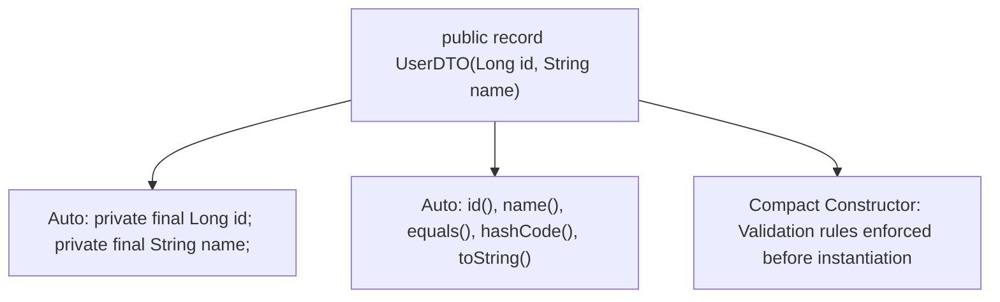

# Lesson 2.3 Java 21 Record Classes & DTO Patterns

> **Course**: Java | **Module**: Module 1 | **Difficulty**: beginner

---

- **Estimated Time**: 45 Minutes (15m Reading | 20m Practice | 10m Quiz)
- **Difficulty Level**: ⭐⭐ Intermediate
- **Prerequisites**: Java Classes & Encapsulation
- **XP Reward**: +50 XP

### Learning Objectives
By the end of this lesson, you will be able to:
1. Define concise immutable data carriers using Java 21 **Record Classes**.
2. Understand auto-generated record components (`private final` fields, accessors, `equals()`, `hashCode()`, `toString()`).
3. Implement validation inside **Compact Constructors**.
4. Replace verbose boilerplate DTO classes (and Lombok `@Value`) with native Java records.

---

---

Ensure JDK 21 LTS is installed:
- Run `java -version` $\to$ Must output `openjdk 21` or higher.

---

---

### 3.1 Eliminating DTO Boilerplate
Before Java 16/21, creating a simple immutable Data Transfer Object (DTO) required 50+ lines of verbose Java boilerplate (private final fields, constructor, getters, `equals`, `hashCode`, `toString`).

**Java Record Classes** reduce this entire declaration to a single line:

```java
// Modern Java 21 Record Class Declaration (1 Line!)
public record UserDTO(Long id, String username, String email) {}
```

```
┌─────────────────────────────────────────────────────────────────────────────┐
│                       JAVA 21 RECORD AUTO-GENERATION MATRIX                 │
├─────────────────┬───────────────────────────────────────────────────────────┤
│ Component       │ Automatically Generated Behavior                           │
├─────────────────┼───────────────────────────────────────────────────────────┤
│ Fields          │ `private final` instance fields for each header component │
│ Accessors       │ `id()`, `username()`, `email()` (No 'get' prefix!)       │
│ Methods         │ Value-based `equals()`, `hashCode()`, and `toString()`    │
│ Class           │ Implicitly `final` (Cannot be extended)                  │
└─────────────────┴───────────────────────────────────────────────────────────┘
```

---

---



---

---

```java
// Java 21 Record with Compact Constructor Validation

public record SensorTelemetry(String nodeId, double temperature, long timestamp) {
    
    // Compact Constructor (No parameters listed!)
    public SensorTelemetry {
        if (temperature < -273.15) {
            throw new IllegalArgumentException("Temperature below Absolute Zero!");
        }
        if (nodeId == null || nodeId.isBlank()) {
            throw new IllegalArgumentException("Node ID cannot be blank.");
        }
        // Components are automatically assigned at the end of compact constructor!
    }

    // Custom Instance Method
    public boolean isFeverish() {
        return temperature > 38.0;
    }
}

class RecordDemo {
    public static void main(String[] args) {
        SensorTelemetry reading = new SensorTelemetry("ESP32-NODE-1", 39.2, System.currentTimeMillis());
        
        // Record Accessors (No 'get' prefix!)
        System.out.println("Node ID: " + reading.nodeId());
        System.out.println("Temperature: " + reading.temperature() + "°C");
        System.out.println("Is Feverish? " + reading.isFeverish());
        System.out.println("Auto toString: " + reading);
    }
}
```

---

---

- **Spring Boot REST DTOs**: Modern Spring Boot 3+ REST controllers use Java Records to map incoming JSON request payloads directly into strongly-typed immutable records with Jackson JSON deserialization.

---

---

1. Save code as `RecordDemo.java`.
2. Compile and run: `javac RecordDemo.java` $\to$ `java RecordDemo`.

---

---

| Bug / Error | Root Cause | Engineering Solution |
| :--- | :--- | :--- |
| **`Cannot assign a value to final variable`** | Attempting to mutate a record component value after construction. | Records are strictly immutable; create a new record instance with modified values instead. |

---

---

- **Use Compact Constructors for Validation**: Omit parameter lists in validation constructors.

---

---

### Q1: Can a Java Record Class extend another class or be extended?
**Answer**: No. All Java records implicitly extend `java.lang.Record` and are implicitly `final`. Therefore, a record cannot extend any other class, nor can another class extend a record. However, records CAN implement interfaces.

---

---

```json
{
  "quiz_title": "Lesson 2.3 Java Records Assessment",
  "questions": [
    {
      "question_id": "Q1",
      "type": "multiple_choice",
      "question_text": "What is the method name used to read the 'email' component from `record User(String email)`?",
      "options": ["getEmail()", "email()", "get_email()", "readEmail()"],
      "correct_answer_index": 1,
      "explanation": "Record accessor methods share the exact name of the component (email())."
    }
  ]
}
```

---

---

Build an immutable REST API response envelope using Java 21 Records and custom validation.

---

---

**Front**: How do accessors in Java Records differ from standard JavaBeans getters?
**Back**: Record accessors match the component name directly (`id()`), whereas JavaBeans use `getId()`.
<!-- flashcard:end -->

---

---

```java
public record User(Long id, String name) {}
```

---
