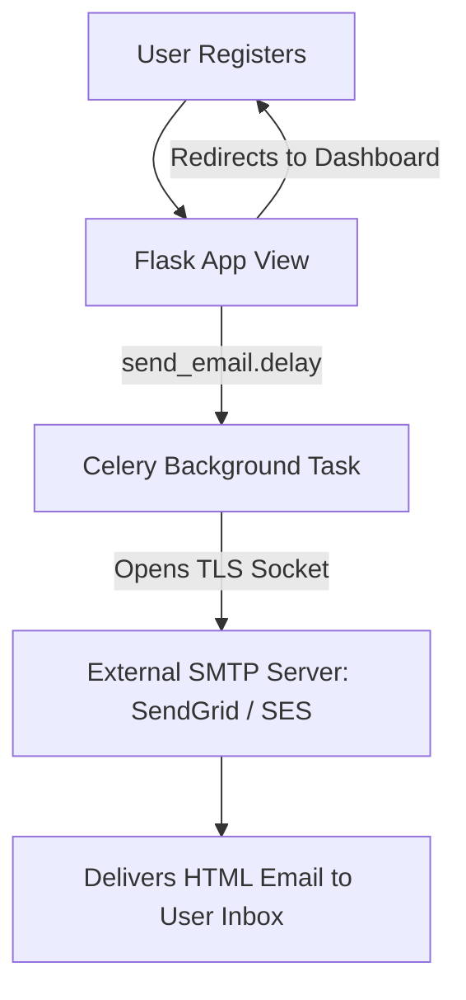

# Lesson 10.3 Email Delivery with Flask-Mail

> **Course**: Flask | **Module**: Module 1 | **Difficulty**: beginner

---

- **Estimated Time**: 45 Minutes (15m Reading | 20m Practice | 10m Quiz)
- **Difficulty Level**: ⭐⭐ Intermediate
- **Prerequisites**: [Lesson 10.2 Celery Tasks](file:///d:/My%20Drive/all%20files/PROJECT%20FILES/notes/docs/curriculum/_04_flask/_04_23_asynchronous_background_tasks_with_celery.md)
- **XP Reward**: +50 XP

### Learning Objectives
By the end of this lesson, you will be able to:
1. Integrate the **Flask-Mail** extension.
2. Configure SMTP server credentials securely via environment variables.
3. Construct plain-text and HTML emails using `Message()`.
4. Send emails asynchronously using **Celery** background tasks to prevent request blocking.

---

---

Install `Flask-Mail`:

```bash
pip install Flask-Mail
```

---

---

### 3.1 SMTP Protocol & Synchronous vs Async Delivery
The **Simple Mail Transfer Protocol (SMTP)** is the standard protocol for sending emails. Connecting to an external SMTP server (SendGrid, Mailgun, AWS SES, Gmail) involves network handshakes and TLS encryption, taking anywhere from 1 to 3 seconds per email.

Synchronous email delivery during an HTTP request blocks the user experience. Combining **Flask-Mail** with **Celery** background tasks ensures instant HTTP responses while emails send in the background:

```
┌─────────────────────────────────────────────────────────────────────────────┐
│                      ASYNCHRONOUS EMAIL DELIVERY FLOW                       │
├─────────────────────────────────────────────────────────────────────────────┤
│ HTTP Request ──► `send_async_email.delay(to, subject, body)`               │
│              ──► Immediate 200 OK to User!                                  │
│                                                                             │
│ Celery Worker ──► Opens SMTP Socket ──► Sends `Message` via Flask-Mail      │
└─────────────────────────────────────────────────────────────────────────────┘
```

---

---



---

---

```python
# Flask-Mail & Asynchronous Celery Email Delivery (mail_demo.py)
import os
from flask import Flask, jsonify, render_template
from flask_mail import Mail, Message
from celery import shared_task

app = Flask(__name__)

# 1. SMTP Server Configuration
app.config.update(
    MAIL_SERVER=os.environ.get("MAIL_SERVER", "smtp.gmail.com"),
    MAIL_PORT=int(os.environ.get("MAIL_PORT", 587)),
    MAIL_USE_TLS=True,
    MAIL_USERNAME=os.environ.get("MAIL_USERNAME"),
    MAIL_PASSWORD=os.environ.get("MAIL_PASSWORD"),
    MAIL_DEFAULT_SENDER=os.environ.get("MAIL_DEFAULT_SENDER", "noreply@telemetry.io")
)

mail = Mail(app)

# 2. Celery Asynchronous Email Task
@shared_task(ignore_result=True)
def send_async_email(to_email, subject, html_body):
    # Note: Requires app context binding!
    msg = Message(
        subject=subject,
        recipients=[to_email],
        html=html_body
    )
    mail.send(msg)
    print(f"[Async Email Sent]: Delivered to {to_email}")

# 3. View Function triggering Async Email
@app.route("/api/v1/alert-email", methods=["POST"])
def trigger_alert_email():
    user_email = "operator@factory.com"
    subject = "HIGH TEMPERATURE ALERT: ESP32-A1"
    html_content = "<h1>Critical Alert</h1><p>Sensor ESP32-A1 exceeded 80.0°C!</p>"

    # Dispatch to Celery worker (Non-blocking!)
    send_async_email.delay(user_email, subject, html_content)

    return jsonify({"message": "Alert email queued for background delivery"}), 200
```

---

---

- **User Password Resets & Alarm Notifications**: Web applications dispatch password reset tokens and IoT critical threshold alert emails asynchronously to guarantee instantaneous user interface feedback.

---

---

1. Save code as `mail_demo.py`.
2. Set environment variables `MAIL_USERNAME` and `MAIL_PASSWORD`.
3. Trigger `/api/v1/alert-email` endpoint $\to$ Inspect background email delivery log!

---

---

| Bug / Error | Root Cause | Engineering Solution |
| :--- | :--- | :--- |
| **`SMTPServerDisconnected`** | Incorrect SMTP port or TLS configuration (e.g., using TLS on port 465 instead of SSL). | Use Port 587 for TLS (`MAIL_USE_TLS=True`) or Port 465 for SSL (`MAIL_USE_SSL=True`). |

---

---

- **Never Hardcode SMTP Credentials**: Load passwords securely from environment variables using `os.environ.get()`.

---

---

### Q1: Why is it crucial to send emails asynchronously in web applications?
**Answer**: Connecting to external SMTP mail servers introduces unpredictable network latency (1–5 seconds per email). Sending emails synchronously inside a web view function blocks the web server worker thread, creating laggy user interfaces and risking browser timeout errors. Offloading email delivery to asynchronous background workers (like Celery) keeps HTTP request-response cycles instantaneous.

---

---

```json
{
  "quiz_title": "Lesson 10.3 Flask-Mail Assessment",
  "questions": [
    {
      "question_id": "Q1",
      "type": "multiple_choice",
      "question_text": "Which standard SMTP port is commonly used for TLS-encrypted email connections?",
      "options": ["25", "80", "587", "443"],
      "correct_answer_index": 2,
      "explanation": "Port 587 is the standard port for TLS SMTP connections."
    }
  ]
}
```

---

---

Build an automated welcome email task dispatched upon user registration.

---

---

**Front**: What class in Flask-Mail constructs plain-text or HTML email objects?
**Back**: `flask_mail.Message()`.
<!-- flashcard:end -->

---

---

```python
msg = Message("Subject", recipients=["a@b.com"], html="<b>Hi</b>")
mail.send(msg)
```

---
