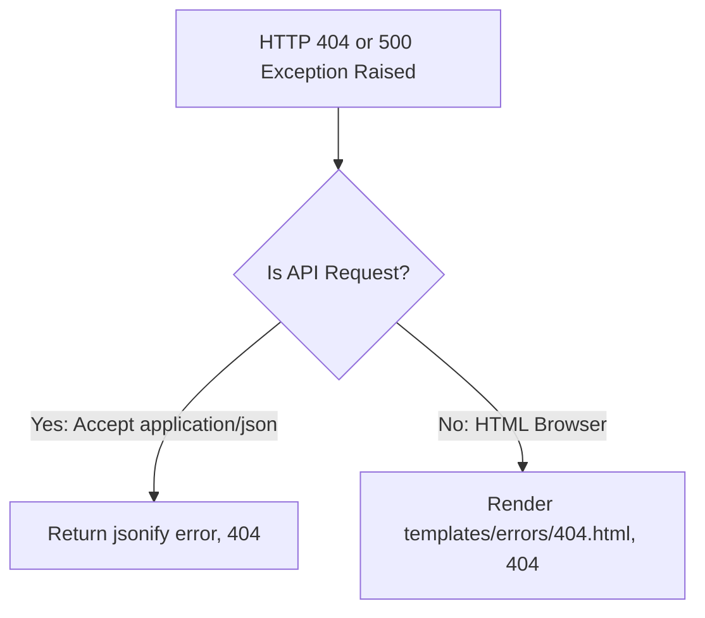

# Lesson 11.1 Custom Error Pages & Error Handlers

> **Course**: Flask | **Module**: Module 1 | **Difficulty**: beginner

---

- **Estimated Time**: 45 Minutes (15m Reading | 20m Practice | 10m Quiz)
- **Difficulty Level**: ⭐ Beginner
- **Prerequisites**: [Lesson 10.3 Flask-Mail](file:///d:/My%20Drive/all%20files/PROJECT%20FILES/notes/docs/curriculum/_04_flask/_04_24_email_delivery_with_flask_mail.md)
- **XP Reward**: +50 XP

### Learning Objectives
By the end of this lesson, you will be able to:
1. Intercept HTTP exceptions using **`@app.errorhandler()`**.
2. Render custom user-friendly HTML error pages for **404 Not Found** and **500 Internal Server Error**.
3. Register application-wide blueprint error handlers using `@bp.app_errorhandler()`.
4. Return standardized JSON error responses for RESTful API clients.

---

---

Open Python REPL or VS Code.

---

---

### 3.1 Exception Handling Architecture
When an unhandled exception or explicit abort (`abort(404)`) occurs in a view function, Flask defaults to serving generic HTML error pages.

Registering custom error handlers intercepts these HTTP status codes or Python exception classes, allowing you to return custom HTML error pages for web users or structured JSON error DTOs for API clients:

```
┌─────────────────────────────────────────────────────────────────────────────┐
│                          FLASK ERROR HANDLING FLOW                          │
├─────────────────────────────────────────────────────────────────────────────┤
│ View Function throws `abort(404)` or unhandled `Exception`                 │
│                                   │                                         │
│                                   ▼                                         │
│ Intercepted by `@app.errorhandler(404)` or `@app.errorhandler(500)`        │
│                                   │                                         │
│                                   ▼                                         │
│ Renders `templates/errors/404.html` OR returns `jsonify({"error": ...})`   │
└─────────────────────────────────────────────────────────────────────────────┘
```

---

---



---

---

```python
# Custom Error Handlers (errors_demo.py)
from flask import Flask, render_template, jsonify, request

app = Flask(__name__)

# 1. Custom 404 Not Found Handler
@app.errorhandler(404)
def not_found_error(error):
    if request.path.startswith("/api/"):
        return jsonify({"error": "Resource Not Found", "status": 404}), 404
    return render_template("errors/404.html"), 404

# 2. Custom 500 Internal Server Error Handler
@app.errorhandler(500)
def internal_error(error):
    app.logger.error(f"[500 Internal Server Error]: {error}")
    if request.path.startswith("/api/"):
        return jsonify({"error": "Internal Server Error", "status": 500}), 500
    return render_template("errors/500.html"), 500

# Test Routes
@app.route("/trigger-500")
def trigger_error():
    # Intentionally raise exception to test 500 error handler!
    raise RuntimeError("Simulated Database Connection Failure")

if __name__ == "__main__":
    app.run(debug=False) # Must be debug=False to trigger custom 500 pages!
```

---

---

- **Production API Gateways**: Enterprise APIs intercept 500 server crashes to log complete tracebacks internally while returning safe, sanitized JSON messages to external API consumers without leaking internal database schemas.

---

---

1. Save code as `errors_demo.py`.
2. Run `python errors_demo.py` with `debug=False` $\to$ Navigate to `/trigger-500` and `/non-existent-route` to inspect custom error responses!

---

---

| Bug / Error | Root Cause | Engineering Solution |
| :--- | :--- | :--- |
| **Custom 500 Handler Not Triggering** | Running the app with `debug=True`. | Set `debug=False` or test error handlers in production environment mode. |

---

---

- **Check Request Header Format**: Return JSON for API routes (`/api/`) and HTML for browser routes.

---

---

### Q1: What is the difference between `@errorhandler` and `@app_errorhandler` on a Flask Blueprint?
**Answer**: `@errorhandler` registered on a Blueprint handles errors raised *only* by routes within that specific blueprint. `@app_errorhandler` registered on a Blueprint handles errors globally across the entire Flask application regardless of which blueprint generated the exception.

---

---

```json
{
  "quiz_title": "Lesson 11.1 Error Handlers Assessment",
  "questions": [
    {
      "question_id": "Q1",
      "type": "multiple_choice",
      "question_text": "Which Flask decorator intercepts specific HTTP status code errors globally?",
      "options": ["@app.catch()", "@app.errorhandler()", "@app.on_error()", "@app.intercept()"],
      "correct_answer_index": 1,
      "explanation": "@app.errorhandler() registers error handler functions."
    }
  ]
}
```

---

---

Build custom 404 and 500 error templates with dynamic JSON fallback.

---

---

**Front**: What HTTP status code represents an internal server crash?
**Back**: HTTP 500 Internal Server Error.
<!-- flashcard:end -->

---

---

```python
@app.errorhandler(404)
def not_found(e): return jsonify(error="Not Found"), 404
```

---
