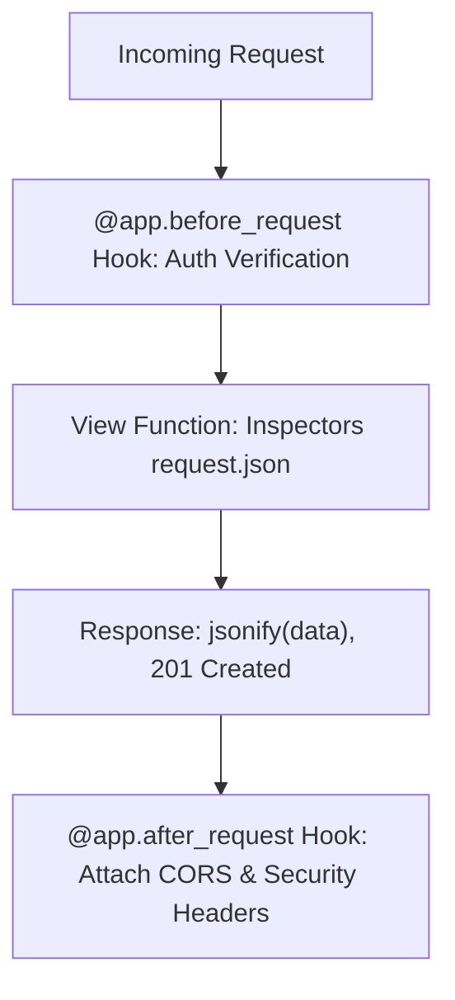

# Lesson 2.2 HTTP Methods, Request Object Inspection, & Response Formatting

> **Course**: Flask | **Module**: Module 1 | **Difficulty**: beginner

---

- **Estimated Time**: 55 Minutes (20m Reading | 25m Practice | 10m Quiz)
- **Difficulty Level**: ⭐⭐ Intermediate
- **Prerequisites**: [Lesson 2.1 Flask Routing](file:///d:/My%20Drive/all%20files/PROJECT%20FILES/notes/docs/curriculum/_04_flask/_04_03_flask_routing_and_url_converters.md)
- **XP Reward**: +60 XP

### Learning Objectives
By the end of this lesson, you will be able to:
1. Specify acceptable HTTP verbs using `methods=['GET', 'POST', 'PUT', 'DELETE']`.
2. Inspect query parameters (`request.args`), JSON payloads (`request.json`), and form data (`request.form`).
3. Construct custom HTTP responses with custom status codes and headers using `make_response()` and `jsonify()`.
4. Implement request lifecycle middleware hooks (`@app.before_request`, `@app.after_request`).

---

---

Open Python REPL or VS Code.

---

---

### 3.1 The Flask `request` Context Local
In Flask, `request` is a **Context Local** proxy object representing the current active HTTP request. It dynamically accesses the correct thread's request data without requiring manual request object parameter passing to every view function.

```
┌─────────────────────────────────────────────────────────────────────────────┐
│                          FLASK REQUEST DATA ATTRIBUTES                      │
├─────────────────┬───────────────────────────────────────────────────────────┤
│ Attribute       │ Purpose & Source Data                                     │
├─────────────────┼───────────────────────────────────────────────────────────┤
│ `request.args`  │ Query string parameters (`?page=1&limit=10`)              │
│ `request.form`  │ URL-encoded form POST fields                              │
│ `request.json`  │ Parsed JSON payload (`Content-Type: application/json`)    │
│ `request.headers`│ HTTP request headers dictionary                           │
└─────────────────┴───────────────────────────────────────────────────────────┘
```

---

---



---

---

```python
# Request Inspection & Response Formatting (request_demo.py)
from flask import Flask, request, jsonify, make_response

app = Flask(__name__)

# 1. Lifecycle Hook: Executes before every request
@app.before_request
def log_request_info():
    app.logger.info(f"[HTTP {request.method}]: Path={request.path} Remote={request.remote_addr}")

# 2. REST Endpoint supporting POST requests
@app.route("/api/v1/telemetry", methods=["POST"])
def receive_telemetry():
    # Validate JSON payload
    if not request.is_json:
        return jsonify({"error": "Content-Type must be application/json"}), 400

    data = request.json
    device_id = data.get("device_id")
    temperature = data.get("temperature")

    if not device_id or temperature is None:
        return jsonify({"error": "Missing required fields: device_id or temperature"}), 422

    # Return custom response tuple: (payload, status_code, headers)
    return jsonify({
        "status": "ACCEPTED",
        "device_id": device_id,
        "processed_temp": float(temperature)
    }), 201

# 3. Custom Headers using make_response()
@app.route("/api/v1/custom-header")
def custom_header():
    resp = make_response(jsonify({"message": "Custom Headers Attached"}))
    resp.headers["X-Telemetry-Gateway-ID"] = "GW-NODE-90210"
    return resp

if __name__ == "__main__":
    app.run(debug=True)
```

---

---

- **API Gateways & Security Logging**: `@app.before_request` hooks authenticate API tokens and log client IP addresses before forwarding requests to database handlers.

---

---

1. Save code as `request_demo.py`.
2. Send POST request via curl: `curl -X POST http://127.0.0.1:5000/api/v1/telemetry -H "Content-Type: application/json" -d '{"device_id":"ESP32-A","temperature":24.5}'` $\to$ Observe 201 Created JSON response!

---

---

| Bug / Error | Root Cause | Engineering Solution |
| :--- | :--- | :--- |
| **`request.json` returns `None`** | Client omitted the `Content-Type: application/json` HTTP header. | Always supply `Content-Type: application/json` or use `request.get_json(force=True)`. |

---

---

- **Use `jsonify()` for API Responses**: Automatically serializes dictionaries into JSON and sets `Content-Type: application/json`.

---

---

### Q1: What is a Context Local in Flask and how does the `request` object work behind the scenes?
**Answer**: A Context Local in Flask acts like a thread-local variable proxy. During an incoming HTTP request, Flask binds the active request data to the current thread context. Accessing `request.args` or `request.json` reads data for the specific thread handling that request without risking cross-thread data contamination.

---

---

```json
{
  "quiz_title": "Lesson 2.2 Request Response Assessment",
  "questions": [
    {
      "question_id": "Q1",
      "type": "multiple_choice",
      "question_text": "Which attribute on the Flask `request` object parses incoming JSON payloads?",
      "options": ["request.data", "request.body", "request.json", "request.payload"],
      "correct_answer_index": 2,
      "explanation": "request.json parses incoming JSON payloads."
    }
  ]
}
```

---

---

Build a REST API endpoint handling `GET` query strings and `POST` JSON payloads.

---

---

**Front**: Which request lifecycle hook executes before every view function in Flask?
**Back**: `@app.before_request`.
<!-- flashcard:end -->

---

---

```python
@app.route("/api", methods=["POST"])
def api():
    data = request.json
    return jsonify(data), 201
```

---
