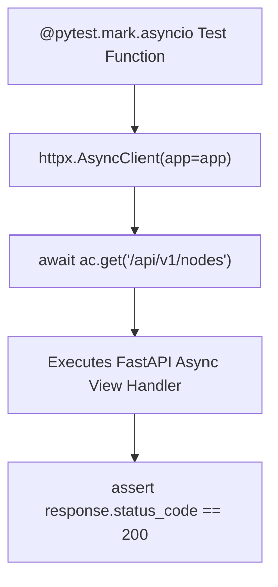

# Lesson 10.1 Async Testing with Pytest & `httpx.AsyncClient`

> **Course**: Fastapi | **Module**: Module 1 | **Difficulty**: beginner

---

- **Estimated Time**: 55 Minutes (20m Reading | 25m Practice | 10m Quiz)
- **Difficulty Level**: ⭐⭐ Intermediate
- **Prerequisites**: [Lesson 9.2 Real-Time Connection Manager](file:///d:/My%20Drive/all%20files/PROJECT%20FILES/notes/docs/curriculum/_05_fastapi/_05_18_realtime_connection_manager_and_broadcasting.md)
- **XP Reward**: +60 XP

### Learning Objectives
By the end of this lesson, you will be able to:
1. Configure **Pytest** for asynchronous test execution using **`pytest-asyncio`**.
2. Simulate asynchronous HTTP requests using **`httpx.AsyncClient`**.
3. Write test functions using **`@pytest.mark.asyncio`**.
4. Test async database operations and assert JSON status codes.

---

---

Install `pytest`, `pytest-asyncio`, and `httpx`:

```bash
pip install pytest pytest-asyncio httpx
```

---

---

### 3.1 Why `httpx.AsyncClient` over Starlette `TestClient`?
FastAPI's built-in `TestClient` uses `requests` under the hood, which executes test requests synchronously.

When testing `async def` endpoints, async database sessions, or async yield dependencies, using **`httpx.AsyncClient`** runs test requests natively inside an asynchronous `asyncio` event loop. This allows seamlessly using `await` inside Pytest test functions:

```
┌─────────────────────────────────────────────────────────────────────────────┐
│                       HTTPX.ASYNC_CLIENT TESTING FLOW                       │
├─────────────────────────────────────────────────────────────────────────────┤
│ `@pytest.mark.asyncio` Test Function                                        │
│   ──► `async with AsyncClient(app=app, base_url="http://test") as ac:`       │
│   ──► `response = await ac.get("/api/v1/sensors")` (Native Async Request!) │
│   ──► `assert response.status_code == 200`                                  │
└─────────────────────────────────────────────────────────────────────────────┘
```

---

---



---

---

### File 1: `conftest.py` (Pytest Async Fixtures)

```python
import pytest
from typing import AsyncGenerator
from httpx import AsyncClient, ASGITransport
from main import app

# Configure pytest-asyncio mode
pytest_plugins = ("pytest_asyncio",)

@pytest.fixture
async def async_client() -> AsyncGenerator[AsyncClient, None]:
    # Transport handles direct ASGI in-memory communication!
    transport = ASGITransport(app=app)
    async with AsyncClient(transport=transport, base_url="http://testserver") as ac:
        yield ac
```

### File 2: `test_main.py` (Async Test Cases)

```python
import pytest
from httpx import AsyncClient

# Mark test function as async for pytest-asyncio!
@pytest.mark.asyncio
async def test_read_root(async_client: AsyncClient):
    # Perform native async GET request using await!
    response = await async_client.get("/")
    
    assert response.status_code == 200
    assert response.json()["status"] == "ONLINE"

@pytest.mark.asyncio
async def test_create_sensor(async_client: AsyncClient):
    payload = {"code": "TEST-ESP32", "location": "Test Lab"}
    
    response = await async_client.post("/api/v1/sensors", json=payload)
    
    assert response.status_code == 201
    data = response.json()
    assert data["code"] == "TEST-ESP32"
```

---

---

- **Async CI/CD Testing Pipelines**: Enterprise GitHub Actions workflows run `pytest` with `pytest-asyncio` and `httpx.AsyncClient` to test hundreds of async endpoints in seconds without spinning up a live Uvicorn web server.

---

---

1. Save `conftest.py` and `test_main.py`.
2. Run `pytest` in terminal $\to$ Observe 2 passed async test cases executed natively in an event loop!

---

---

| Bug / Error | Root Cause | Engineering Solution |
| :--- | :--- | :--- |
| **`PytestUnhandledCoroutineWarning`** | Writing `async def test_fn()` without marking it with `@pytest.mark.asyncio`. | Annotate all async test functions with `@pytest.mark.asyncio`. |

---

---

- **Use `ASGITransport(app=app)` in `httpx` v0.27+**: Use `ASGITransport` when initializing `httpx.AsyncClient` in modern `httpx` versions.

---

---

### Q1: Why is `httpx.AsyncClient` preferred over `TestClient` when testing async FastAPI applications with Pytest?
**Answer**: Starlette's `TestClient` executes test calls synchronously using `requests`, which blocks the thread and prevents awaiting async operations inside Pytest fixtures or test functions. `httpx.AsyncClient` executes HTTP requests natively within the `asyncio` event loop, enabling full `async/await` syntax inside test cases.

---

---

```json
{
  "quiz_title": "Lesson 10.1 Async Testing Assessment",
  "questions": [
    {
      "question_id": "Q1",
      "type": "multiple_choice",
      "question_text": "Which Pytest decorator marks a test function as asynchronous for execution by pytest-asyncio?",
      "options": ["@pytest.mark.asyncio", "@pytest.async_test", "@pytest.mark.async", "@async_test"],
      "correct_answer_index": 0,
      "explanation": "@pytest.mark.asyncio marks async test functions."
    }
  ]
}
```

---

---

Build an async Pytest test suite using `httpx.AsyncClient` testing async CRUD endpoints.

---

---

**Front**: What HTTP client class performs native async in-memory testing for FastAPI in Pytest?
**Back**: `httpx.AsyncClient(transport=ASGITransport(app=app), base_url="http://test")`.
<!-- flashcard:end -->

---

---

```python
@pytest.mark.asyncio
async def test_api(async_client: AsyncClient):
    res = await async_client.get("/")
    assert res.status_code == 200
```


---

---

> **Source**: `_17_01_Testing_Pytest_and_Mocking_Notes.md` (from backend concepts archive)
> This content was migrated from existing study notes. Review and merge with topics above.

# Module 9: Testing

---

---

### 1. The Big Picture

#### Why We Test
In an enterprise, you cannot deploy code to production based on "it works on my machine." **Automated Testing** is the safety net that ensures:
1. New features do not break existing functionality (Regression Testing).
2. Code is designed cleanly (hard-to-test code is usually poorly designed code).
3. The team can deploy changes to production multiple times a day with confidence.

#### The Testing Pyramid

```
       ▲
      / \      E2E / System Tests (Slow, expensive, covers entire flow)
     /   \
    /     \    Integration Tests (Verifies database, HTTP, and services work together)
   /       \
  /         \  Unit Tests (Fast, cheap, tests a single function/class in isolation)
 ─────────────
```

* **Unit Tests:** Test a single unit of code (e.g., a service method) in isolation. External dependencies (like databases or APIs) are **mocked**.
* **Integration Tests:** Test how multiple components work together (e.g., a route handler interacting with a real database).
* **End-to-End (E2E) Tests:** Test the entire system from the client's perspective (e.g., simulating a user clicking a button and checking the database).

---

### 2. Testing with Pytest
**Pytest** is the standard testing framework for Python. It makes it easy to write small, readable tests.

#### Core Pytest Concepts
* **Test Discovery:** Pytest automatically finds and runs files named `test_*.py` or `*_test.py`. Inside those files, it runs functions prefixed with `test_`.
* **Assertions:** Instead of complex methods, Pytest uses Python's native `assert` statement. E.g., `assert value == 42`.
* **Fixtures:** Reusable setup and teardown code. E.g., creating a clean database session before each test.

---

### 3. What is Mocking?
**Mocking** is replacing a real dependency (like a database connection or a Stripe payment client) with a simulated object that returns predetermined responses.
* **Why Mock?**
  * **Speed:** Querying a real database or sending an email takes seconds. Running 1,000 mocked tests takes milliseconds.
  * **Consistency:** Tests shouldn't fail because Google's servers are temporarily down.
  * **Safety:** You don't want to charge a real credit card during a test run!

---

### 4. Python Example: Writing a FastAPI Test with Pytest
We use Pytest's fixtures and FastAPI's `TestClient` to write clean integration tests.

```python
import pytest
from fastapi.testclient import TestClient
from main import app # Import your FastAPI app

@pytest.fixture
def client():
    # Setup: Create a TestClient instance
    with TestClient(app) as c:
        yield c
    # Teardown: Code here runs after the test finishes

def test_create_user_success(client):
    # Act: Make request
    payload = {"name": "Michael Scott", "email": "michael@dundermifflin.com"}
    response = client.post("/api/v1/users", json=payload)
    
    # Assert: Verify response
    assert response.status_code == 201
    data = response.json()
    assert data["name"] == "Michael Scott"
    assert "id" in data
```

---

### 5. Hands-on Workout & Assessment

#### Part A: Testing Design Challenge
You are writing a unit test for a `PaymentService.charge_customer()` method. This method:
1. Fetches the customer's Stripe ID from the database.
2. Calls Stripe's API (`stripe.Charge.create()`) using a secret key.
3. If successful, updates the order status to "Paid" in the database.

- Which parts of this method should be **mocked** in a unit test?
- Write a short description of how you would set up the mock for the Stripe API call.

#### Part B: Quiz
1. What is a Pytest fixture?
   A. A database table constraint.
   B. A reusable function that provides setup (and optional teardown) code for tests.
   C. A tool to format code.
   D. A test case that never changes.
2. Why do we prefer unit tests over E2E tests for testing complex business logic edge cases?
   A. E2E tests are not secure.
   B. Unit tests are extremely fast, cheap to run, and allow isolating the exact logic without setting up the entire application stack.
   C. Unit tests do not require writing code.
   D. E2E tests cannot test edge cases.
3. What happens if you run a test file that is not named with a `test_` prefix or `_test` suffix in Pytest?
   A. Pytest will raise a syntax error.
   B. Pytest will ignore the file during test discovery.
   C. Pytest will delete the file.
   D. The test will run but always pass.

---

### 6. Progress Tracker

* **Module 9: Testing:** 0%
* **Topics Completed:** 0/1
* **Coding Exercises:** 0/0
* **Quiz Score:** N/A
* **API Design Challenge Score:** N/A
* **Backend Score:** 0 / 100

---

---
